<div class="portada" markdown="1">

<div class="logos">


</div>

# trainHIT

**User manual and teacher’s guide**

A teaching simulator and vHIT in the browser: with the computer’s webcam or
with a phone as the head.

<div class="ilustracion">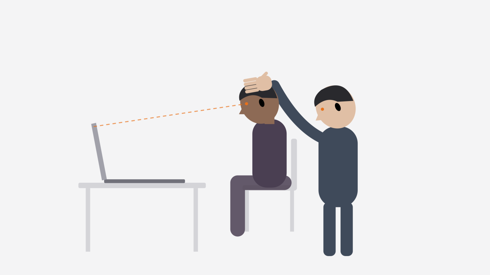</div>

<div class="ficha" markdown="1">

**Authors:** Nicolás&nbsp;Baier-Quezada, Vanessa&nbsp;Uribe-Hernández, Fernanda&nbsp;López-Moncada, Benjamín&nbsp;Catipillan-Ulloa<br>
**Date:** October 1, 2026<br>
**trainHIT version documented:** 2026-10-01.1

TecMedHub Lab · Universidad Austral de Chile, Puerto Montt campus

</div>

</div>

## Contents

<div class="indice" markdown="1">

**Part I · User manual**

- [1. What trainHIT is](#1-what-trainhit-is)
- [2. Before you start](#2-before-you-start)
- [3. The screen](#3-the-screen)
- [4. Preparing the session](#4-preparing-the-session)
- [5. The first measurement](#5-the-first-measurement)
- [6. Reading the plots](#6-reading-the-plots)
- [7. Tools](#7-tools)
- [8. The engine settings](#8-the-engine-settings)
- [9. Learn: the guided tours](#9-learn-the-guided-tours)
- [10. Blind cases](#10-blind-cases)
- [11. Simulated patient](#11-simulated-patient)
- [12. The phone on the head](#12-the-phone-on-the-head)
- [13. Saving and sharing data](#13-saving-and-sharing-data)
- [14. Language, theme, small screens and offline use](#14-language-theme-small-screens-and-offline-use)
- [15. Keyboard shortcuts](#15-keyboard-shortcuts)
- [16. Troubleshooting](#16-troubleshooting)

**Part II · Teacher’s guide: ideas for teaching**

- [17. What for and for whom](#17-what-for-and-for-whom)
- [18. Learning outcomes](#18-learning-outcomes)
- [19. Suggested class sequences](#19-suggested-class-sequences)
- [20. Activities](#20-activities)
- [21. Assessment](#21-assessment)
- [22. Common mistakes and discussion questions](#22-common-mistakes-and-discussion-questions)
- [23. Care in the classroom](#23-care-in-the-classroom)

**Appendix**

- [24. Glossary](#24-glossary)
- [25. References](#25-references)

</div>

---

## 1. What trainHIT is

> **trainHIT is not a medical device.** It is for *learning* how the
> vestibulo-ocular reflex is measured, not for diagnosing. It works at 30
> frames per second at most, a deliberate cap so that it is not used on
> patients, the distance to the target is not fixed and the gain it reports is
> not desaccaded, so the values are for teaching.

trainHIT measures the **vestibulo-ocular reflex (VOR)** with the computer’s
camera. Frame by frame it tracks the head and the iris with the MediaPipe face
mesh (Kartynnik et al., 2019), and computes the **gain** of each head impulse
(Halmagyi & Curthoys, 1988): how much the eye turned for every degree the head
turned.

**Three ways to practice.** With the **camera** you examine a real classmate.
With the **Simulator**, a pathology —neuritis, compensated deficit, bilateral
vestibulopathy— is added to those same impulses, and you practice examining
and reading at the same time. And with a **phone as the head** you need neither
camera nor classmate: the gyroscope gives the turn and a drawn face shows the
model’s eye, healthy or with the chosen pathology. So the impulse technique can
be practiced anywhere, and in class you can project a patient with whatever
condition you want to teach.

Unlike a clinical device, trainHIT puts **every step of the computation in
plain sight**, and you can touch it. You can see the parallax line, the impulse
window, the three gain methods and the engine settings. The point is to
understand why it gives what it gives.

The camera is **remote, with no goggles**: it stays fixed and is not mounted
on the patient’s head. This is not an incomplete vHIT but a different method,
which already has published norms with a remote camera (Wiener-Vacher &
Wiener, 2017). Everything is processed in the browser and **the video never
leaves the computer**.

### What it is not

- **It does not diagnose.** A 30 fps webcam, without fixing the distance to
  the target, gives teaching values.
- **It does not desaccade.** A covert saccade stays inside the gain and raises
  it, precisely in the patient with a deficit. The bias is toward **false
  negatives**.
- **With the webcam, it only measures the lateral canal.** The vertical canals
  (RALP/LARP) need the vertical movement of the eye, which the eyelid hides and
  a webcam measures poorly. With the phone as the head all six can be
  practised, with a simulated eye (sections 11 and 12).

**Why 30 frames per second.** Even if the camera can deliver more, trainHIT
processes 30 at most; if the camera delivers more, **30 FPS CAP** shows up in
the bar. The cap is deliberate: it prevents trainHIT from being used to assess
patients, because with more frames its numbers would start to look like those
of a clinical device without having its validation. At 30 frames the shape of
the impulse is clearly visible and it is enough to learn to read it. Measuring
a patient is left to validated clinical devices, and what is learnt here is
precisely what it takes to use them well.

---

## 2. Before you start

### What you need

- A computer with a **webcam** and a modern browser (Chrome, Edge, Firefox).
- To practice for real, **two people**: one plays the patient and the other
  the examiner. On your own you can learn the tool, but the reflex is not
  measured: a turn you make yourself is predictable and the brain anticipates
  it.

### Opening the page

If trainHIT is published at a web address, just open it. To run it on your own
computer, from the project folder:

```
python3 -m http.server 8080
```

and open <http://localhost:8080>. A server is needed; opening `index.html`
with a double click does not work, because the browser does not give the camera
to a local file.

The first time, the face tracking model is downloaded (about 10 MB). After
that it stays stored and the page works **offline** (see
[section 14](#14-language-theme-small-screens-and-offline-use)).

### The welcome screen

When the page opens, the welcome screen shows what trainHIT measures, its
limits and two buttons.

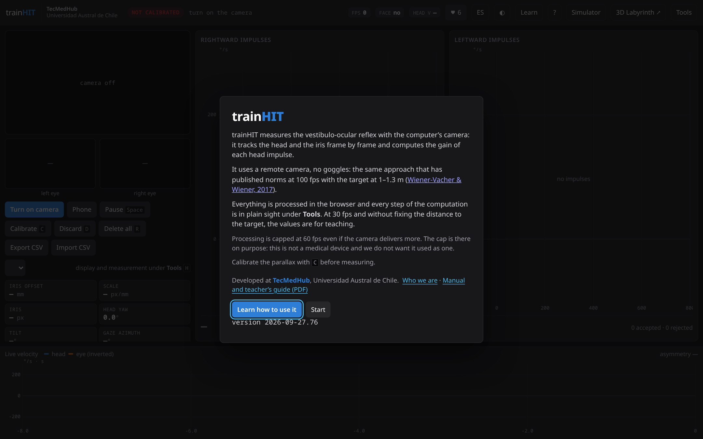

- **Learn how to use it** opens the menu of guided tours
  ([section 9](#9-learn-the-guided-tours)). Recommended the first time.
- **Start** goes straight to the measurement screen.

Next to **Who we are**, **Manual and teacher’s guide (PDF)** downloads this
document in the interface language.

The **?** in the bar reopens this welcome screen at any time. The **Who we
are** link, like the **TecMedHub** signature in the bar, opens the team card:

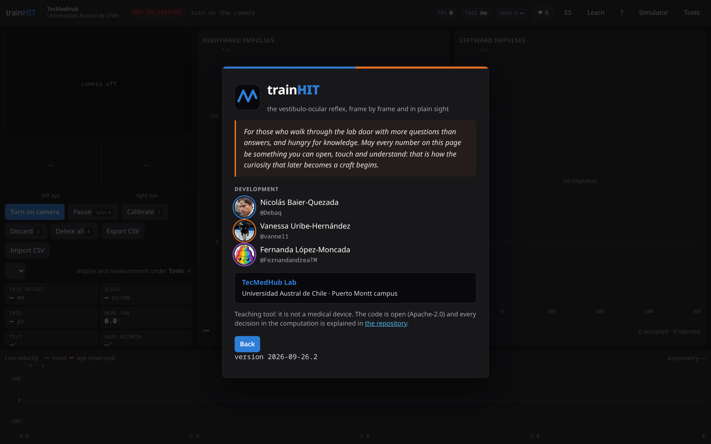

---

## 3. The screen

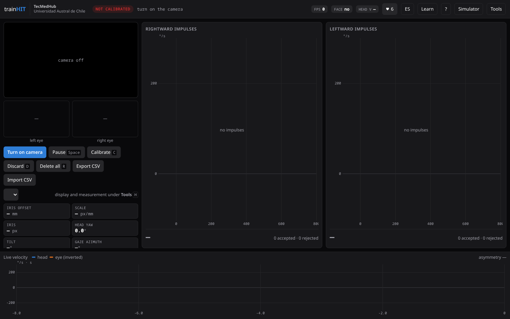

The screen has four areas:

| Area | What is there |
|---|---|
| **Top bar** | Calibration status (**NOT CALIBRATED** / **CALIBRATED k=…**), status message, frames per second (**FPS**), whether there is a **FACE** in the frame, head velocity, the **♥** (like), the language switch, the theme switch (**◐** / **☀** / **☾**) and the **Learn**, **?**, **Simulator**, **3D Labyrinth ↗** and **Tools** buttons. |
| **Left column** | The video with the tracking points, both eyes magnified, the measurement buttons and the live readouts. |
| **Center** | One panel per side: **Rightward impulses** and **Leftward impulses**. Each one has all the impulses overlaid, the mean gain ± SD and the list of impulses. |
| **Bottom** | **Live velocity**: the head in blue and the eye (inverted) in orange, over the last 8 seconds. On the right, the **asymmetry**. |

**Colors used throughout the page:**

- **Blue:** the head.
- **Orange:** the eye.
- **Violet triangle:** covert saccade.
- **Red triangle:** overt saccade.

**«Right» and «left» always mean the patient’s**, not the screen’s. An impulse
toward the patient’s right lands in the right panel.

### The measurement buttons

| Button | What it does |
|---|---|
| **Turn on camera** / **Stop** | Turns the camera on or off. The selector below picks which camera to use if there is more than one. |
| **Phone** | Uses a phone as the head, no camera (see [section 11](#11-simulated-patient)). |
| **Pause** (`Space`) | Freezes the analysis and the trace below so it can be measured. The camera stays on. |
| **Calibrate** (`C`) | Calibrates the parallax for 10 s. It is **mandatory before trusting the gain**. |
| **Discard** (`D`) | Discards the last impulse. `Z` brings it back. |
| **Delete all** (`R`) | Deletes the session and asks for confirmation. |
| **Export CSV** / **Import CSV** | Saves the session to a file or opens a saved one. |

---

## 4. Preparing the session

A good measurement depends more on the setup than on the software.

### Camera and light

- The camera **at eye level**, with the face straight on and centered.
- **At arm’s length**, just close enough for the iris to look sharp in the
  magnified eyes. If it is too far, the impulse is rejected with *IRIS TOO
  SMALL*.
- Light **from the front** or from the side. **Never a window behind the
  patient**: the face ends up in shadow and the model loses it.
- **No glasses** if possible, because the reflections hide the iris.

### Posture and target

- The patient seated, with the head **flexed about 30° down**. That way the
  lateral canal lies horizontal. The **tilt** readout shows it live.
- The target to look at is **the camera itself**, or a dot stuck next to the
  lens. The parallax model assumes the target is next to the camera, and
  looking at something else changes the gain.

### The examiner’s hands

The examiner stands **behind** the patient and holds the head **from above**,
with the hands away from the eyes, eyebrows and cheekbones. The model tracks
the whole face: a finger over an eyebrow is enough to lose tracking (*FACE
LOST*).

---

## 5. The first measurement

### Step 1: Turn on the camera

Press **Turn on camera**. The first time, the browser asks for permission to
use the camera. Go on when the bar says **FACE yes**.

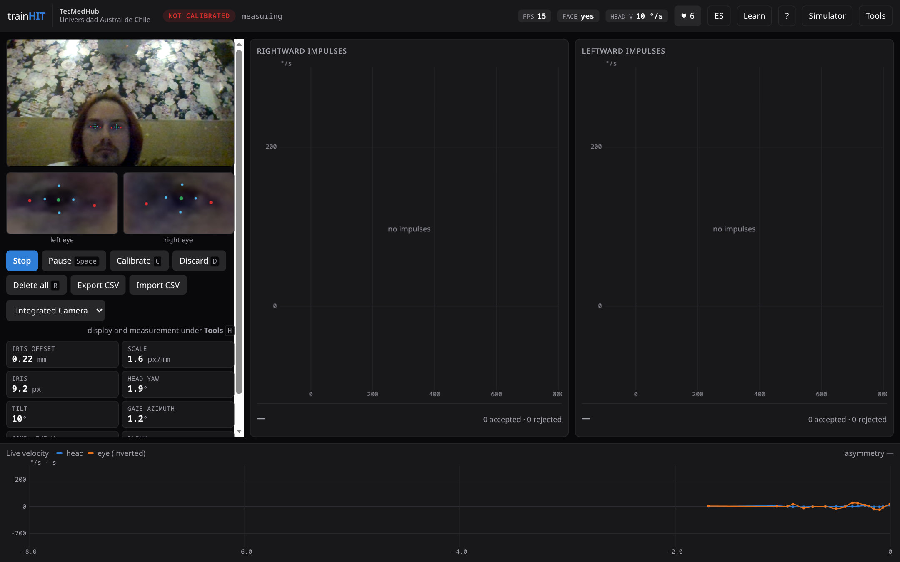

The points on the face are what the model tracks. Below the video, the two
magnified eyes show the outline of the iris and its center:

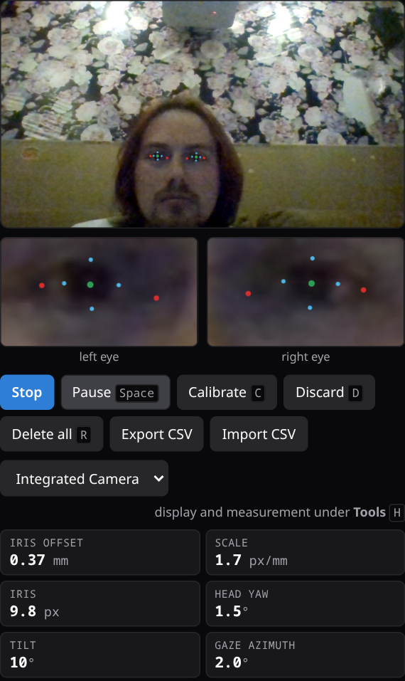

If the iris does not look sharp in the magnified eyes, move closer to the
camera or improve the light **before going on**. Everything else is computed
from there.

### Step 2: Check the readouts

Below the buttons are the live numbers:

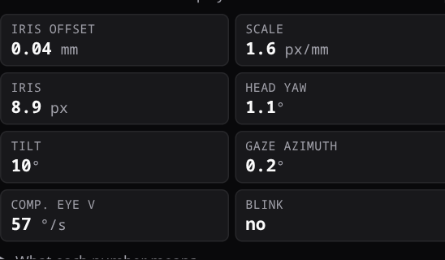

The ones that matter while preparing:

- **iris:** the iris radius in pixels. Below the minimum (5 px by default) the
  impulse is rejected.
- **tilt:** the head flexion; aim for about 30°.
- **blink:** a blink inside the impulse invalidates it.

Each number explains what it is when you hover over it. On touch screens,
**What each number means** (below the readouts) says the same in plain view.

### Step 3: Calibrate the parallax

Press **Calibrate** (or `C`). At the top center, next to the camera, a **red
dot** appears. The patient looks at it **without letting go** and turns the
head **slowly** from side to side, about ±20°, for 10 seconds. A countdown
shows how much time is left and the range of rotation reached. The Tools
drawer opens by itself, so you can watch the fit points come in.

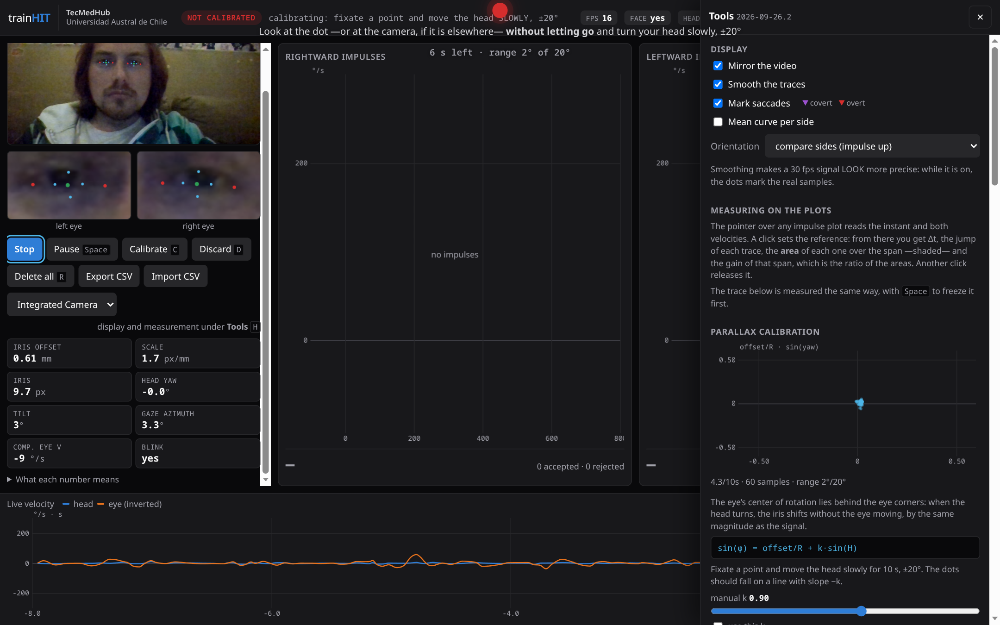

**Why it is needed:** the eye’s center of rotation lies behind the eye
corners. When the head turns, the iris shifts in the image even if the eye does
not move, and that shift is **as large as the signal**. Without calibration, a
perfect reflex reads ~1.9.

When it finishes, the bar says **CALIBRATED k=…** in green. If the calibration
is rejected, the status message says what to do differently (turn more slowly,
hold the gaze better, and so on). In **Tools** you can see the fit: if the
patient held the gaze well, the points fall on a line.

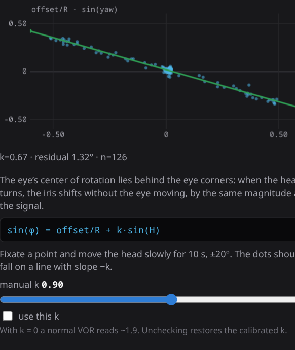

### Step 4: Deliver the impulses

Each impulse is a **short (10–20°) and fast (150–300 °/s)** turn to one side,
and **the head stays still there**. Then it goes back slowly to the center, you
wait, and the next one goes to a side the patient cannot guess.

In the trace below each impulse shows up as a **blue** peak (head). The
**orange** one is the eye, drawn inverted: with a normal reflex the two curves
cover each other.

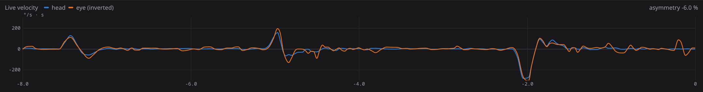

**Good technique:** a short, fast, unpredictable turn. **Poor technique:** a
wide (more than 40°) and slow turn, or always to the same side.

### Step 5: Read the result

Each impulse lands in the panel for its side:

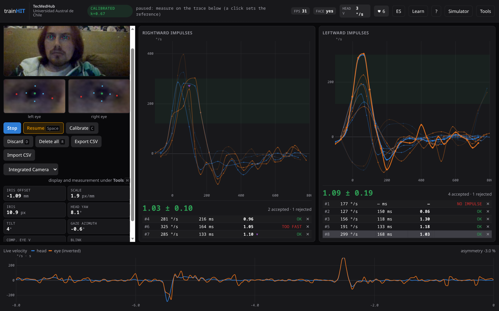

- **At the top** of each panel, all the impulses overlaid. The green band is
  the accepted range of peak velocity.
- **The mean gain ± SD**, in green or red against the 0.80 cutoff. That cutoff
  comes from devices that do desaccade (MacDougall et al., 2009), and normal
  gain changes with the device and the protocol (Money-Nolan & Flagge, 2023),
  so here it is a reference, not a criterion. Without calibration it stays
  gray.
- **The count** of accepted and rejected impulses.
- **The list**, one impulse per row: number, peak velocity, duration, gain,
  saccades (▼) and status. **✕** discards that impulse.

A rejected impulse says why, and a dashed red box with the reason appears on
the plot. Rejected impulses **do not enter the mean**.

| Reason | What to do |
|---|---|
| *TOO SLOW* | Deliver a stronger impulse. |
| *TOO FAST* | A gentler impulse; it went past the maximum peak. |
| *BLINK in the window* | Repeat it with the eyes open. |
| *FACE LOST* | Stay in the frame and keep the hands off the face. |
| *IRIS TOO SMALL* | Move closer to the camera or improve the light. |

An impulse measured **without calibration** is marked **n/c** and its gain is
struck through: it is useful to see the shape, not the number.

### Step 6: Pause to measure the trace

**Pause** (or `Space`) freezes the trace below. The camera stays on; what stops
is the analysis. Once frozen, the trace is measured with the ruler
([section 6](#6-reading-the-plots)).

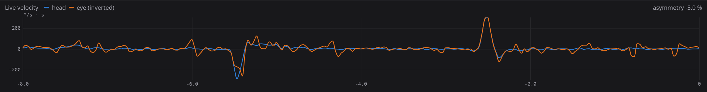

---

## 6. Reading the plots

This section needs no camera: you can load the **example impulses**, from a
synthetic patient with a healthy right canal and a left canal with a deficit.
They are loaded from **Learn › Reading the plots › Load example impulses**.


The examples go through the same engine as a measured impulse. They replace
the session, are marked **ex**, and the bar says **EXAMPLE k=…**. They go away
by themselves when the camera is turned on or with **Delete all**.

### The ruler on the plot

When the pointer moves over a panel, a vertical line marks the instant and a
label gives the head and eye velocity at that point.

**A click sets a reference.** From there, moving the pointer shows:

- **Δt** and the jump of each curve;
- the **area** of each curve over the span, shaded. It is the displacement:
  the degrees the head turned and the ones the eye moved;
- the **gain of the span**: the ratio of the two areas.

Another click releases the reference.

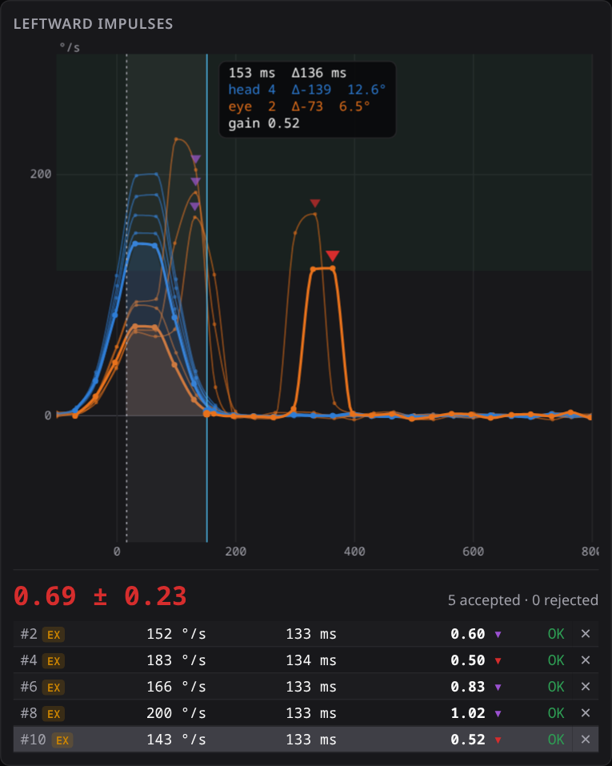

With a finger, on touch screens: one tap places the cursor, another sets the
reference, dragging sideways measures, and another tap releases it.

> Try measuring only the rise of the impulse and then the whole impulse: the
> gain changes with the span, and the engine uses only one.

### Looking at a single impulse

A click on a row of the list **highlights** that impulse in the panel. Hovering
over the row shows its other gains (at 60 ms, at the peak) and the settings it
was computed with. If it is rejected, the dashed red box with the reason
appears:

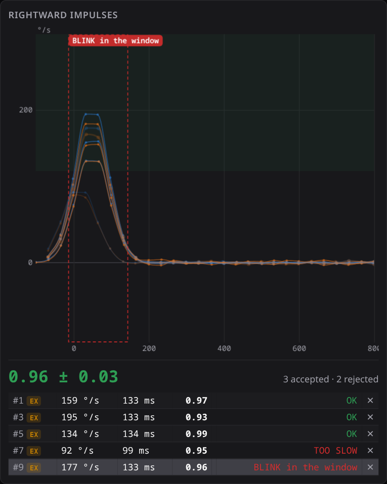

### The saccades

Each saccade has a triangle over its peak. The classification is the clinical
one (Weber et al., 2008):

- **Violet: covert.** It started while the head was still turning.
- **Red: overt.** It came after the turn.

In the list, the triangle column says the same impulse by impulse. The **up to
the saccade ≈** gain (in the row’s label) is the gain cut before the first
covert saccade, and it is usually quite a bit lower than the reported one.

### The asymmetry

Bottom right: **(right − left) / (right + left)**, in %. Zero is symmetric, and
the sign tells which side has the deficit: with the examples it is positive
because the left side is the weak one.

> **An asymmetry close to zero is not a normal result.** If both sides fail
> equally (bilateral deficit), the asymmetry is zero. Each mean has to be read
> on its own.

### The mean curve

In **Tools › Display › Mean curve per side**, each panel adds the mean of its
accepted impulses, as a thicker line. The noise goes away and the shape
remains.

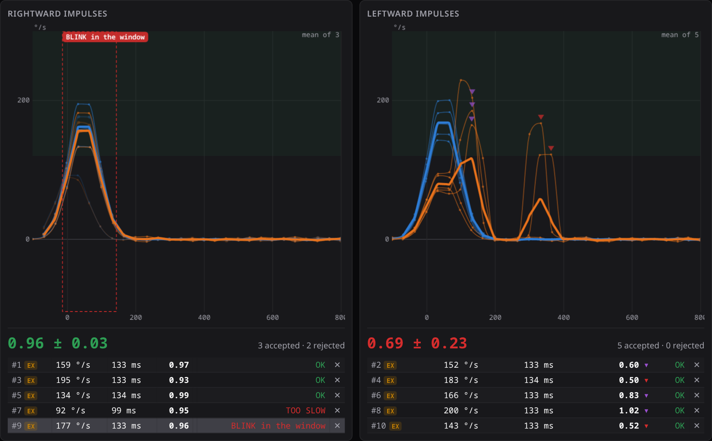

### Panel orientation

In **Tools › Display › Orientation**:

- **Compare sides** (default): both panels with the impulse pointing up and the
  eye inverted. With a normal reflex the curves cover each other, and what you
  read is the **gap** between them.
- **Real direction:** each impulse toward its own side (right up, left down)
  and the eye not inverted. It is the same thing, drawn as it happens.

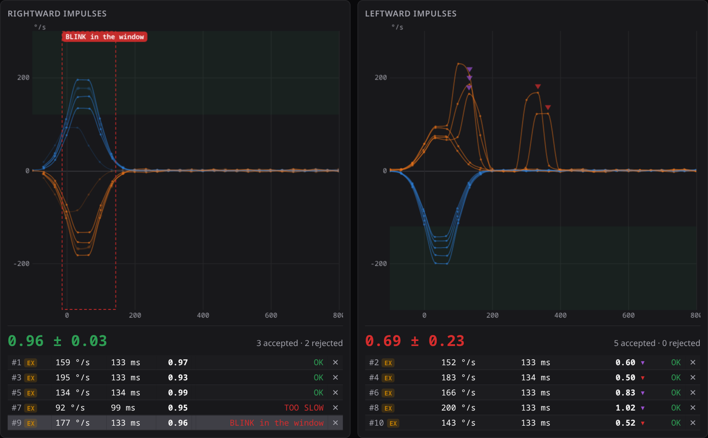

### Smoothing

**Smooth the traces** joins the samples with a monotone curve, which never
draws a peak higher than the one measured. Even so, it makes a 30 fps signal
**look** more precise; that is why, while it is on, the dots mark the real
samples. Turn it off to see how many samples an impulse really has.

---

## 7. Tools

**Tools** (or `H`) opens a drawer on the right with every step of the
computation in plain sight. Nothing inside is needed to measure: it is there
to understand.

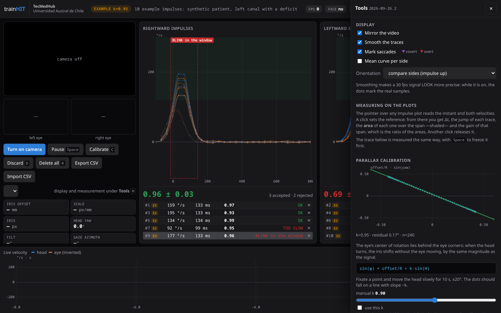

### Display

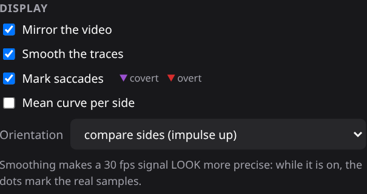

- **Mirror the video:** with the mirror on, the patient’s right eye appears on
  the right of the screen.
- **Smooth the traces**, **Mark saccades**, **Mean curve per side** and
  **Orientation:** see [section 6](#6-reading-the-plots).

### Parallax calibration

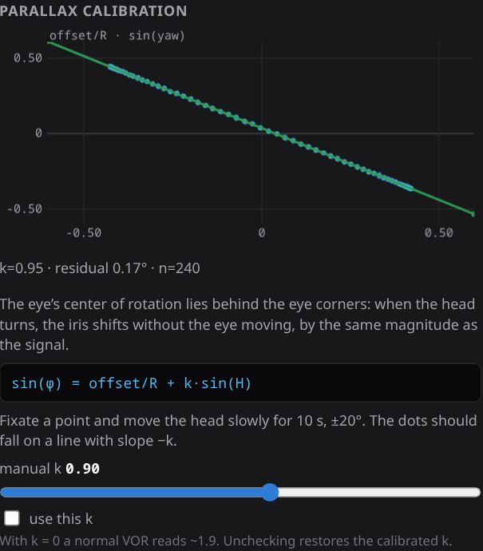

Each point is a frame of the calibration: the iris shift against the sine of
the head turn. If the patient held the gaze well, the points fall on a
**line** with slope −k. Seeing the line is the proof that what was measured is
parallax and not the gaze wandering.

**Manual k:** with the slider and **use this k** you can force a value of k.
The experiment that explains everything is setting **k = 0** and pressing
**Recompute**: the gains on the healthy side go to ~1.9. Nobody has a reflex of
1.9; what you see is the uncorrected parallax.

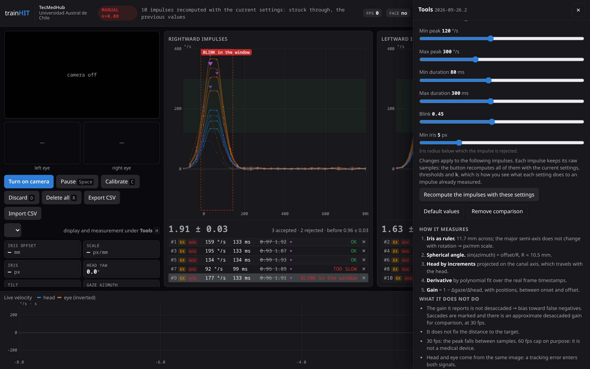

Unchecking **use this k** restores the calibrated k.

### Last impulse

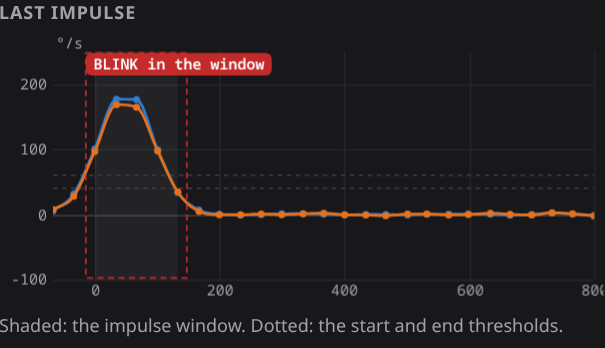

The selected impulse (or the last one), large. The **shading** is the impulse
window, the span over which the gain is computed. The dotted lines are the
start and end thresholds that bound it.

### Gain vs peak, and the methods

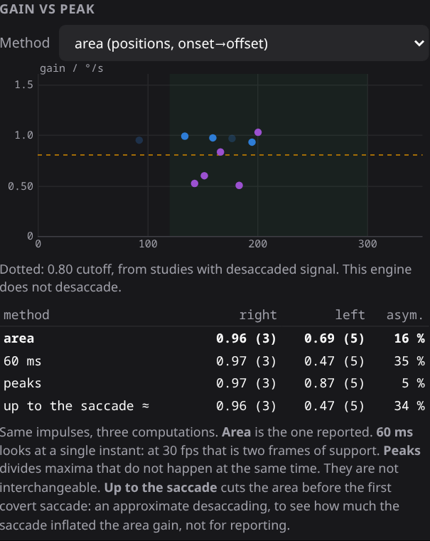

There is one point per impulse: the head’s peak velocity against the gain.
Blue for the right side, violet for the left; rejected ones are faded. A
healthy reflex gives a **flat, tight cloud**, because the gain does not depend
on how strong the impulse was.

The **Method** selector and the table show the same gains computed four ways:

| Method | What it computes |
|---|---|
| **Area** | How much the eye turned over how much the head turned during the whole impulse. **This is the one reported.** |
| **60 ms** | The ratio of velocities at a single instant. At 30 fps it rests on two frames. |
| **Peaks** | The eye’s maximum over the head’s maximum, even if they do not happen at the same time. |
| **Up to the saccade ≈** | The area cut before the first covert saccade: an approximate desaccading, for comparison, not for reporting. |

With the same impulses, the means and the asymmetry change with the method.
That is why **a gain without its method cannot be compared with another**
(Zamaro et al., 2020; Jacobsen et al., 2021).

After a **Recompute**, each old point is joined to the new one:

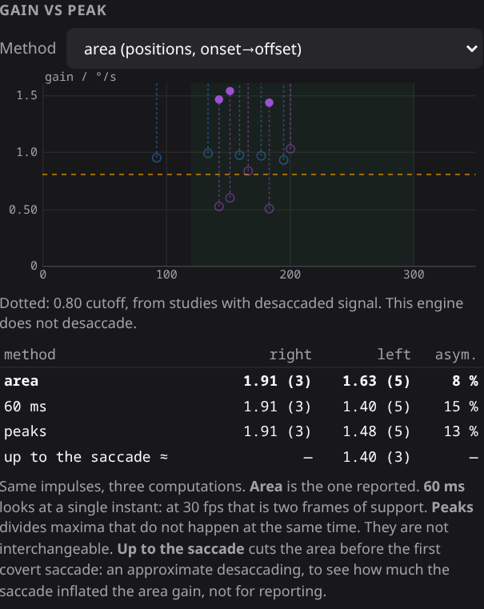

### How it measures, and references

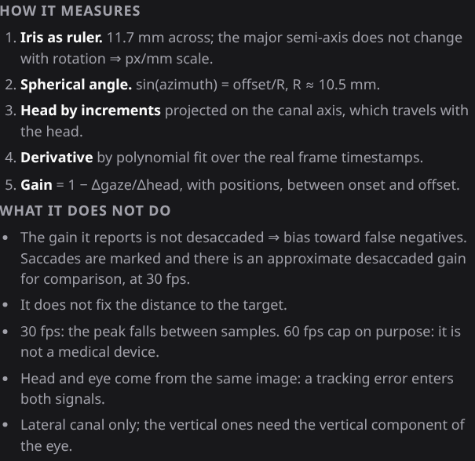

The engine’s five decisions:

1. the iris as a ruler: its horizontal diameter is ~11.7 mm, with little
   variation between people (Rüfer et al., 2005), and it gives the pixels per
   millimeter;
2. the spherical angle;
3. the head measured by increments, with the MediaPipe face mesh (Kartynnik et
   al., 2019; Ablavatski et al., 2020);
4. the derivative by polynomial fit (Savitzky & Golay, 1964);
5. the gain computed with positions.

Below are what the method does **not** do and the references for each number,
which are listed in full in [section 25](#25-references).

### For teachers

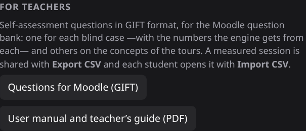

**Questions for Moodle (GIFT)** downloads a `.txt` file ready to import into a
Moodle question bank. It includes:

- one question for each blind case, with the numbers the engine gets from each
  one;
- a bank of concepts: parallax, saccades, false negatives, canals, asymmetry,
  calibration, rejections, a numerical question, a true/false and a matching
  question on the methods.

It comes out in the interface language.

Next to it, **User manual and teacher’s guide (PDF)** downloads this document,
also in the interface language.

---

## 8. The engine settings

They are at the bottom of the Tools drawer.

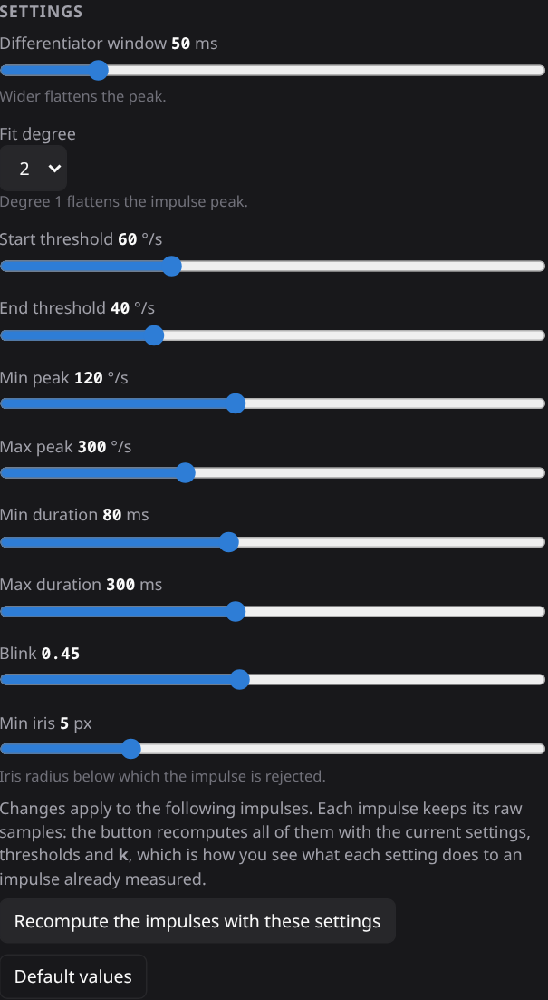

A changed setting applies to the **following** impulses. Each impulse keeps
its raw samples, so **Recompute the impulses with these settings** runs the
whole engine again over the impulses already there. After recomputing:

- the previous gain stays struck through next to the new one;
- the panels show the previous mean;
- **Remove comparison** clears the struck-through values.

While any setting is not at its factory value, the bar says **SETTINGS
CHANGED**: those impulses are not comparable with others. **Default values**
puts everything back.

| Setting | Default | What it does | To try |
|---|---|---|---|
| **Differentiator window** | 50 ms | Velocity comes from fitting a parabola to the samples in this window (Savitzky & Golay, 1964). Wider means less noise, but a flatter peak. | Set 200 ms and recompute: the peaks drop and several impulses become *TOO SLOW*. |
| **Fit degree** | 2 | 1 fits a line and flattens the peak; 3 also follows the noise. | Try it with the window at 50 and at 100 ms. |
| **Start / End threshold** | 60 / 40 °/s | Where the impulse starts and ends, that is, the window over which the gain is computed. | Move them and watch **Last impulse**. |
| **Min / Max peak** | 120 / 300 °/s | Criterion for accepting an impulse. It changes no gain; it decides which ones enter the mean. | Lower the minimum to 80: the slow example impulse becomes accepted. |
| **Min / Max duration** | 80 / 300 ms | Like the peak, but with duration. | — |
| **Blink** | 0.45 | How closed the eye has to be (0 open, 1 closed) to count as a blink. | Raise it to 0.90: the impulse with a blink becomes accepted, with a gain computed with the eye closed. |
| **Min iris** | 5 px | Iris radius below which the impulse is rejected. | — |

> The method is to move **one** setting, recompute, look at what changed and
> put it back.

---

## 9. Learn: the guided tours

**Learn** (in the bar, or `T`) opens a menu of short guided tours. They can be
taken in any order; if it is your first time, from top to bottom. A ✓ marks the
finished tours.

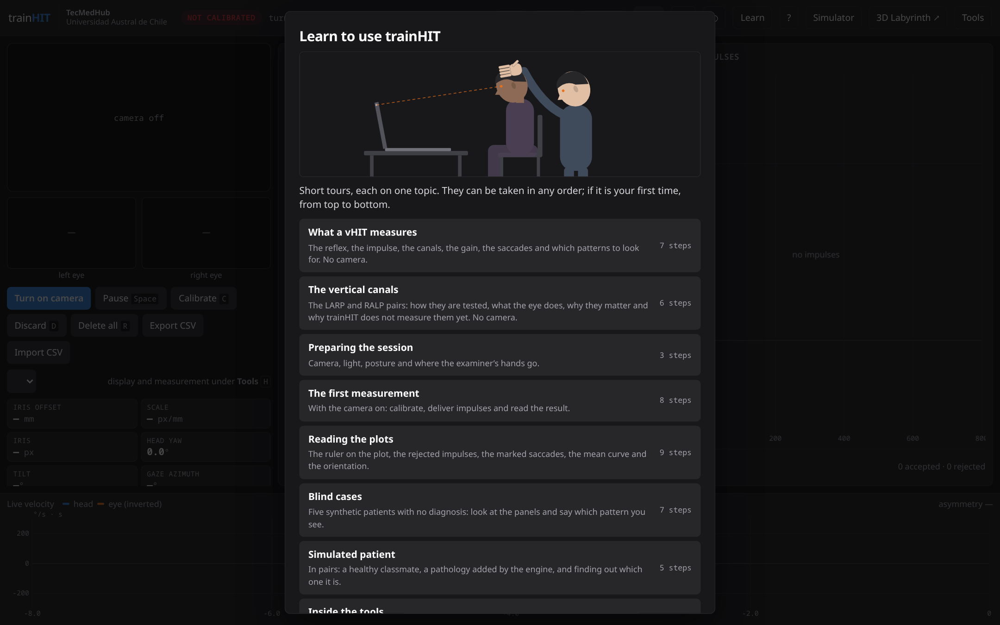

| Tour | What it covers | Camera? |
|---|---|---|
| **What a vHIT measures** | The reflex, the impulse, the six canals, the gain, the saccades, the patterns to look for and the limits. | No |
| **The vertical canals** | The LARP and RALP pairs: how they are tested, what the eye does, why they matter and why the webcam cannot measure them and the phone can. | No |
| **Preparing the session** | Camera, light, posture and the examiner’s hands. | No |
| **The first measurement** | Calibrating, delivering impulses, reading panels and list, CSV. | Yes |
| **Reading the plots** | The ruler, rejected impulses, saccades, asymmetry, mean curve, smoothing, orientation and pause. | No (uses examples) |
| **Blind cases** | Five synthetic patients with no diagnosis. | No |
| **Simulated patient** | In pairs, a pathology added by the engine. | Yes |
| **Inside the tools** | The parallax line, the last impulse, the cloud, the methods and the manual k. | No (uses examples) |
| **The engine settings** | Each setting, tried with Recompute. | No (uses examples) |

Reading cards appear in the center with the background darkened:

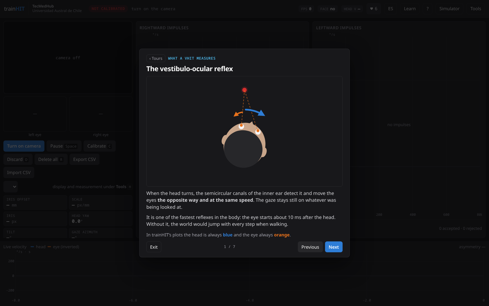

The other cards light up the part of the screen they talk about and leave the
page usable, because what is pointed at has to be clickable. Some steps wait
for something (the face, a calibration, impulses, a recompute), but waiting
never blocks: the button says **Skip** until the condition is met.

---

## 10. Blind cases

Five synthetic patients, each with a letter and **without saying what they
have**. They are loaded from **Learn › Blind cases**. You look at the panels
and choose the pattern from a list, which is the same for every case: if each
case brought its own options, the list would give the answer away.

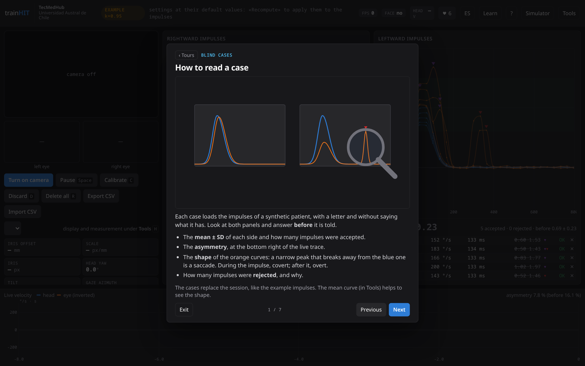

What to look at:

- the **mean ± SD** on each side and how many impulses were accepted;
- the **asymmetry**;
- the **shape** of the orange curves: a narrow peak that pulls away from the
  blue one is a saccade;
- how many impulses were **rejected**, and why.

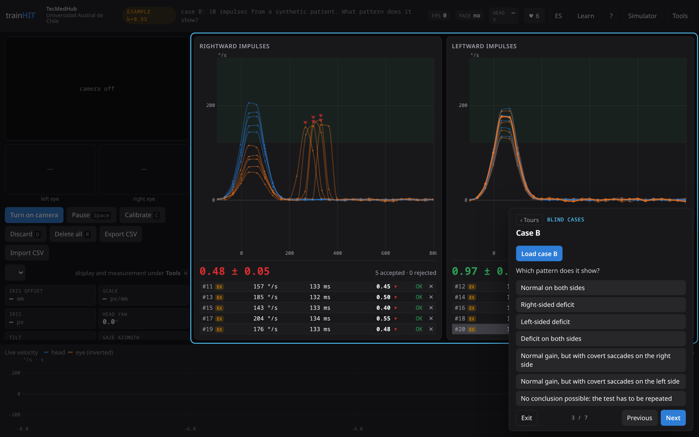

A wrong answer shows a hint and you can try again. A right answer shows the
explanation:

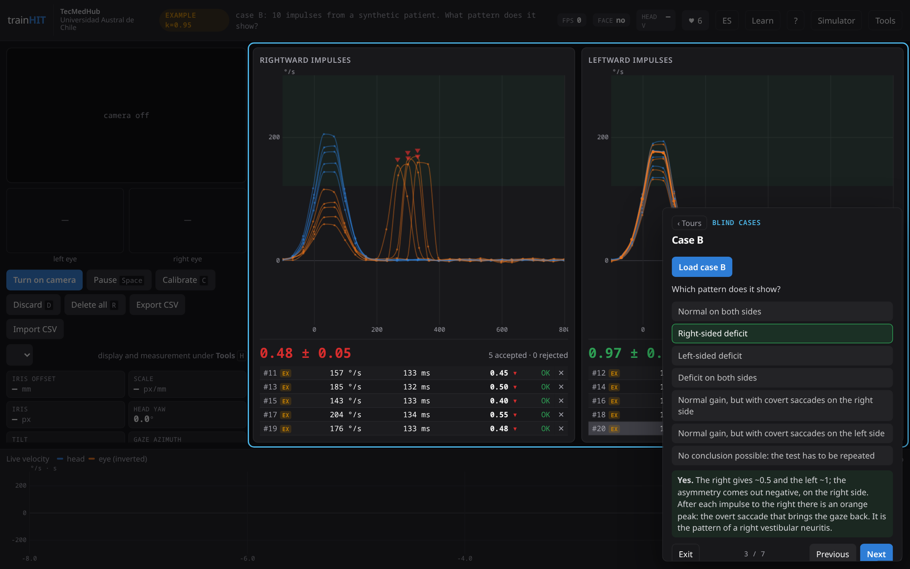

| Case | What it teaches |
|---|---|
| A | The reference: what normal looks like. |
| B | The textbook neuritis, and the sign of the asymmetry. |
| C | An asymmetry of zero is not a normal result. |
| D | A normal mean (even >1!) can hide a deficit with covert saccades: the false negative. |
| E | Without enough accepted impulses no conclusion is drawn: the test is repeated. |

---

## 11. Simulated patient

The **Simulator** (in the bar, or `S`) puts a pathology on top of **real**
impulses. A healthy classmate plays the patient and the student delivers real
impulses, with their own technique, rebounds and hands on the face. The engine
adds the deficit: the gaze is dragged along with the head in whatever the
reflex does not compensate, and saccades bring it back. You practice
**examining and reading at the same time**.

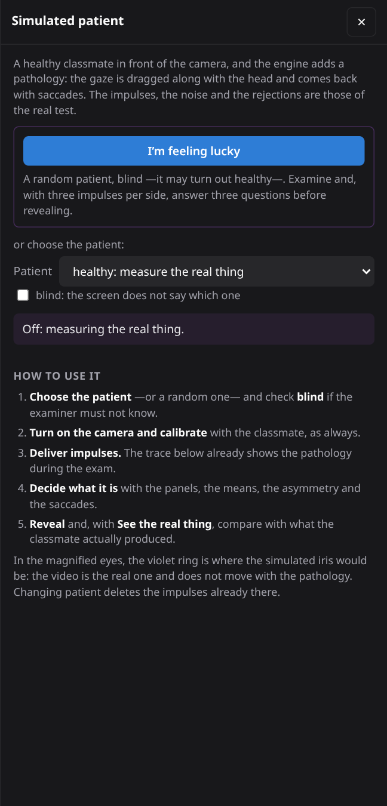

| Profile | What it adds |
|---|---|
| Right / left vestibular neuritis | Gain 0.35–0.55 on that side, with overt saccades. |
| Right / left compensated deficit | Gain 0.40–0.55 with clustered covert saccades: **it reads normal**. |
| Bilateral vestibulopathy | Both sides 0.30–0.50, with overt saccades. |
| No pathology (control) | Nothing: the impulses are marked as simulated, but they are the real ones. |

### I’m feeling lucky

The whole practice in one click.

**1.** Turn on the camera and **calibrate** with the classmate, as always.

**2.** Open **Simulator** and press **I’m feeling lucky**. A patient is drawn
at random (the healthy control included) and stays **blind**.

**3.** The drawer **closes** to leave both panels in view. In the bar, next to
**SIMULATED**, a counter keeps track of the accepted impulses on each side.
Clicking the counter opens the drawer again.

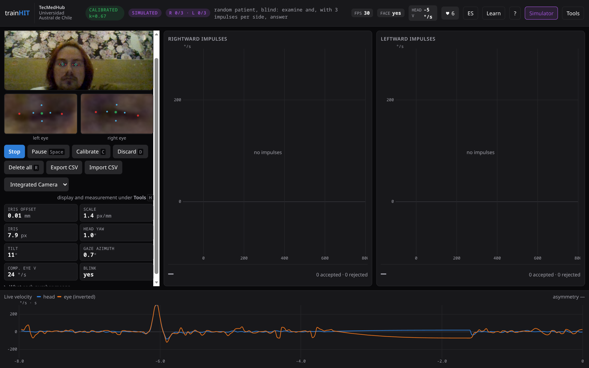


**4.** Deliver impulses. The trace below already shows the pathology during
the exam. In the magnified eyes, a **violet ring** marks where the simulated
iris would be. The video is the real one and does not move.

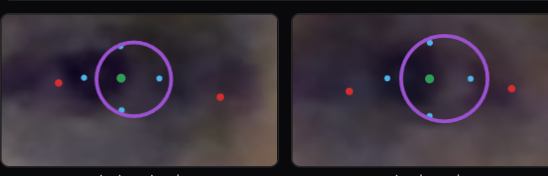

**5.** With **three accepted impulses per side** the drawer opens by itself and
**I know what it has** becomes available.

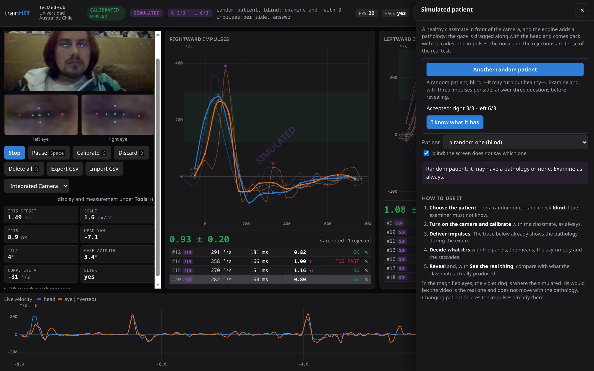

**6.** Three questions appear in the order of clinical reasoning: which side is
affected, which saccades appear and which pattern it shows.

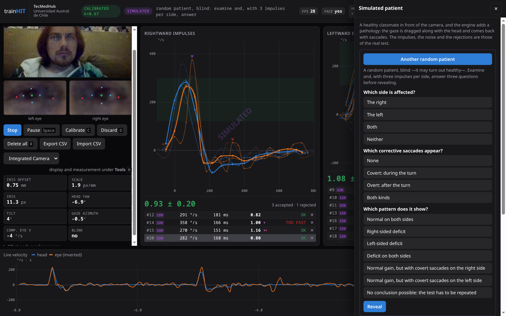

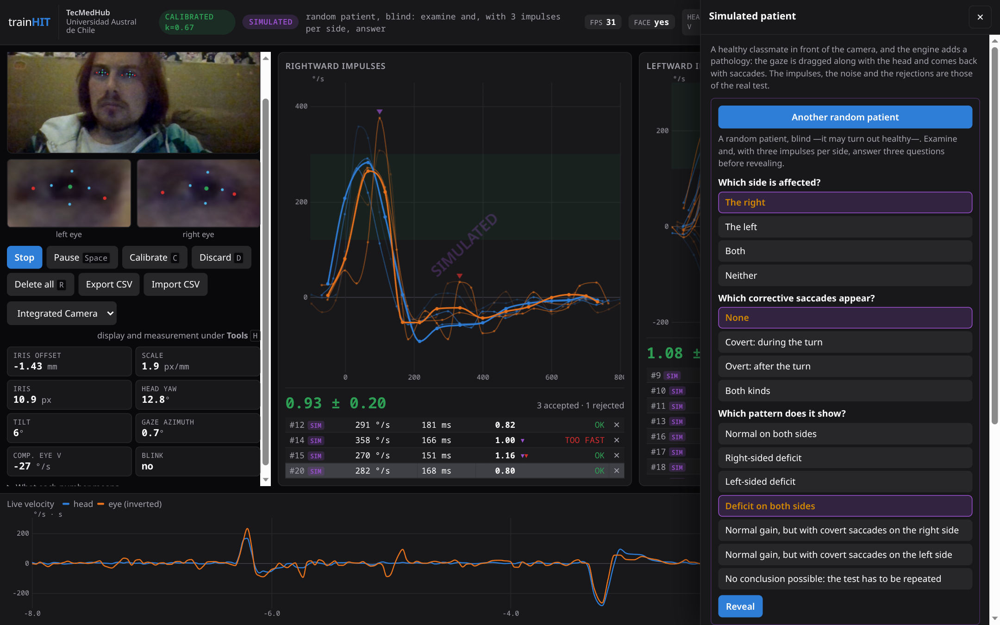

**7.** **Reveal** grades each question: green for the right answer, red for the
chosen one if it was wrong. It also gives the score and says which profile it
was.

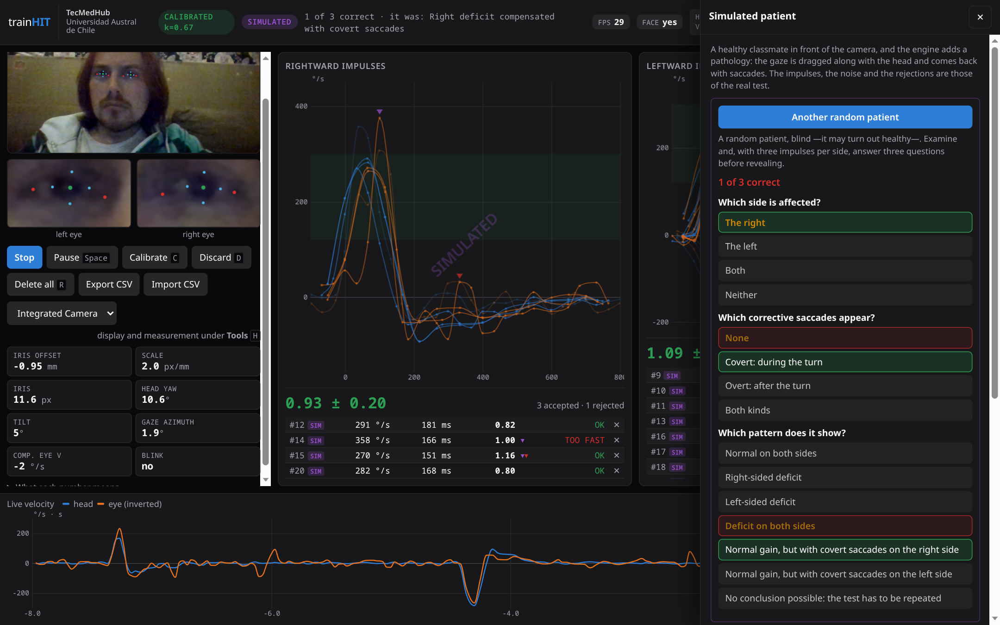

**8.** **See the real thing** recomputes each impulse without the pathology:
what the classmate actually produced, with the simulated values struck through
next to it. The plots then say **NOT SIMULATED**.

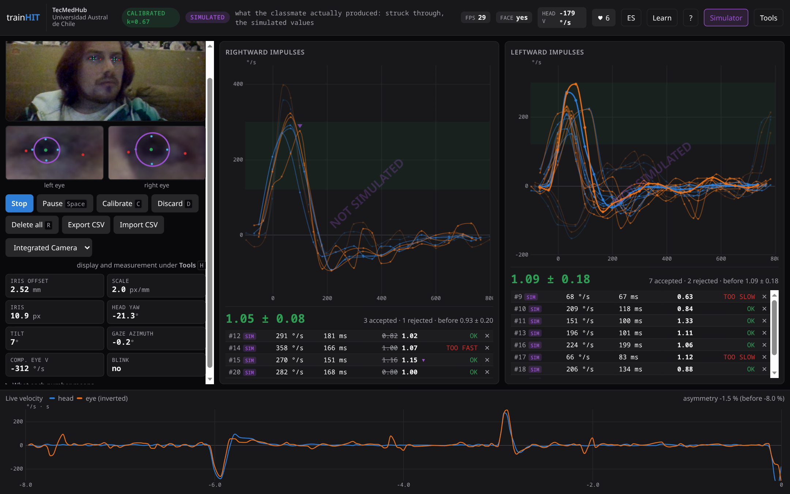

**Another random patient** starts over.

### Choosing the patient by hand

Outside the practice, whoever plays the teacher can choose the profile under
**Patient** and check **blind**. The selector then hides and the screen does
not say which one it is. **Reveal** shows it at the end.

### The simulated never passes as real

- The bar says **SIMULATED**.
- Every impulse carries the **sim** mark.
- The plots carry a watermark, so a screenshot carries it too.
- The CSV has a `simulado` column (`oculto` while blind).
- **Changing the patient deletes the impulses:** mixing two patients would
  give a mean that belongs to nobody.

### No camera: the phone as the head

With **Phone** (next to **Turn on camera**) you can practice without a webcam
and without a classmate. The phone acts as the patient’s head: its gyroscope
gives the turn, and a **drawn face** that turns with it appears in the camera
box. The eye comes from the model: healthy, with the gaze still on the target,
or with the pathology chosen in the Simulator. Everything else —the trace, the
impulses, the gains, the settings and **I’m feeling lucky**— works as with the
camera.

**1.** On the PC, press **Phone** and then **Show the QR**.

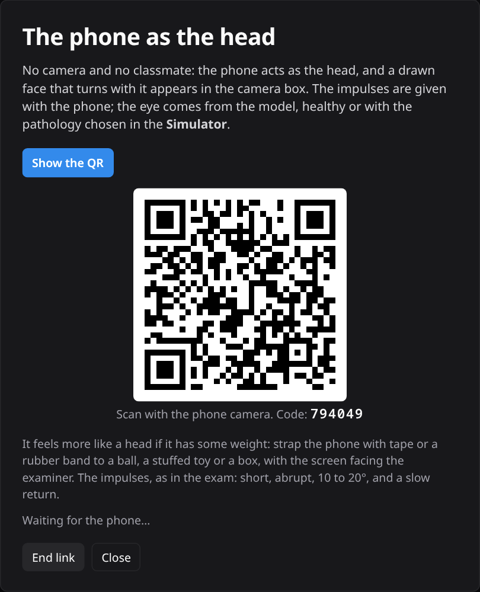

**2.** Scan the QR with the phone camera and tap **Use this phone as the
head**. The phone screen is the patient’s face and it looks at the examiner:
turning the phone to the examiner’s right turns the head to the patient’s left.

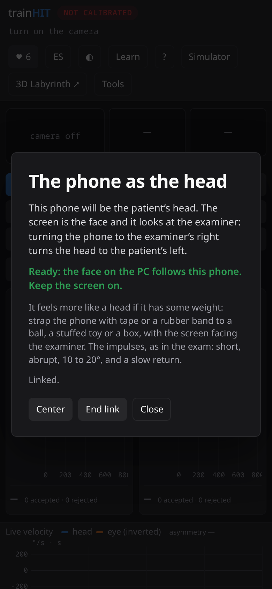

**3.** On the PC, the bar says **PHONE LINKED** and the calibration badge
**PHONE k=0.95**: no calibration is needed, because the parallax of the drawn
face is known. **Center** takes the current position as straight ahead.

**4.** Give impulses with the phone as with a head: short, abrupt, 10 to 20°,
and a slow return. Most realistic is strapping it to a classmate’s forehead
(see [section 12](#12-the-phone-on-the-head)); otherwise it feels better with the phone strapped with tape or a
rubber band to something with weight —a ball, a stuffed toy, a box—, with the
screen facing the examiner.

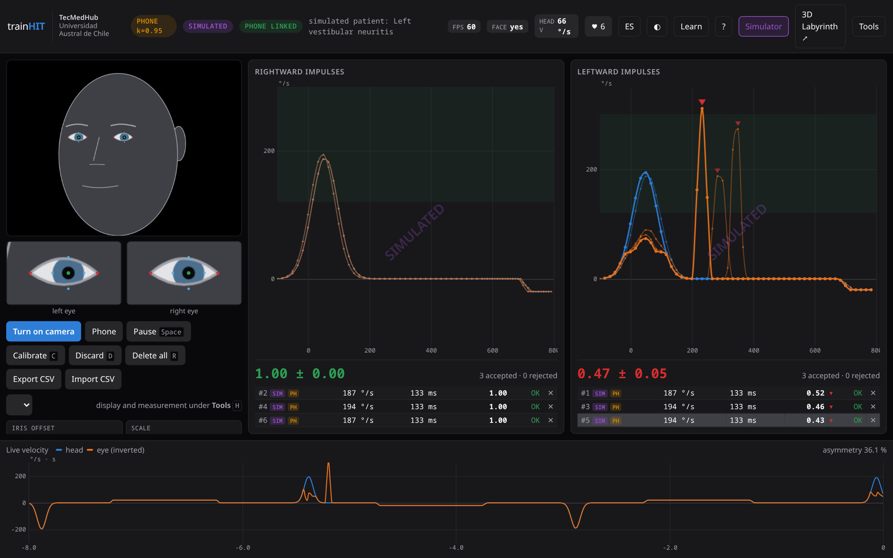

The face shows what an exam shows: with a healthy reflex the iris keeps looking
ahead while the head turns; with a deficit it goes along with the head, and a
saccade brings it back.

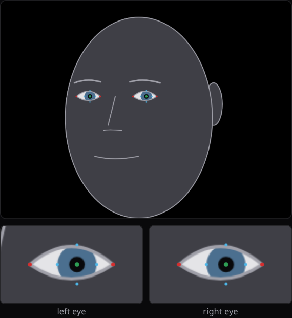

- Phone impulses carry the **ph** mark and are deleted when the camera is turned
  on: they are not mixed with measured impulses.
- The link goes through the Labyrinthus 3D server only to introduce the two
  devices; the gyroscope goes straight to the PC. If the network does not let
  them connect directly, it goes through the server and the bar says so
  (**VIA THE SERVER**).
- The phone needs a gyroscope and permission to read its sensors.

### The vertical canals, with the phone on the head

The webcam cannot measure the vertical canals (the eyelid covers the iris when
looking up and down), but with the phone the model places the eye: all **six
canals** can be practised. The phone is strapped to a classmate’s forehead, in
landscape with the screen facing forward: [section
12](#12-the-phone-on-the-head) explains how to strap it with household items
and how to do each manoeuvre. It also comes on its own, as a short guide to
print (`trainhit-sujecion-en.pdf`, linked in the phone dialog).

With the phone linked, the selector **Lateral · LARP · RALP** appears next to
the buttons. Below it says how to place the head, and next to it how far the
head is turned right now, green when it is where the plane asks:

| Plane | Head | Nose down | Nose up |
|---|---|---|---|
| **LARP** | turned 45° to the right | left anterior | right posterior |
| **RALP** | turned 45° to the left | right anterior | left posterior |

The panels change their titles with the plane, and the means, the list and the
cloud show only the impulses of the chosen plane. An impulse more than 30° off
the plane is rejected: **OFF THE PLANE**.

Below the guide, the **six-canal summary**: the head seen from above, nose up
and the right ear on the right, and in each canal the mean gain and how many
impulses give it. Green if it reaches the cut-off of its plane —0.8 in the
lateral, 0.7 in the vertical ones, which normally give somewhat less—, red if
not, grey with no impulses. The blue line is the plane being examined; a click
on a canal chooses its plane.

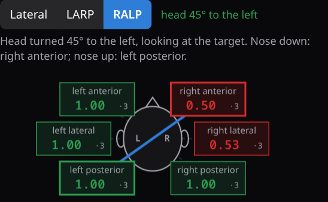

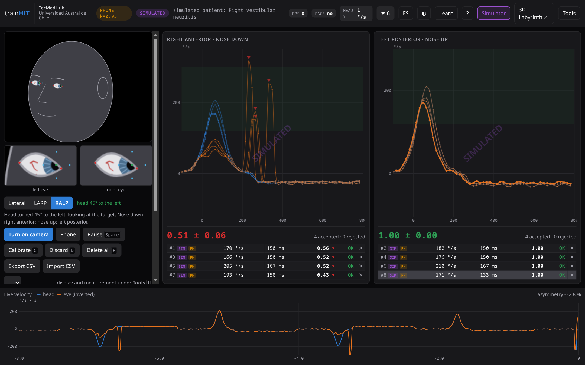

The drawn face turns with the phone’s whole orientation, and the compensating
eye turns about the axis of the canal. The iris has fibres and a crypt, and the
sclera has vessels: you can see whether the eye **rolls** (torsion). With the
head at 45° the eye moves almost only vertically; with the head facing forward,
the same turn is half torsion.

In the vertical planes the Simulator profiles follow the anatomy: common
neuritis (the superior branch of the nerve) also affects the **anterior** canal
on the same side and spares the **posterior**; bilateral vestibulopathy affects
all six. **Inferior neuritis**, right or left, affects only the posterior: the
lateral canals look normal and with the webcam it would pass as healthy, so it
only appears with the phone.

With the phone, **I’m feeling lucky** covers the six canals: it asks for three
accepted impulses in each canal —the bar counts the canals ready— and asks
which lateral canal and which vertical ones are affected and which saccades
appear.

---

## 12. The phone on the head

With the phone strapped to a classmate’s head, the impulses are real: the
weight of the head, the neck that brakes and the hands that slip. trainHIT
reads the turn from the phone’s gyroscope, draws the face on the computer and
places the eye with its model, healthy or with the pathology chosen in the
**Simulator**. This way the **vertical canals** can be practised too, which
the webcam cannot measure.

> **This is training, not an exam.** The face and the eye are simulated: what
> is measured is the examiner’s technique. Not for use with patients. Small
> impulses (10 to 20°), and never on someone with neck pain or a neck injury.

### Where the phone goes

**On the forehead, in landscape, with the screen facing forward** and the back
of the phone against the skin, above the eyebrows. That way the app works out
by itself which way the nose points.

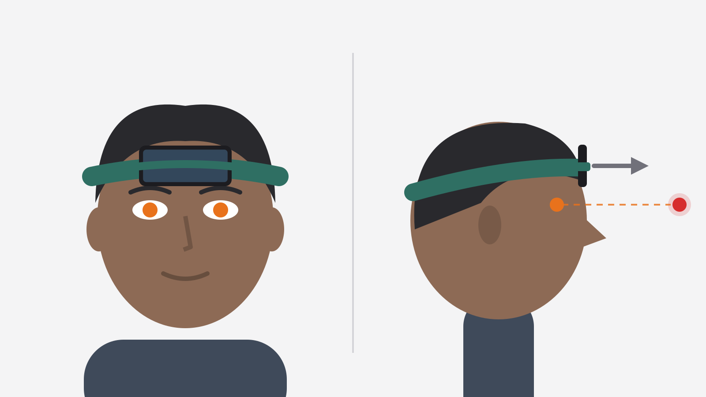

What matters:

- **It must not wobble.** If the phone moves on the skin, it adds turns the
  head never made and the impulse comes out with a rebound or off the plane. A
  piece of non-slip kitchen mat (the rubber mesh) between forehead and phone
  helps a lot.
- **It must not cover the eyes** or the eyebrows: above them.
- **Firm but not tight.** A phone weighs about 200 g: a well-placed band is
  enough.
- **Screen on.** trainHIT asks the phone not to sleep while the link lasts;
  a charged battery helps.

### Home-made ways to hold it

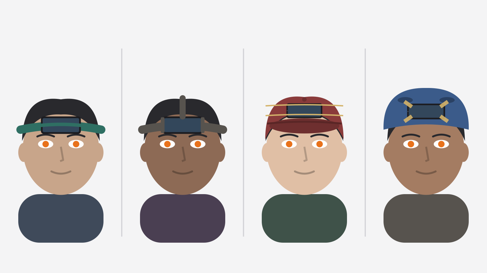

| With | How | Watch out |
|---|---|---|
| **Wide elastic band** (sports or hair band, 4 to 6 cm) | The phone between the band and the forehead; if long, a second turn over it. | Narrow bands let it rotate: wide is better. |
| **Head-torch harness** | Remove the torch; the holder grips the phone. The top strap stops it sliding down. | The steadiest option. |
| **Sewing elastic** (60 cm × 3 cm, sewn into a ring) | Adjust it to the head; a fabric pocket for the phone can be sewn on. | Cheap and washable: lasts a whole course. |
| **Tight cap + two rubber bands** | The phone on the front of the cap, with two rubber (or hair) bands around it. | A loose cap slips: tighten it at the back. |
| **Bike helmet + velcro or tape** | The phone stuck to the front of the helmet, strap well fastened. | Tape on the case, not on the phone. |
| **Elastic bandage** (first-aid kit) | Two or three turns around the head over the phone. | Not tight: a head is not an ankle. |

**The test before starting:** with the head still, push the phone sideways
with a finger. If it moves on the skin, adjust or change the mount.

### Link and center

1. On the computer, press **Phone** and **Show the QR**.
2. Scan the QR with the phone and tap **Use this phone as the head** *before*
   strapping it on: the sensor permission needs a tap.
3. Strap the phone to the forehead.
4. With the head straight and looking at the target (the computer’s camera or
   a spot on the wall), press **Center** on the computer. That is “facing
   forward”.

### Examining each plane

With the phone linked, the computer shows the selector **Lateral · LARP ·
RALP**. Below it says how to place the head, and next to it how far the head
is turned right now: **green** when it is where the plane asks.

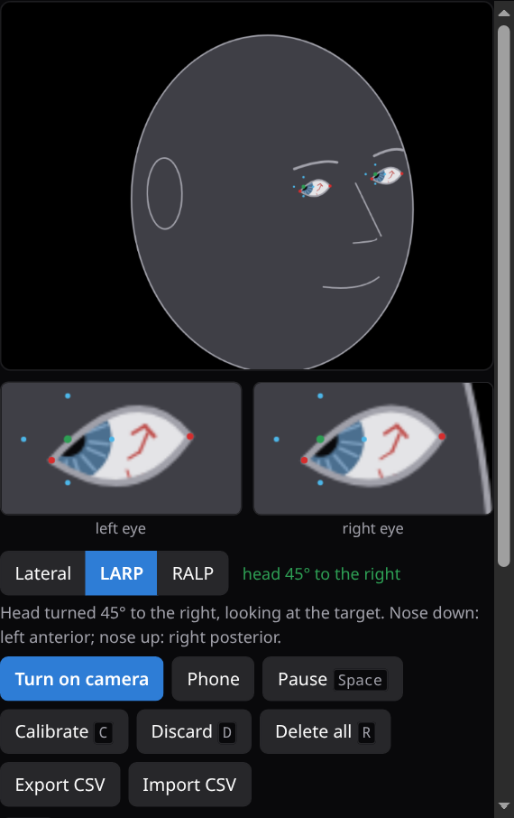

| Plane | Head | Impulse | Canal |
|---|---|---|---|
| **Lateral** | facing forward, tilted slightly down | sideways, right / left | right / left lateral |
| **LARP** | turned 45° to the **right**, eyes on the target | nose down | left anterior |
| | | nose up | right posterior |
| **RALP** | turned 45° to the **left**, eyes on the target | nose down | right anterior |
| | | nose up | left posterior |

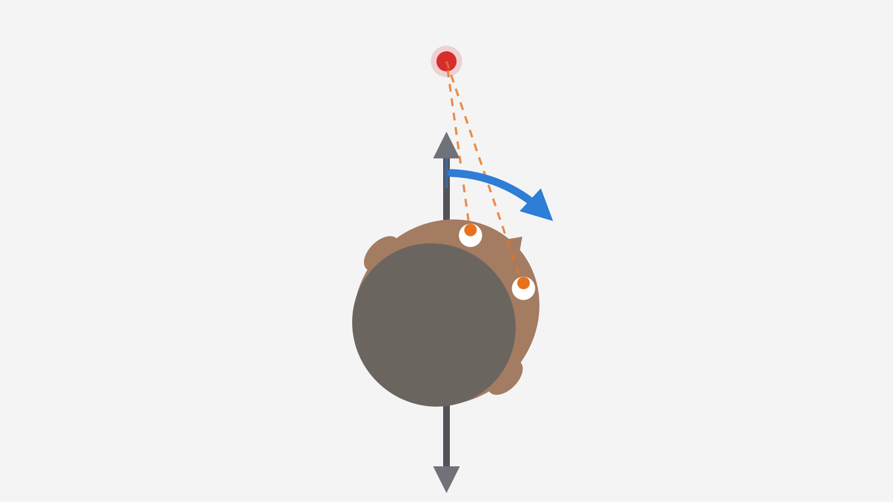

In the vertical planes the impulse is a **pitch** —the nose goes down or up—
with the head already turned 45°. As always: short, abrupt, 10 to 20°, and a
slow return. Hands on top of the head and under the chin, away from the phone.

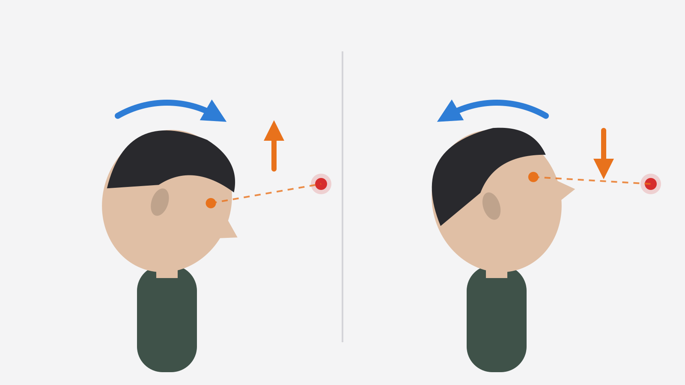

If the impulse strays more than 30° from the plane —for example, pitching with
the head facing forward in LARP— the impulse is rejected: **OFF THE PLANE**.

Below the guide, the **six-canal summary** puts it all together: the head from
above with the mean gain of each canal, green or red according to the cut-off
of its plane. A click on a canal goes to its plane.


### What to look at in the face

The iris has fibres and a dark crypt, and the sclera has vessels: with them
you can see whether the eye **rolls** (torsion). With the head at 45° and the
gaze in the plane of the canal, the compensating eye moves almost only up or
down. With the head facing forward, the same turn would be half torsion: that
is why the head is turned.

With a **Simulator** profile on, the affected canal shows the low gain and the
saccades. Common vestibular neuritis affects the lateral and the anterior
canal of one ear and spares the posterior; the **inferior** one affects only
the posterior, and the lateral canals look normal. **I’m feeling lucky** draws
a patient and asks for all six canals before answering.

### If something goes wrong

| You see | What to do |
|---|---|
| Nose down lands in the “nose up” panel | The screen faces the skin: turn the phone round and **Center**. |
| The drawn face tilts sideways when the head pitches | The phone is on the side of the head: move it to the forehead and **Center**. |
| Many **REBOUND** or **OFF THE PLANE** | The phone wobbles: adjust the mount or add non-slip mat. |
| The guide never turns green | **Center** with the head looking at the target, and only then turn it 45°. |
| The computer says **RECONNECTING** | The phone slept or lost wifi: it reconnects by itself when woken. |

---

## 13. Saving and sharing data

### Export CSV

**Export CSV** downloads a file with the whole session:

- one impulse per row, with its gain and the settings it was computed with;
- one sample per row, to redo the computations in a spreadsheet;
- the raw frames.

The CSV always stays in Spanish, because it is a data format.

### Import CSV

**Import CSV** opens that file on another computer or another day and
**recomputes each impulse from the raw data**. It is useful to hand out a
measured case and have each student look at it with their own settings. The
imported session replaces the current one, and the bar shows that the
calibration is the file’s.

### The «like»

The **♥** in the bar adds a vote to a public, anonymous counter. Neither the
video, nor the measurements, nor anything from the session is sent. One vote
per browser.

---

## 14. Language, theme, small screens and offline use

### Language

trainHIT comes in **Spanish and English**. It starts in Spanish if the browser
is in Spanish, in any variant, and in English if it is in any other language;
the browser usually takes the operating system’s language. The one given in the
address (`?lang=en`, handy for a course link) and the one chosen last time come
first. The **EN** / **ES** button in the bar switches language live, without
reloading and without losing the session.

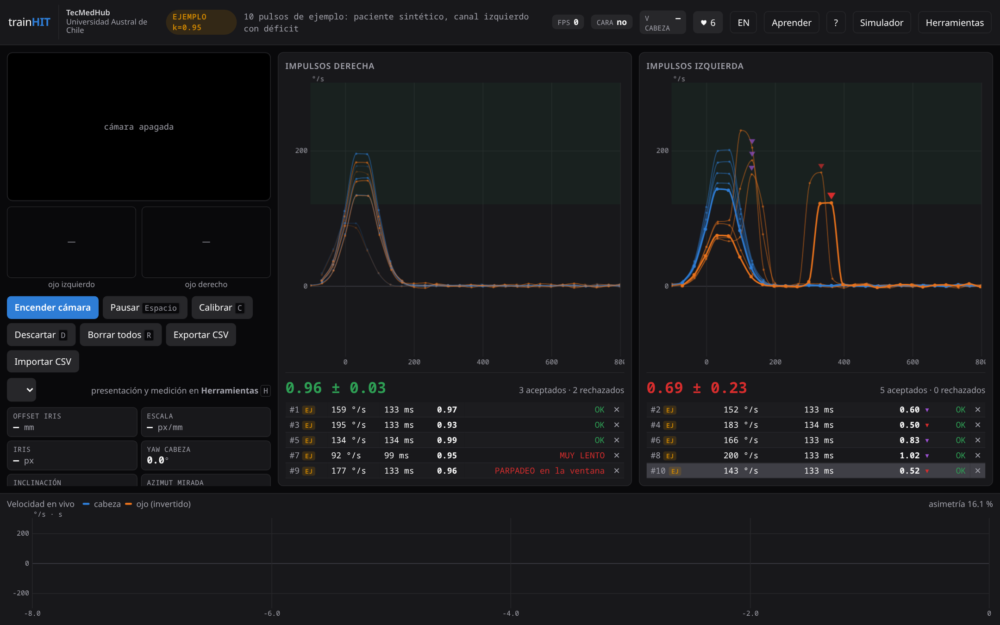

### Light or dark theme

The theme button, in the bar next to the language one, cycles through three
options:

| Button | Theme |
|---|---|
| **◐** | **Automatic:** the operating system’s. If the system switches on its own —night mode turning on at dusk—, the page switches with it. This is the default. |
| **☀** | **Light**, always: for projecting in a lit room. |
| **☾** | **Dark**, always. |

The button shows the theme it is in, not the next one. The choice is saved in
the browser. The clinical colors —blue head, orange eye, the saccades— are the
same in both themes, and the video and magnified eyes stay on a black
background, because they are images.

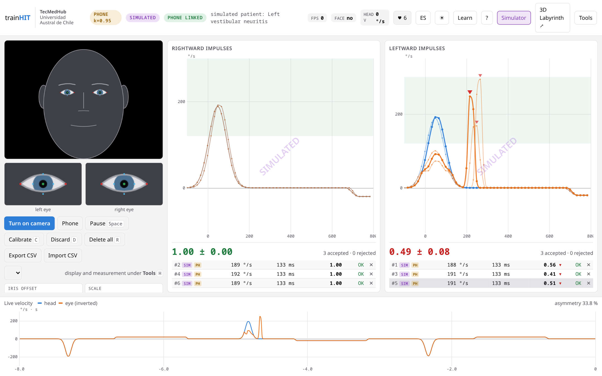

### Small screens

On a phone, the camera becomes a small box with the eyes beside it. With the
phone sideways, the screen goes back to two columns.

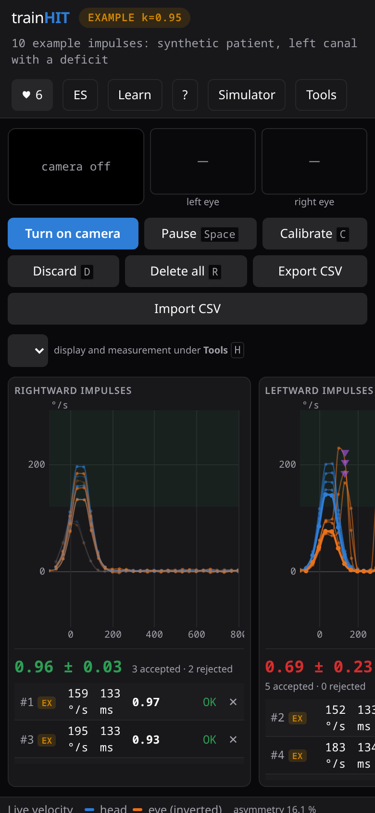

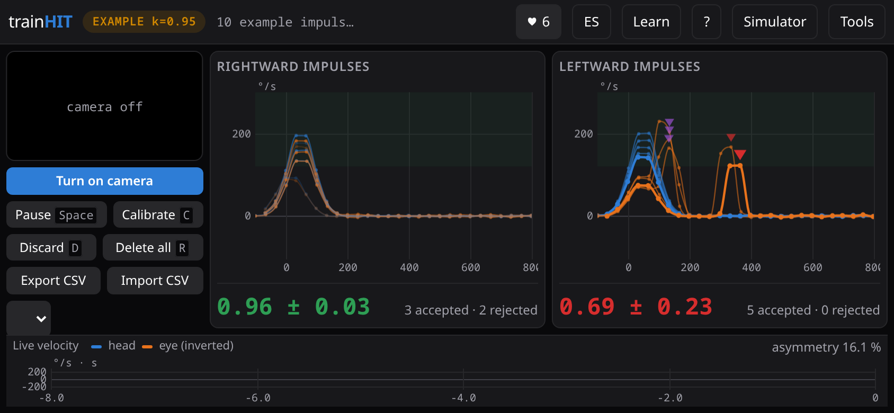

### Offline

After the first load, the page and the tracking model stay stored in the
browser, and trainHIT opens and measures **without a connection**. It is meant
for the classroom, where the wifi fails.

---

## 15. Keyboard shortcuts

| Key | What it does |
|---|---|
| `C` | Calibrate the parallax (10 s). |
| `Space` or `P` | Pause and freeze the trace below (the camera stays on). |
| `D` | Discard the last impulse. |
| `Z` | Bring back the last discarded one. |
| `R` | Delete all impulses. |
| `H` | Open or close Tools. |
| `S` | Open or close the Simulator. |
| `T` | Open or close «Learn». |

---

## 16. Troubleshooting

| Problem | Likely cause and fix |
|---|---|
| The camera does not turn on | The browser has no permission: grant it from the padlock in the address bar. If `index.html` was opened with a double click, a server is needed (see [section 2](#2-before-you-start)). |
| **FACE no** | Little light, light from behind or face out of the frame. Put the light in front and center the face. |
| **30 FPS CAP** shows up in the bar | The camera can deliver more than 30 frames per second and trainHIT uses 30. Nothing needs to be done (see «Why 30 frames per second», [section 1](#1-what-trainhit-is)). |
| Very low **FPS** (under 20) | The computer is struggling. Close other tabs and programs using the camera or the GPU. |
| The calibration is rejected | Turn more slowly, without taking the eyes off the red dot, with a ±20° arc. |
| Every impulse *TOO SLOW* | The impulses have to be faster: a short, sharp turn. |
| Many *FACE LOST* | The hands cover eyebrows or cheekbones: hold the head higher. |
| *IRIS TOO SMALL* | The patient is far away or the camera has low resolution. Move closer. |
| Gains around 1.9 | Calibration is missing (the bar says **NOT CALIBRATED**), or **manual k** was left at 0. |
| Gains above 1 | A covert saccade inside the impulse inflates the gain (see case D). It also happens with impulses the patients make themselves. |
| The phone does not link | Both devices need internet to introduce themselves. If the bar stays at **WAITING FOR THE PHONE…**, try with both on the same wifi network, or with the PC connected to the phone hotspot. |
| The bar says **SETTINGS CHANGED** | Some settings are off their factory value. Tools › **Default values**. |

---

## 17. What for and for whom

This second part gathers **ideas for using trainHIT in class**. It is not a
closed program: they are activities, sequences and rubrics that each teacher
can adapt to the course, the time available and the equipment at hand.

### For whom

Students in health programs that cover the **vestibular system** and its
assessment: speech and hearing sciences, medical technology, medicine,
physiotherapy and nursing. It also works in workshops and lab visits, to show
how a clinical number comes out of an image.

### What it adds compared with a clinical device

A clinical vHIT gives the gain and the saccades, but does not show how they
were computed. trainHIT does, and that makes it possible to teach three things
that stay a black box with a closed device:

- **How it is measured:** from the video to the eye angle, from there to the
  velocity and from there to the gain, with every step in view.
- **Why the number can mislead:** parallax, covert saccades, the computation
  method and the acceptance criteria all change the result.
- **How the exam is done:** the examiner’s technique decides whether there are
  impulses to read, and that shows in the rejections.

### What the room needs

- **A computer with a webcam per group** of 2 or 3 students. Without a camera
  you can still do the tours, the blind cases and the settings.
- **A projector** for demonstrations and discussion.
- **Network only the first time.** Open the page on each computer before
  class: after that it works offline.
- **A chair without wheels** for the patient, with room behind it for the
  examiner.

---

## 18. Learning outcomes

After the activities, the student is expected to be able to:

1. **Explain** the vestibulo-ocular reflex and why the head impulse tests a
   semicircular canal.
2. **Perform** a head impulse with proper technique: amplitude, velocity,
   unpredictability and hand position.
3. **Interpret** the plots of a vHIT: gain per side, asymmetry, covert and
   overt saccades, and rejected impulses.
4. **Recognize** the normal, unilateral deficit and bilateral deficit
   patterns, and the deficit hidden by covert saccades.
5. **Justify** why a gain depends on the calibration, the computation method
   and the acceptance criteria.
6. **Recognize the limits** of a measurement: when no conclusion can be drawn
   and why this tool cannot be used to diagnose.

---

## 19. Suggested class sequences

### A 90-minute practical session

For a course that has already covered the physiology of the VOR in theory.

| Time | Activity | With | Output |
|---|---|---|---|
| 0–15 min | Framing: what a vHIT measures and what it does not | **What a vHIT measures** tour, projected | Open questions from the class |
| 15–30 min | Preparing the session and calibrating | **Preparing the session** and **The first measurement** tours | Each group with an accepted calibration |
| 30–50 min | Blind cases | **Blind cases** tour, in groups | Each group’s answer to each case |
| 50–80 min | Simulated patient in pairs | **Simulator › I’m feeling lucky**, rotating roles | Practice score and technique rubric |
| 80–90 min | Wrap-up | Discussion of case D and of the limits | One idea each student takes away |

### A 45-minute session, no camera

For a lecture with a projector, or when there are no webcams.

1. **10 min:** the **What a vHIT measures** tour.
2. **15 min:** **Blind cases** A to E, with a show of hands before revealing
   each one.
3. **15 min:** the parallax experiment (activity 19.2) and the three methods
   (activity 19.6).
4. **5 min:** wrap-up with the question “why does case D read normal?”.

With a phone at hand, step 3 can be hands-on: the phone as the head (section
11) with a Simulator profile, projected for the whole class.

### A lab in two sessions

- **Session 1, technique.** Preparation, calibration and exams in pairs
  without the simulator. The goal is the **acceptance rate** (activity 19.8).
- **Session 2, reading.** Blind simulator, settings and work on a shared CSV
  (activity 19.7). It ends with a short report.

---

## 20. Activities

Each activity says what it aims for, how it is done and what to discuss at the
end.

### 19.1 From the plot to the number

**Aim:** the gain stops being a magic number.

1. Load the **example impulses** (Learn › Reading the plots).
2. With the **ruler**, measure the head and eye areas of an impulse on the
   right side, from the start to the end of the impulse.
3. Divide the areas by hand and compare with the gain in the list.
4. Repeat, measuring only the rise of the impulse.

**To discuss:** why does the gain change with the span? Which span does the
engine use, and why that one?

### 19.2 The parallax experiment

**Aim:** understand what calibration is for.

1. With the example impulses, open **Tools › Parallax calibration**.
2. Set **manual k to 0**, check **use this k** and press **Recompute**.
3. Write down the gain of the healthy side (~1.9) and go back to the
   calibrated k.

**To discuss:** no reflex has a gain of 1.9. Where does that number come from?
What would happen in the clinic with a badly calibrated device?

### 19.3 Blind cases in groups

**Aim:** read a whole vHIT, not just a number.

1. Each group loads cases A to E and decides the pattern **before** answering
   on the page.
2. The teacher asks each group for its answer and only then is it revealed.
3. The cases with disagreement are discussed.

**To discuss:** in case C, why is an asymmetry of zero not normal? In case D,
what would you have to look at so as not to stop at the mean?

### 19.4 Simulated patient with rotating roles

**Aim:** examine and read at the same time, with an unknown pathology.

Groups of three, with three roles that rotate each round:

- **Patient:** a healthy classmate in front of the camera.
- **Examiner:** delivers the impulses and answers the questions.
- **Observer:** fills in the technique rubric (section 21).

Each round is an **I’m feeling lucky**: examine until there are 3 accepted
impulses per side, answer, **Reveal** and look at **See the real thing**.

**To discuss:** were the examiner’s rejected impulses due to technique or to
the patient? What changed between the first round and the last?

### 19.5 One setting per group

**Aim:** understand the criteria behind a result.

1. Each group gets a setting: differentiator window, thresholds, minimum peak,
   blink or minimum iris.
2. With the example impulses, they change only that setting, press
   **Recompute** and write down what changed: gains, accepted and rejected.
3. Each group presents its finding in 2 minutes.

**To discuss:** lowering the minimum peak lets the slow impulse in, and raising
the blink threshold accepts measurements with the eye closed. Which criterion
would you relax in the clinic, and which never?

### 19.6 Three methods, one impulse

**Aim:** a gain is never compared without its method.

1. With case D loaded, open **Tools › Gain vs peak**.
2. Compare the means and the asymmetry of each method in the table.
3. Look at the **up to the saccade ≈** row on the left side.

**To discuss:** which of the methods “is right”? Why, in case D, does the area
gain come out at ~1 and the one cut at the saccade at ~0.5?

### 19.7 One case for everyone

**Aim:** the whole class analyzes the same measurement, each with their own
criteria.

1. The teacher measures a volunteer (or builds a case with the simulator) and
   saves the session with **Export CSV**.
2. The file is shared through the virtual classroom.
3. Each student opens it with **Import CSV**, analyzes it and writes a short
   report: gain per side, asymmetry, saccades, rejected impulses and a
   conclusion, or “inconclusive” if that is the case.

The CSV can also be opened in a spreadsheet to redo the computations.

### 19.8 The acceptance rate

**Aim:** improve technique with an objective measure.

Each examiner delivers 10 impulses and counts how many were **accepted** and
the reasons for the rejected ones (*TOO SLOW*, *TOO FAST*, *FACE LOST*,
*BLINK*). It is repeated after correcting the technique, and compared.

**To discuss:** which rejection reason was the most common in the class, and
what fixes it?

### 19.9 What this is not

**Aim:** critical thinking about clinical technology.

In groups, with the **What a vHIT measures › What this is not** tour step and
the **Tools › How it measures** section, list the differences between trainHIT
and a clinical vHIT: frames per second, desaccading, distance to the target
(Judge et al., 2018; Castro et al., 2018), vertical canals and validation.

**To discuss:** what would it take for a tool like this to be used with
patients? Why does it have a 30 frames per second cap on purpose?

---

## 21. Assessment

### Formative assessment, within the page itself

- **Blind cases:** each answer gives a hint if wrong and an explanation if
  right. It works as self-assessment.
- **I’m feeling lucky:** on reveal, the page gives the score (“2 of 3
  correct”). A screenshot serves as evidence.

### Quiz in Moodle

**Tools › For teachers › Questions for Moodle (GIFT)** downloads a file ready to
import into the course’s **question bank** (Question bank › Import › GIFT
format). It includes:

- one question for each blind case, with the case’s numbers;
- concept questions: parallax, saccades, false negatives, canals, asymmetry,
  calibration and rejections;
- a numerical gain question, a true/false and a matching question on methods.

With that bank you can build an entry quiz (before the practical) and an exit
quiz (after it) to compare.

### Examiner technique rubric

Filled in by the observer in activity 19.4, or by the teacher.

| Criterion | Achieved | Developing | Not achieved |
|---|---|---|---|
| **Preparation** | Camera at eye level, light from the front, tilt ~30° | One element missing | Several elements wrong |
| **Calibration** | Accepted on the first try | Accepted on the second or third try | Cannot calibrate |
| **Hands** | Above the head, face clear | Sometimes covers the face | Often loses the face (*FACE LOST*) |
| **Amplitude and velocity** | Short, fast turns, peak between 150 and 300 °/s | Some *TOO SLOW* or *TOO FAST* | Most rejected |
| **Unpredictability** | Alternates sides with no pattern | Pattern sometimes predictable | Always alternates the same way |
| **Return** | Returns slowly to the center and waits | Sometimes returns fast | Abrupt return, chained impulses |
| **Acceptance rate** | 8 or more out of 10 | 5 to 7 out of 10 | Fewer than 5 out of 10 |

### Guide for the short report (activity 19.7)

| Element | What is expected |
|---|---|
| Measurement data | Accepted and rejected impulses per side, and reasons |
| Results | Mean gain ± SD per side, with the method, and asymmetry |
| Saccades | Kind (covert or overt) and side |
| Interpretation | The pattern shown, justified with the plots |
| Limits | What cannot be concluded from this measurement and why |

---

## 22. Common mistakes and discussion questions

### Common student mistakes

| Mistake | How to address it |
|---|---|
| Reading only the asymmetry | Case C: both sides low give an asymmetry of zero. |
| Stopping at the mean without looking at the curves | Case D: the covert saccade inflates the gain. Select an impulse and look at it. |
| Confusing the side with the screen’s | Right and left are the patient’s: an impulse to their right lands in the right panel. |
| Thinking a gain above 1 is “better” | Show case D and the uncalibrated impulses: above 1 is usually an artifact. |
| Forgetting to calibrate | The bar says **NOT CALIBRATED** and the impulses are marked **n/c**. Repeat the parallax experiment (19.2). |
| Wide, slow impulses | Look at the peak in the list and the *TOO SLOW* rejections; practice short turns. |
| Interpreting with two or three impulses | Case E: without enough accepted impulses no conclusion is drawn. |
| Taking the result as a diagnosis | Go back to «What it is not» and to activity 19.9. |

### Questions to open the discussion

- Why does the impulse have to be unpredictable?
- If the reflex is perfect, what does the plot show? And if there is no
  reflex?
- What information does a saccade give that the gain does not?
- Why can a normal vHIT in acute vertigo be a warning sign?
- What weighs more in the result: the patient, the examiner or the equipment?
- What would change if the camera delivered 250 frames per second instead of
  30?

---

## 23. Care in the classroom

> **The classmate’s neck is real.** Before delivering impulses, ask whether
> they have any neck injury, pain or surgery, or vertigo at the moment: if so,
> they do not play the patient. Impulses are **small (10–20°)**, never to the
> end of the range, and stop if the patient feels discomfort.

- **It is for learning, not for diagnosing.** If a student sees something
  worrying in their own measurement, the most likely causes are the technique,
  the light or the 30 fps. Even so, any real symptom is taken to a
  professional, not to this page.
- **The video never leaves the computer.** trainHIT processes everything in
  the browser and does not store or send images.
- **The CSV files carry no names**, but they are measurements of a person.
  When sharing them in the virtual classroom, it is better not to identify the
  volunteer.
- **Test before class.** Open the page, turn on the camera and calibrate on
  each computer beforehand: the model gets stored and any permission or light
  problems show up before class, not during it.

---

## 24. Glossary

| Term | Meaning |
|---|---|
| **VOR** | Vestibulo-ocular reflex: it moves the eyes opposite to the head and at the same speed, so the gaze stays still. |
| **Head impulse** | A small, fast, unpredictable head turn, delivered by the examiner (Halmagyi & Curthoys, 1988). |
| **Gain** | How much the eye turned for every degree the head turned. 1 is perfect compensation. |
| **Corrective saccade** | The quick jump with which the eye returns to the target when the reflex fell short. |
| **Covert / overt** | The saccade that happens during the turn / after the turn. |
| **Desaccading** | Removing the saccades from the signal before computing the gain. trainHIT does not do it. |
| **Parallax (k)** | The shift of the iris in the image when the head turns, even if the eye does not move. Calibration measures it. |
| **Asymmetry** | (right − left) / (right + left), in %. |
| **Impulse window** | The span between the start and end of the impulse, over which the gain is computed. |
| **RALP / LARP** | The pairs of vertical canals. The webcam cannot measure them; with the phone they are practised with a simulated eye. |


*trainHIT was developed at the TecMedHub Lab of the Universidad Austral de
Chile, Puerto Montt campus.*

---

## 25. References

The sources of trainHIT’s numbers and decisions. They are cited by author and
year in the text; each one carries a line on what it is used for here.

### The head impulse and the vHIT

<div class="referencias" markdown="1">

- Halmagyi GM, Curthoys IS. A clinical sign of canal paresis. *Arch Neurol.*
  1988;45(7):737-9. doi:[10.1001/archneur.1988.00520310043015](https://doi.org/10.1001/archneur.1988.00520310043015)
  — The head impulse as a clinical sign: the test trainHIT teaches.
- Weber KP, Aw ST, Todd MJ, McGarvie LA, Curthoys IS, Halmagyi GM. Head impulse
  test in unilateral vestibular loss: vestibulo-ocular reflex and catch-up
  saccades. *Neurology.* 2008;70(6):454-63. doi:[10.1212/01.wnl.0000299117.48935.2e](https://doi.org/10.1212/01.wnl.0000299117.48935.2e)
  — Covert and overt catch-up saccades.
- MacDougall HG, Weber KP, McGarvie LA, Halmagyi GM, Curthoys IS. The video
  head impulse test: diagnostic accuracy in peripheral vestibulopathy.
  *Neurology.* 2009;73(14):1134-41. doi:[10.1212/WNL.0b013e3181bacf85](https://doi.org/10.1212/WNL.0b013e3181bacf85)
  — The vHIT against the scleral search coil. The 0.80 cutoff comes from here,
  measured with desaccaded area gain, at ~250 Hz and with the target at ~1 m.
- Halmagyi GM, Chen L, MacDougall HG, Weber KP, McGarvie LA, Curthoys IS. The
  video head impulse test. *Front Neurol.* 2017;8:258. doi:[10.3389/fneur.2017.00258](https://doi.org/10.3389/fneur.2017.00258)
  — Review of the method: technique, gain and saccades.

</div>

### Remote camera and what makes the gain vary

<div class="referencias" markdown="1">

- Wiener-Vacher SR, Wiener SI. Video head impulse tests with a remote camera
  system: normative values of semicircular canal vestibulo-ocular reflex gain
  in infants and children. *Front Neurol.* 2017;8:434. doi:[10.3389/fneur.2017.00434](https://doi.org/10.3389/fneur.2017.00434)
  — Norms with a remote camera at 100 fps and the target at 1–1.3 m: the
  precedent of the goggle-free approach.
- Judge PD, Rodriguez AI, Barin K, Janky KL. Impact of target distance, target
  size, and visual acuity on the video head impulse test. *Otolaryngol Head
  Neck Surg.* 2018;159(4):739-42. doi:[10.1177/0194599818779908](https://doi.org/10.1177/0194599818779908)
  — The distance and size of the target change the measured gain.
- Castro P, Sena Esteves S, Lerchundi F, Buckwell D, Gresty MA, Bronstein AM,
  et al. Viewing target distance influences the vestibulo-ocular reflex gain
  when assessed using the video head impulse test. *Audiol Neurootol.*
  2018;23(5):285-9. doi:[10.1159/000493845](https://doi.org/10.1159/000493845)
  — Target distance and VOR gain.
- Money-Nolan LE, Flagge AG. Factors affecting variability in vestibulo-ocular
  reflex gain in the video head impulse test in individuals without
  vestibulopathy: a systematic review of literature. *Front Neurol.*
  2023;14:1125951. doi:[10.3389/fneur.2023.1125951](https://doi.org/10.3389/fneur.2023.1125951)
  — Normal gain is not a fixed number: norms are needed per device and
  protocol.

</div>

### How the gain is computed

<div class="referencias" markdown="1">

- Zamaro E, Saber Tehrani AS, Kattah JC, Eibenberger K, Guede CI, Armando L,
  et al. VOR gain calculation methods in video head impulse recordings.
  *J Vestib Res.* 2020;30(4):225-34. doi:[10.3233/VES-200708](https://doi.org/10.3233/VES-200708)
  — Gain calculation methods are not interchangeable.
- Jacobsen CL, Abrahamsen ER, Skals RK, Hougaard DD. Is regression gain or
  instantaneous gain the most reliable and reproducible gain value when
  performing video head impulse testing of the lateral semicircular canals?
  *J Vestib Res.* 2021;31(3):151-62. doi:[10.3233/VES-180669](https://doi.org/10.3233/VES-180669)
  — Regression gain versus instantaneous gain: which one is more
  reproducible.
- Du Y, Ren L, Liu X, Guo W, Wu Z, Yang S. The characteristics of vHIT gain
  and PR score in peripheral vestibular disorders. *Acta Otolaryngol.*
  2021;141(1):43-9. doi:[10.1080/00016489.2020.1812715](https://doi.org/10.1080/00016489.2020.1812715)
  — Gain and saccade scatter (PR score) in peripheral vestibular disorders.

</div>

### The measurement engine

<div class="referencias" markdown="1">

- Kartynnik Y, Ablavatski A, Grishchenko I, Grundmann M. Real-time facial
  surface geometry from monocular video on mobile GPUs. arXiv:[1907.06724](https://arxiv.org/abs/1907.06724);
  2019. — The MediaPipe face mesh, which gives the head turn and the eye
  landmarks.
- Ablavatski A, Vakunov A, Grishchenko I, Raveendran K, Zhdanovich M.
  Real-time pupil tracking from monocular video for digital puppetry.
  arXiv:[2006.11341](https://arxiv.org/abs/2006.11341); 2020. — MediaPipe’s iris
  tracking.
- Rüfer F, Schröder A, Erb C. White-to-white corneal diameter: normal values in
  healthy humans obtained with the Orbscan II topography system. *Cornea.*
  2005;24(3):259-61. doi:[10.1097/01.ico.0000148312.01805.53](https://doi.org/10.1097/01.ico.0000148312.01805.53)
  — The horizontal corneal diameter, 11.71 ± 0.42 mm in healthy adults: why
  the iris works as a ruler.
- Savitzky A, Golay MJE. Smoothing and differentiation of data by simplified
  least squares procedures. *Anal Chem.* 1964;36(8):1627-39. doi:[10.1021/ac60214a047](https://doi.org/10.1021/ac60214a047)
  — The differentiator’s derivative by local polynomial fit.

</div>

### Software

- **MediaPipe** (Google, Apache-2.0), the face tracking model:
  <https://github.com/google-ai-edge/mediapipe>
- **Labyrinthus 3D**, from the same lab, where the phone link comes from.

### How to cite trainHIT

> Baier-Quezada N, Uribe-Hernández V, López-Moncada F, Catipillan-Ulloa B.
> trainHIT: a teaching vHIT in the browser [software]. Version 2026-10-01.1.
> Puerto Montt: TecMedHub Lab, Universidad Austral de Chile; 2026.
> doi:10.5281/zenodo.23106742

This DOI covers every version archived on Zenodo; each version also has
its own, listed at <https://doi.org/10.5281/zenodo.23106742>.
