<div class="portada" markdown="1">

<div class="logos">


</div>

# trainHIT

**Manual de uso y guía docente**

Simulador y vHIT didáctico en el navegador: con la webcam del equipo o con un
teléfono como cabeza.

<div class="ilustracion"></div>

<div class="ficha" markdown="1">

**Autor:** Nicolás Baier Quezada<br>
**Fecha:** 27 de septiembre de 2026<br>
**Versión de trainHIT documentada:** 2026-09-27.77

Laboratorio TecMedHub · Universidad Austral de Chile, Sede Puerto Montt

</div>

</div>

## Contenido

<div class="indice" markdown="1">

**Parte I · Manual de uso**

- [1. Qué es trainHIT](#1-que-es-trainhit)
- [2. Antes de empezar](#2-antes-de-empezar)
- [3. La pantalla](#3-la-pantalla)
- [4. Preparar la sesión](#4-preparar-la-sesion)
- [5. La primera medición](#5-la-primera-medicion)
- [6. Leer los gráficos](#6-leer-los-graficos)
- [7. Herramientas](#7-herramientas)
- [8. Las perillas del motor](#8-las-perillas-del-motor)
- [9. Aprender a usar: los paseos](#9-aprender-a-usar-los-paseos)
- [10. Casos a ciegas](#10-casos-a-ciegas)
- [11. Paciente simulado](#11-paciente-simulado)
- [12. Guardar y compartir datos](#12-guardar-y-compartir-datos)
- [13. Idioma, tema, pantallas pequeñas y uso sin red](#13-idioma-tema-pantallas-pequenas-y-uso-sin-red)
- [14. Atajos de teclado](#14-atajos-de-teclado)
- [15. Problemas frecuentes](#15-problemas-frecuentes)

**Parte II · Guía docente: ideas de uso pedagógico**

- [16. Para qué y para quién](#16-para-que-y-para-quien)
- [17. Resultados de aprendizaje](#17-resultados-de-aprendizaje)
- [18. Secuencias de clase sugeridas](#18-secuencias-de-clase-sugeridas)
- [19. Actividades](#19-actividades)
- [20. Evaluación](#20-evaluacion)
- [21. Errores frecuentes y preguntas para discutir](#21-errores-frecuentes-y-preguntas-para-discutir)
- [22. Cuidados en el aula](#22-cuidados-en-el-aula)

**Anexo**

- [23. Glosario](#23-glosario)
- [24. Referencias](#24-referencias)

</div>

---

## 1. Qué es trainHIT

> **trainHIT no es un equipo médico.** Sirve para *aprender* cómo se mide el
> reflejo vestíbulo-ocular, no para diagnosticar. Una webcam común da 30 cuadros
> por segundo, no se fija la distancia al blanco y la ganancia que reporta no
> desacadiza. Por eso los valores son didácticos. Además la página procesa como
> mucho 60 cuadros por segundo aunque la cámara dé más: el tope está puesto a
> propósito.

trainHIT mide el **reflejo vestíbulo-ocular (VOR)** con la cámara del computador.
Cuadro a cuadro sigue la cabeza y el iris con la malla facial de MediaPipe
(Kartynnik et al., 2019), y calcula la **ganancia** de cada impulso cefálico
(Halmagyi & Curthoys, 1988): cuánto giró el ojo por cada grado que giró la
cabeza.

**Tres formas de practicar.** Con la **cámara** se examina a un compañero de
verdad. Con el **Simulador**, a esos mismos impulsos se les agrega una
patología —neuritis, déficit compensado, vestibulopatía bilateral— y se
practica examinar y leer a la vez. Y con un **teléfono como cabeza** no hace
falta ni cámara ni compañero: el giroscopio da el giro y una cara dibujada
muestra el ojo del modelo, sano o con la patología elegida. Así se practica la
técnica del impulso en cualquier lugar, y en clase se proyecta un paciente con
el cuadro que se quiera enseñar.

A diferencia de un equipo clínico, en trainHIT **cada paso del cálculo está a la
vista** y se puede tocar. Se ve la recta del paralaje, la ventana del impulso,
los tres métodos de ganancia y las perillas del motor. La idea es entender por
qué da lo que da.

La cámara es **remota y sin gafas**: queda fija y no va en la cabeza del
paciente. No es un vHIT incompleto sino otro método, que ya tiene normativos
publicados con cámara remota (Wiener-Vacher & Wiener, 2017). Todo se procesa en
el navegador y **el video no sale del equipo**.

### Lo que no es

- **No diagnostica.** Una webcam a 30 fps, sin fijar la distancia al blanco,
  da valores didácticos.
- **No desacadiza.** Una sacada encubierta queda dentro de la ganancia y la
  sube, justo en el paciente con déficit. El sesgo es hacia el **falso
  negativo**.
- **Solo mide el canal lateral.** Los canales verticales (RALP/LARP) necesitan
  el movimiento vertical del ojo, que el párpado tapa y la webcam mide mal.

---

## 2. Antes de empezar

### Qué hace falta

- Un computador con **webcam** y un navegador moderno (Chrome, Edge, Firefox).
- Para practicar en serio, **dos personas**: una hace de paciente y otra de
  examinador. Solo se puede aprender la herramienta, pero no se mide el
  reflejo: un giro que hace uno mismo es predecible y el cerebro se anticipa.

### Abrir la página

Si trainHIT está publicado en una dirección web, alcanza con abrirla. Para
correrlo en un computador propio, desde la carpeta del proyecto:

```
python3 -m http.server 8080
```

y abrir <http://localhost:8080>. Hace falta un servidor; abrir `index.html` con
doble clic no funciona, porque el navegador no da la cámara a un archivo local.

La primera vez se baja el modelo de seguimiento de caras (unos 10 MB). Después
queda guardado y la página funciona **sin red** (ver la
[sección 13](#13-idioma-tema-pantallas-pequenas-y-uso-sin-red)).

### La bienvenida

Al abrir aparece la bienvenida: qué mide trainHIT, sus límites y dos botones.

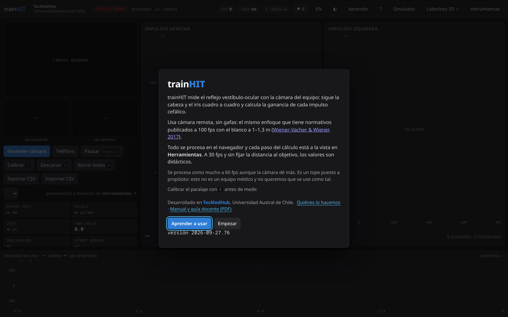

- **Aprender a usar** abre el menú de paseos guiados
  ([sección 9](#9-aprender-a-usar-los-paseos)). Es lo recomendado la primera vez.
- **Empezar** va directo a la pantalla de medición.

Al lado de **Quiénes lo hacemos**, **Manual y guía docente (PDF)** baja este
documento en el idioma de la interfaz.

El **?** de la barra vuelve a abrir esta bienvenida cuando se quiera. El enlace
**Quiénes lo hacemos**, igual que la firma **TecMedHub** de la barra, abre la
tarjeta del equipo:

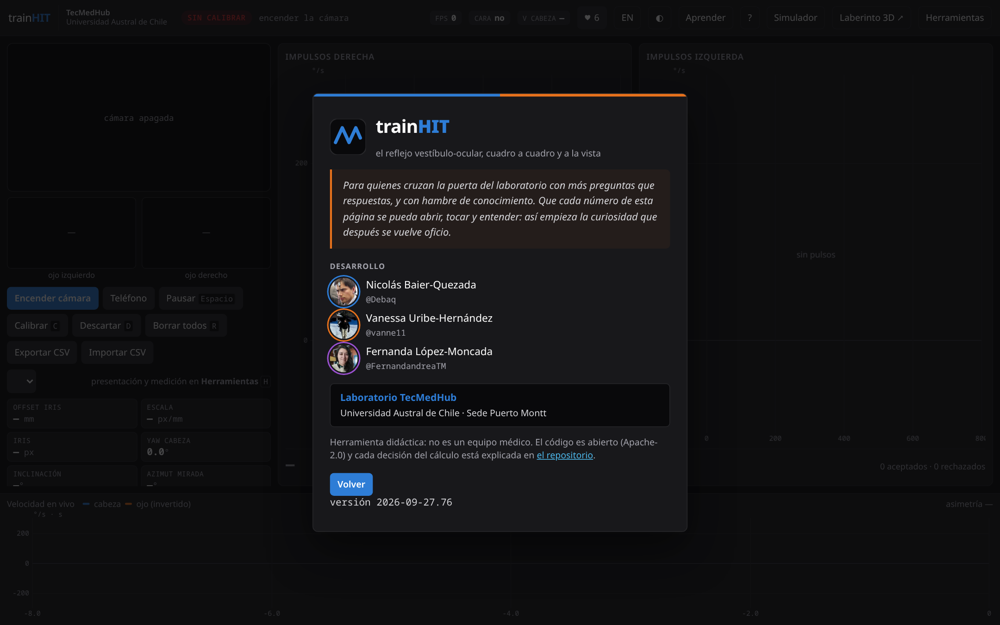

---

## 3. La pantalla

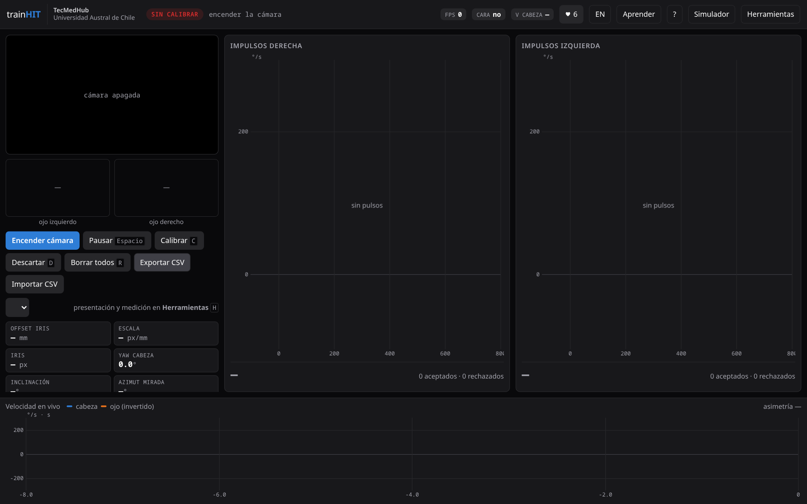

La pantalla tiene cuatro zonas:

| Zona | Qué hay |
|---|---|
| **Barra de arriba** | Estado de la calibración (**SIN CALIBRAR** / **CALIBRADO k=…**), mensaje de estado, cuadros por segundo (**FPS**), si hay **CARA** en el encuadre, velocidad de la cabeza, el **♥** (me gusta), el cambio de idioma, el del tema (**◐** / **☀** / **☾**) y los botones **Aprender**, **?**, **Simulador**, **Laberinto 3D ↗** y **Herramientas**. |
| **Columna izquierda** | El video con los puntos de seguimiento, los dos ojos ampliados, los botones de medición y las lecturas en vivo. |
| **Centro** | Un panel por lado: **Impulsos derecha** e **Impulsos izquierda**. Cada uno tiene todos los impulsos superpuestos, la ganancia media ± DE y la lista de pulsos. |
| **Abajo** | **Velocidad en vivo**: la cabeza en azul y el ojo (invertido) en naranja, los últimos 8 segundos. A la derecha, la **asimetría**. |

**Colores que se repiten en toda la página:**

- **Azul:** la cabeza.
- **Naranja:** el ojo.
- **Triángulo violeta:** sacada encubierta.
- **Triángulo rojo:** sacada manifiesta.

**«Derecha» e «izquierda» son siempre las del paciente**, no las de la
pantalla. Un impulso hacia la derecha del paciente cae en el panel derecho.

### Los botones de medición

| Botón | Qué hace |
|---|---|
| **Encender cámara** / **Detener** | Enciende o apaga la cámara. El selector de abajo elige qué cámara usar si hay más de una. |
| **Teléfono** | Usa un teléfono como cabeza, sin cámara (ver la [sección 11](#11-paciente-simulado)). |
| **Pausar** (`Espacio`) | Congela el análisis y la traza de abajo para poder medirla. La cámara sigue encendida. |
| **Calibrar** (`C`) | Calibra el paralaje durante 10 s. Es **obligatorio antes de creerle a la ganancia**. |
| **Descartar** (`D`) | Descarta el último pulso. `Z` lo devuelve. |
| **Borrar todos** (`R`) | Borra la sesión y pide confirmación. |
| **Exportar CSV** / **Importar CSV** | Guarda la sesión en un archivo o abre una guardada. |

---

## 4. Preparar la sesión

Una buena medición depende más del montaje que del software.

### Cámara y luz

- La cámara **a la altura de los ojos**, con la cara de frente y centrada.
- **A un brazo de distancia**, lo justo para que el iris se vea nítido en los
  ojos ampliados. Si queda muy lejos, el pulso sale rechazado por *IRIS MUY
  PEQUEÑO*.
- Luz **de frente** o de costado. **Nunca una ventana detrás del paciente**:
  la cara queda en sombra y el modelo la pierde.
- **Sin anteojos** si se puede, porque los reflejos tapan el iris.

### Postura y blanco

- El paciente sentado, con la cabeza **flexionada unos 30° hacia abajo**. Así
  el canal lateral queda horizontal. La lectura **inclinación** lo muestra en
  vivo.
- El blanco que se mira es **la cámara misma**, o un punto pegado al lado del
  lente. El modelo de paralaje asume que el objetivo está junto a la cámara, y
  mirar otra cosa cambia la ganancia.

### Las manos del examinador

El examinador se para **detrás** del paciente y le toma la cabeza **por
arriba**, con las manos lejos de ojos, cejas y pómulos. El modelo sigue la cara
entera: basta un dedo sobre una ceja para perder el seguimiento (*CARA PERDIDA*).

---

## 5. La primera medición

### Paso 1: Encender la cámara

Presiona **Encender cámara**. La primera vez el navegador pide permiso para usar
la cámara. Sigue cuando la barra diga **CARA sí**.

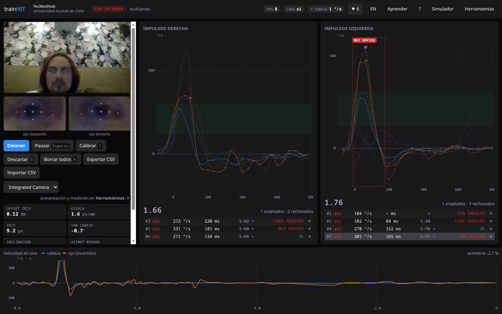

Los puntos sobre la cara son lo que sigue el modelo. Debajo del video, los dos
ojos ampliados muestran el contorno del iris y su centro:

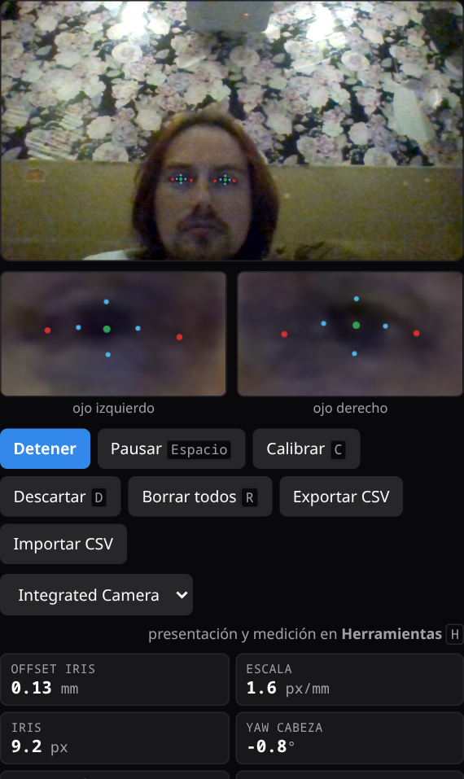

Si en los ojos ampliados el iris no se ve nítido, acércate a la cámara o mejora
la luz **antes de seguir**. Todo lo demás se calcula a partir de ahí.

### Paso 2: Revisar las lecturas

Bajo los botones están los números en vivo:

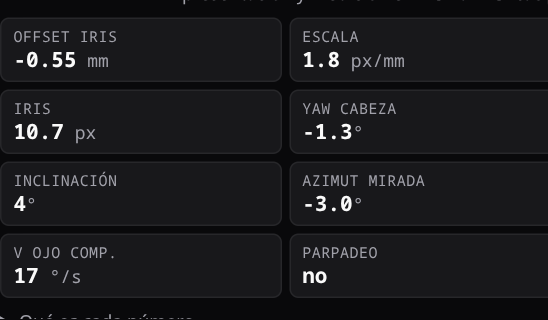

Los que importan al preparar:

- **iris:** el radio del iris en píxeles. Por debajo del mínimo (5 px por
  defecto) el pulso se rechaza.
- **inclinación:** la flexión de la cabeza; busca unos 30°.
- **parpadeo:** un parpadeo dentro del impulso lo invalida.

Cada número explica qué es al pasar el mouse. En pantallas táctiles, **Qué es
cada número** (debajo de las lecturas) dice lo mismo a la vista.

### Paso 3: Calibrar el paralaje

Presiona **Calibrar** (o `C`). Arriba al centro, junto a la cámara, aparece un
**punto rojo**. El paciente lo mira **sin soltarlo** y gira la cabeza **lento**
de un lado al otro, unos ±20°, durante 10 segundos. Una cuenta regresiva
indica cuánto falta y el rango de giro alcanzado. El cajón de Herramientas se
abre solo, para ver cómo llegan los puntos del ajuste.

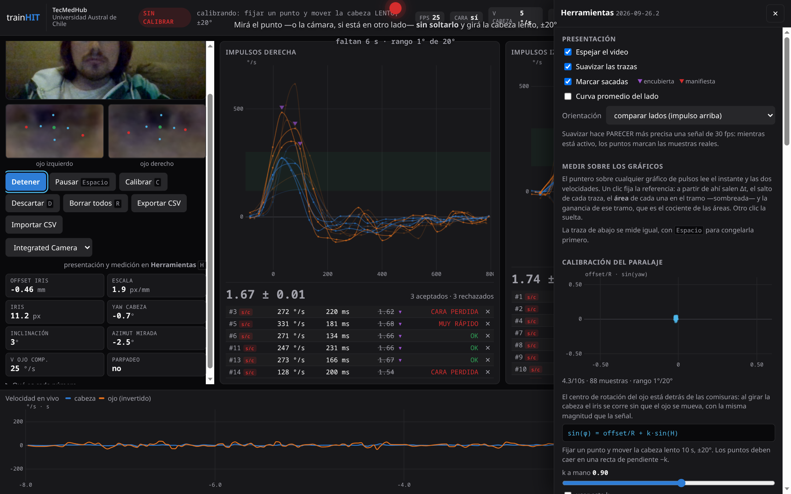

**Por qué hace falta:** el centro de rotación del ojo está detrás de las
comisuras. Al girar la cabeza, el iris se corre en la imagen aunque el ojo no
se mueva, y ese corrimiento es **tan grande como la señal**. Sin calibrar, un
reflejo perfecto se lee ~1,9.

Al terminar, la barra dice **CALIBRADO k=…** en verde. Si la calibración sale
rechazada, el mensaje de estado dice qué hacer distinto (girar más lento, fijar
mejor la mirada, etc.). En **Herramientas** se ve el ajuste: si el paciente fijó
bien, los puntos caen sobre una recta.

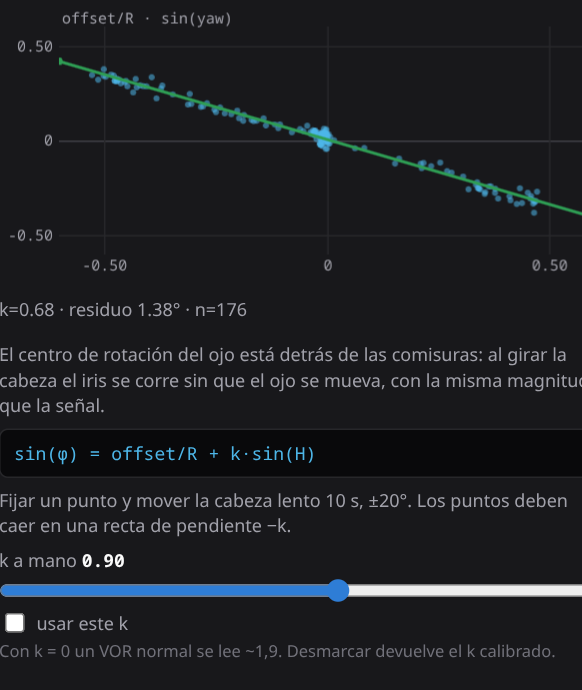

### Paso 4: Dar los impulsos

Cada impulso es un giro **corto (10–20°) y rápido (150–300 °/s)** hacia un lado,
y **la cabeza queda quieta ahí**. Después se vuelve despacio al centro, se
espera y se da el siguiente hacia un lado que el paciente no pueda adivinar.

En la traza de abajo cada impulso aparece como un pico **azul** (cabeza). El
**naranja** es el ojo, dibujado invertido: con un reflejo normal las dos curvas
se tapan.

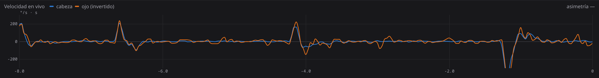

**Buena técnica:** un giro corto, rápido e impredecible. **Mala técnica:** un
giro amplio (más de 40°) y lento, o siempre hacia el mismo lado.

### Paso 5: Leer el resultado

Cada impulso cae en el panel de su lado:

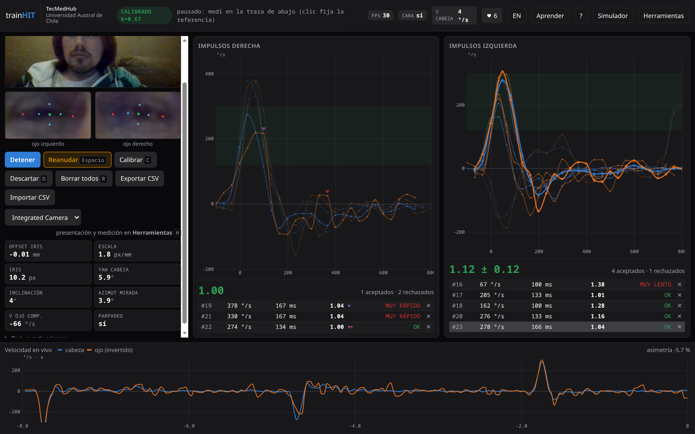

- **Arriba** de cada panel, todos los impulsos superpuestos. La franja verde
  es el rango de pico de velocidad aceptado.
- **La ganancia media ± DE**, en verde o rojo contra el corte de 0,80. Ese
  corte viene de equipos que sí desacadizan (MacDougall et al., 2009), y la
  ganancia normal cambia con el equipo y el protocolo (Money-Nolan & Flagge,
  2023), así que aquí es una referencia y no un criterio. Sin calibrar queda
  gris.
- **La cuenta** de aceptados y rechazados.
- **La lista**, un pulso por fila: número, pico de velocidad, duración,
  ganancia, sacadas (▼) y estado. **✕** descarta ese pulso.

Un rechazado dice por qué, y sobre el gráfico aparece una caja punteada roja con
el motivo. Los rechazados **no entran en la media**.

| Motivo | Qué hacer |
|---|---|
| *MUY LENTO* | Dar un impulso más fuerte. |
| *MUY RÁPIDO* | Un impulso más suave; pasó el pico máximo. |
| *PARPADEO en la ventana* | Repetirlo con los ojos abiertos. |
| *CARA PERDIDA* | Quedarse en el encuadre y sacar las manos de la cara. |
| *IRIS MUY PEQUEÑO* | Acercarse a la cámara o mejorar la luz. |

Un pulso medido **sin calibrar** sale marcado **s/c** y con la ganancia
tachada: sirve para ver la forma, no el número.

### Paso 6: Pausar para medir la traza

**Pausar** (o `Espacio`) congela la traza de abajo. La cámara sigue encendida;
lo que se detiene es el análisis. Congelada, la traza se mide con la regla
([sección 6](#6-leer-los-graficos)).

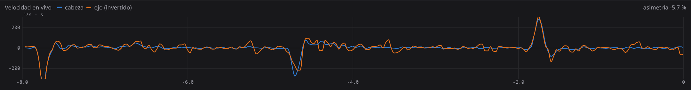

---

## 6. Leer los gráficos

Para esta sección no hace falta cámara: se pueden cargar los **pulsos de
ejemplo**, de un paciente sintético con el canal derecho sano y el izquierdo
con déficit. Se cargan desde **Aprender › Leer los gráficos › Cargar pulsos de
ejemplo**.

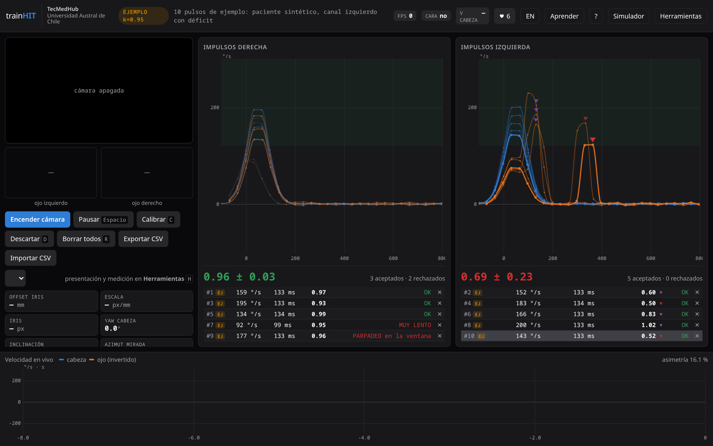

Los ejemplos pasan por el mismo motor que un pulso medido. Reemplazan la sesión,
salen marcados **ej** y la barra dice **EJEMPLO k=…**. Se van solos al encender
la cámara o con **Borrar todos**.

### La regla sobre el gráfico

Al pasar el puntero por un panel, una línea vertical marca el instante y un
cartel da la velocidad de cabeza y de ojo en ese punto.

**Un clic fija una referencia.** Desde ahí, al mover el puntero aparecen:

- **Δt** y el salto de cada curva;
- el **área** de cada curva en el tramo, sombreada. Es el desplazamiento: los
  grados que giró la cabeza y los que se movió el ojo;
- la **ganancia del tramo**: el cociente de las dos áreas.

Otro clic suelta la referencia.

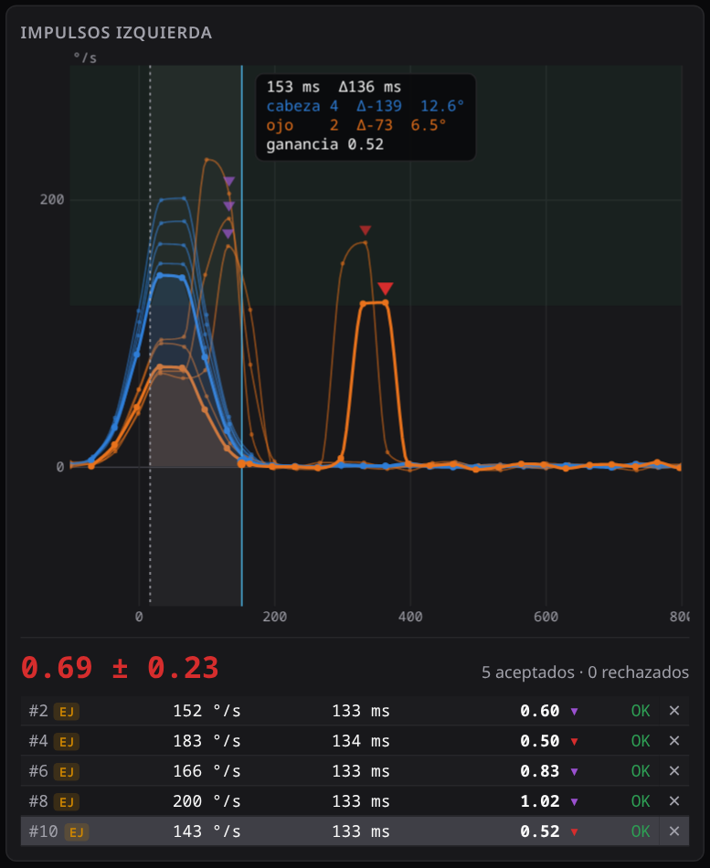

Con el dedo, en pantallas táctiles: un toque pone el cursor, otro fija la
referencia, arrastrar de costado mide y otro toque la suelta.

> Prueba medir solo la subida del impulso y después el impulso entero: la
> ganancia cambia según el tramo, y el motor usa uno solo.

### Mirar un pulso solo

Un clic en una fila de la lista **resalta** ese pulso en el panel. Al pasar el
puntero por la fila aparecen sus otras ganancias (a 60 ms, en el pico) y la
configuración con que se calculó. Si está rechazado, aparece la caja punteada
roja con el motivo:

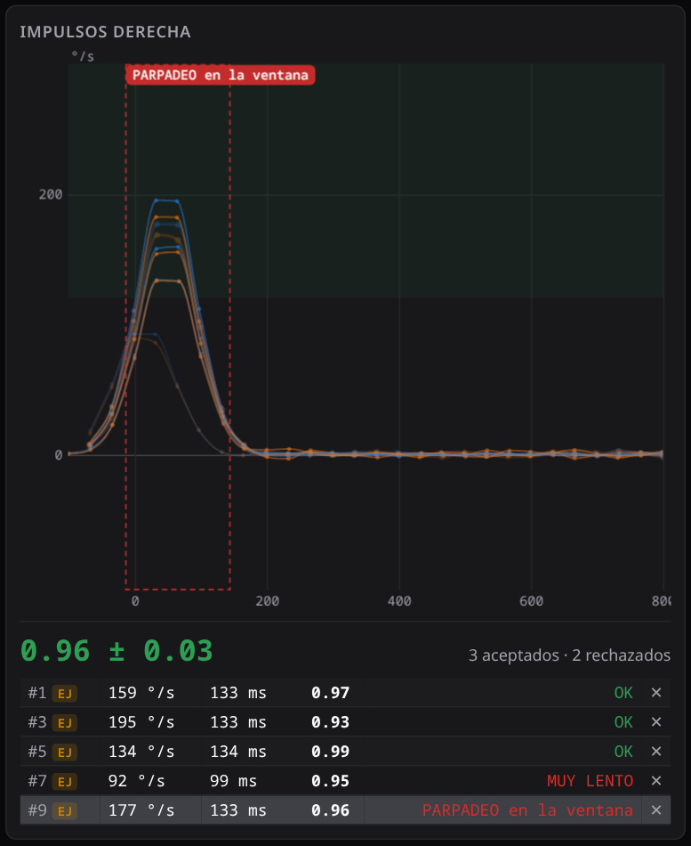

### Las sacadas

Cada sacada lleva un triángulo sobre su pico. La clasificación es la clínica
(Weber et al., 2008):

- **Violeta: encubierta.** Arrancó mientras la cabeza todavía giraba.
- **Rojo: manifiesta.** Llegó después del giro.

En la lista, la columna de triángulos dice lo mismo pulso por pulso. La
**ganancia hasta la sacada ≈** (en el cartel de la fila) es la ganancia cortada
antes de la primera sacada encubierta, y suele ser bastante más baja que la
reportada.

### La asimetría

Abajo a la derecha: **(derecha − izquierda) / (derecha + izquierda)**, en %.
Cero es simétrico, y el signo dice de qué lado está el déficit: con los ejemplos
da positiva porque el izquierdo es el débil.

> **Una asimetría cercana a cero no es un resultado normal.** Si los dos lados
> fallan igual (déficit bilateral), la asimetría da cero. Hay que mirar cada
> media por separado.

### La curva promedio

En **Herramientas › Presentación › Curva promedio del lado**, cada panel suma la
media de sus pulsos aceptados, en trazo más grueso. El ruido se va y queda la
forma.

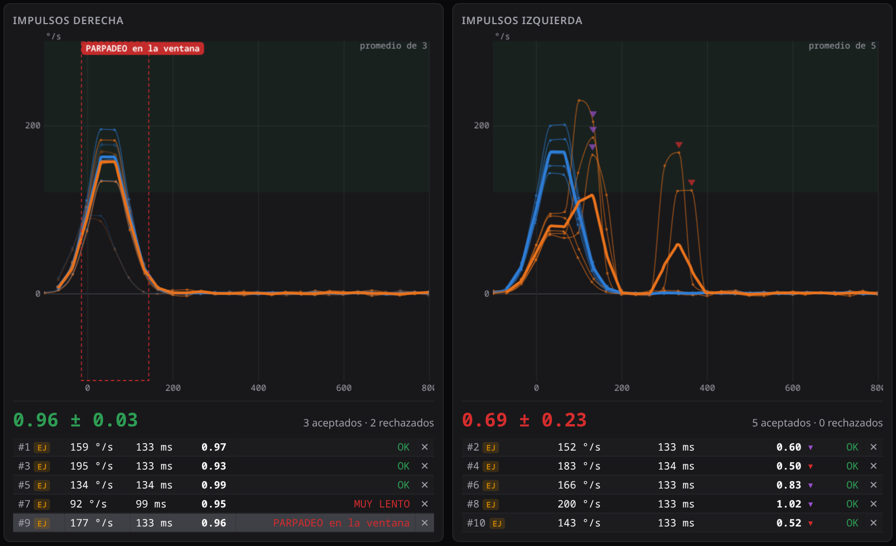

### Orientación de los paneles

En **Herramientas › Presentación › Orientación**:

- **Comparar lados** (por defecto): los dos paneles con el impulso hacia arriba
  y el ojo invertido. Con reflejo normal las curvas se tapan, y lo que se lee es
  la **separación** entre ellas.
- **Dirección real:** cada impulso hacia su lado (derecha arriba, izquierda
  abajo) y el ojo sin invertir. Es lo mismo, dibujado como pasa.

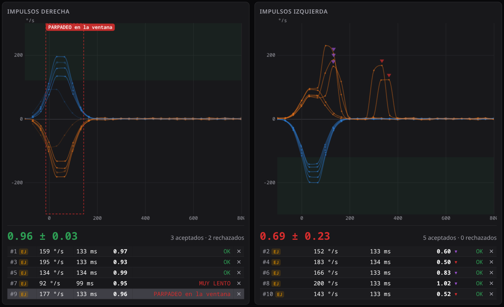

### Suavizar

**Suavizar las trazas** une las muestras con una curva monótona, que nunca
dibuja un pico más alto que el medido. Aun así hace **parecer** más precisa una
señal de 30 fps; por eso, mientras está encendido, los puntos marcan las
muestras reales. Apágalo para ver cuántas muestras tiene de verdad un impulso.

---

## 7. Herramientas

**Herramientas** (o `H`) abre un cajón a la derecha con cada paso del cálculo a
la vista. Nada de lo que hay adentro hace falta para medir: está para entender.

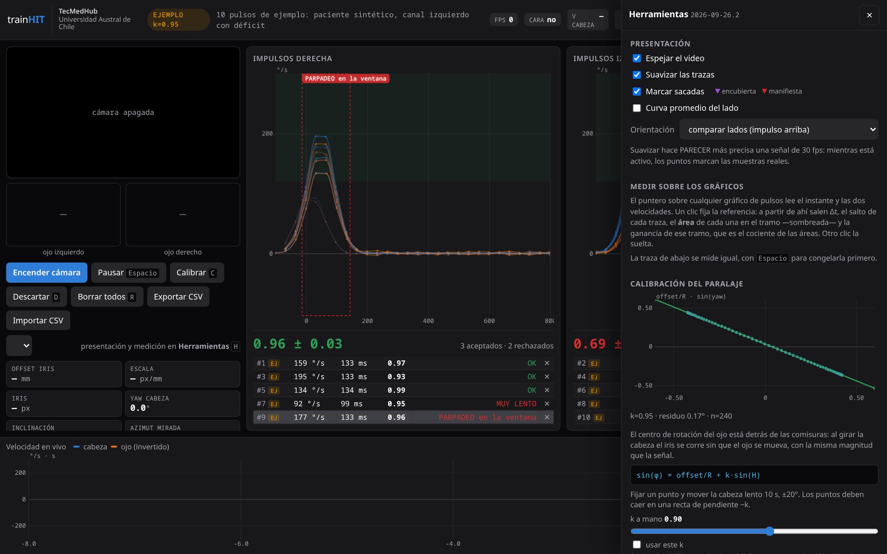

### Presentación

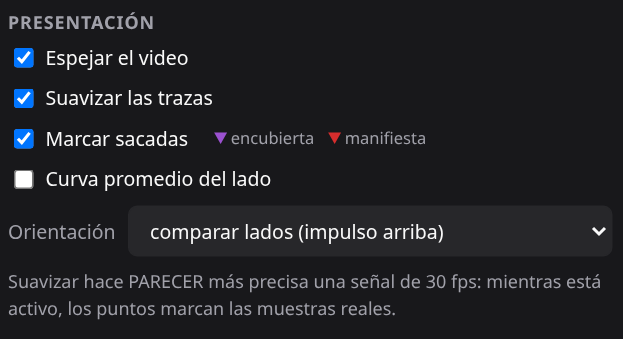

- **Espejar el video:** con espejo, el ojo derecho del paciente queda a la
  derecha de la pantalla.
- **Suavizar las trazas**, **Marcar sacadas**, **Curva promedio del lado** y
  **Orientación:** ver la [sección 6](#6-leer-los-graficos).

### Calibración del paralaje

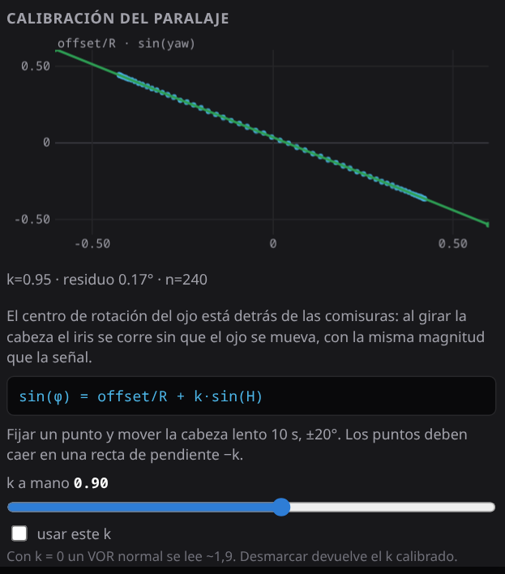

Cada punto es un cuadro de la calibración: el corrimiento del iris contra el
seno del giro de la cabeza. Si el paciente fijó bien la mirada, los puntos caen
sobre una **recta** de pendiente −k. Que se vea la recta prueba que lo medido es
paralaje y no la mirada paseando.

**k a mano:** con el deslizador y **usar este k** se fuerza un valor de k. El
experimento que explica todo es poner **k = 0** y **Recalcular**: las ganancias
del lado sano pasan a ~1,9. Nadie tiene un reflejo de 1,9; lo que se ve es el
paralaje sin corregir.

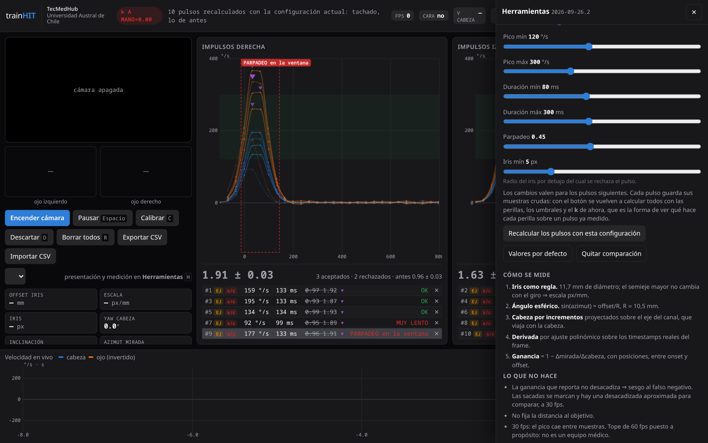

Desmarcar **usar este k** devuelve el k calibrado.

### Último pulso

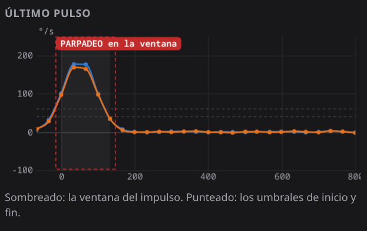

El pulso seleccionado (o el último), en grande. El **sombreado** es la ventana
del impulso, el tramo sobre el que se calcula la ganancia. Las líneas punteadas
son los umbrales de inicio y fin que la delimitan.

### Ganancia vs pico, y los métodos

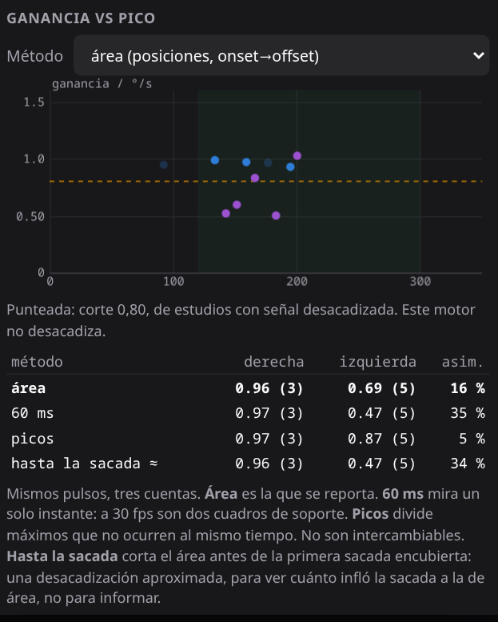

Hay un punto por pulso: el pico de velocidad de la cabeza contra la ganancia.
Azul el lado derecho, violeta el izquierdo; los rechazados salen pálidos. Un
reflejo sano da una nube **chata y apretada**, porque la ganancia no depende de
qué tan fuerte fue el impulso.

El selector **Método** y la tabla muestran las mismas ganancias calculadas de
cuatro formas:

| Método | Qué calcula |
|---|---|
| **Área** | Cuánto giró el ojo sobre cuánto giró la cabeza en todo el impulso. **Es la que se reporta.** |
| **60 ms** | El cociente de velocidades en un solo instante. A 30 fps se apoya en dos cuadros. |
| **Picos** | El máximo del ojo sobre el máximo de la cabeza, aunque no ocurran a la vez. |
| **Hasta la sacada ≈** | El área cortada antes de la primera sacada encubierta: una desacadización aproximada, para comparar y no para informar. |

Con los mismos pulsos, las medias y la asimetría cambian según el método. Por
eso **una ganancia sin su método no se compara con otra** (Zamaro et al., 2020;
Jacobsen et al., 2021).

Después de un **Recalcular**, cada punto viejo queda unido al nuevo:

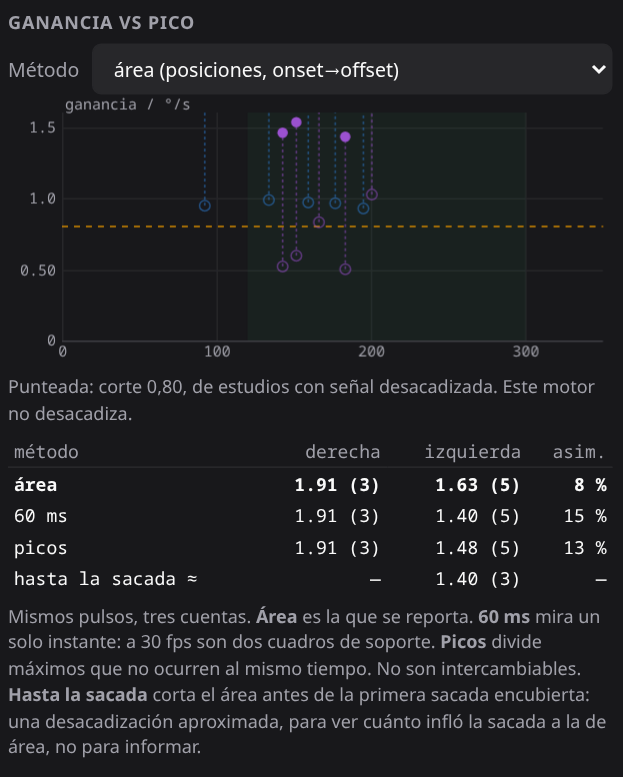

### Cómo se mide, y referencias

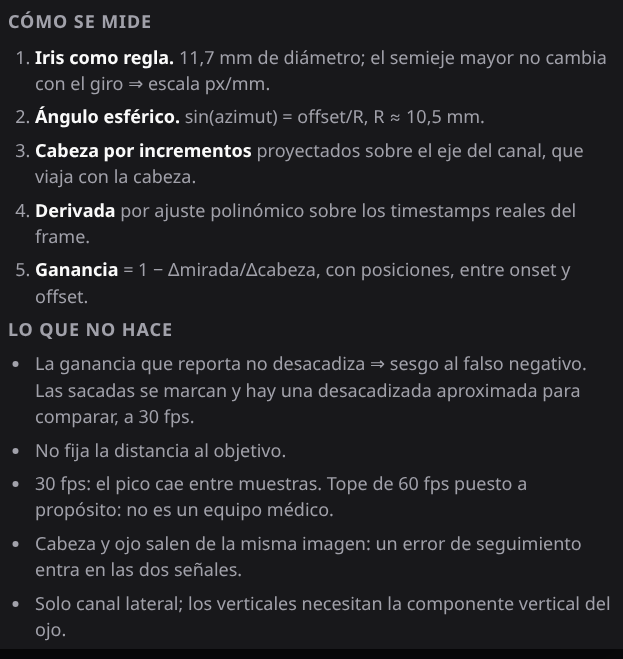

Las cinco decisiones del motor:

1. el iris como regla: su diámetro horizontal es de ~11,7 mm, con poca
   variación entre personas (Rüfer et al., 2005), y da los píxeles por
   milímetro;
2. el ángulo esférico;
3. la cabeza medida por incrementos, con la malla facial de MediaPipe
   (Kartynnik et al., 2019; Ablavatski et al., 2020);
4. la derivada por ajuste polinómico (Savitzky & Golay, 1964);
5. la ganancia calculada con posiciones.

Debajo está lo que el método **no** hace y las referencias bibliográficas de
cada número, que están completas en la [sección 24](#24-referencias).

### Para docentes

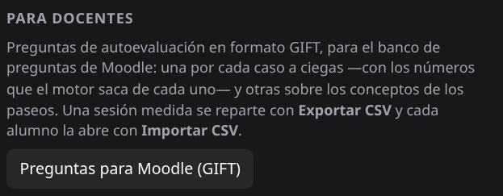

**Preguntas para Moodle (GIFT)** baja un archivo `.txt` listo para importar en
el banco de preguntas de Moodle. Trae:

- una pregunta por cada caso a ciegas, con los números que el motor saca de
  cada uno;
- un banco de conceptos: paralaje, sacadas, falso negativo, canales, asimetría,
  calibración, rechazos, una pregunta numérica, una de verdadero/falso y un
  emparejamiento de métodos.

Sale en el idioma de la interfaz.

Al lado, **Manual de uso y guía docente (PDF)** baja este documento, también en
el idioma de la interfaz.

---

## 8. Las perillas del motor

Están al fondo del cajón de Herramientas.

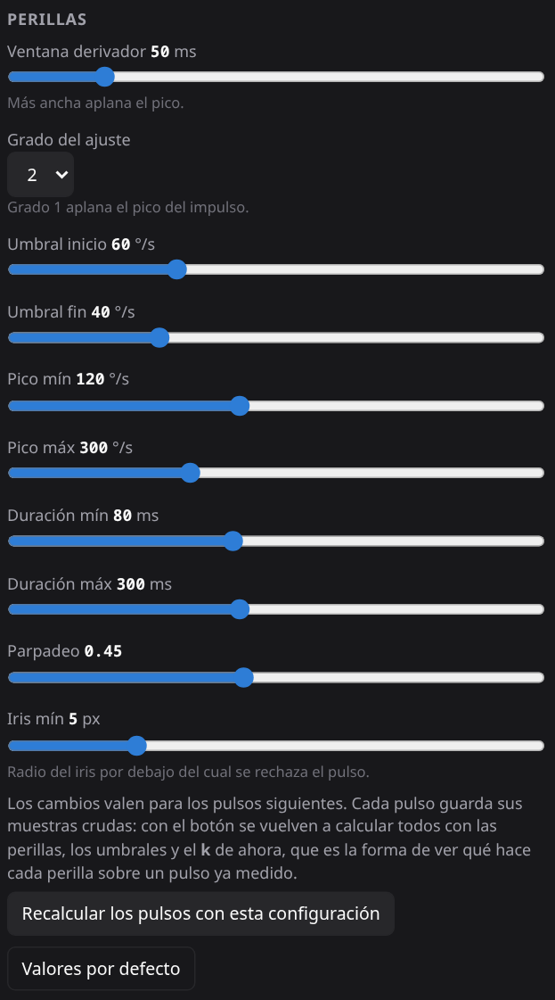

Una perilla cambiada vale para los pulsos **siguientes**. Cada pulso guarda sus
muestras crudas, así que **Recalcular los pulsos con esta configuración** vuelve
a correr el motor entero sobre los pulsos que ya están. Después de recalcular:

- la ganancia de antes queda tachada al lado de la nueva;
- los paneles muestran la media de antes;
- **Quitar comparación** borra lo tachado.

Mientras alguna perilla no está en su valor de fábrica, la barra dice
**PERILLAS CAMBIADAS**: esos pulsos no son comparables con otros.
**Valores por defecto** devuelve todo a su lugar.

| Perilla | Por defecto | Qué hace | Para probar |
|---|---|---|---|
| **Ventana derivador** | 50 ms | La velocidad sale de ajustar una parábola a las muestras de esta ventana (Savitzky & Golay, 1964). Más ancha da menos ruido, pero aplana el pico. | Pon 200 ms y recalcula: los picos bajan y varios pulsos pasan a *MUY LENTO*. |
| **Grado del ajuste** | 2 | 1 ajusta una recta y aplana el pico; 3 sigue también el ruido. | Pruébalo con la ventana en 50 y en 100 ms. |
| **Umbral inicio / fin** | 60 / 40 °/s | Dónde empieza y termina el impulso, o sea la ventana sobre la que se calcula la ganancia. | Muévelos y mira **Último pulso**. |
| **Pico mín / máx** | 120 / 300 °/s | Criterio para aceptar un pulso. No cambia ninguna ganancia; decide cuáles entran en la media. | Baja el mínimo a 80: el pulso lento del ejemplo pasa a aceptado. |
| **Duración mín / máx** | 80 / 300 ms | Igual que el pico, pero con la duración. | — |
| **Parpadeo** | 0,45 | Qué tan cerrado tiene que estar el ojo (0 abierto, 1 cerrado) para contar como parpadeo. | Súbelo a 0,90: el pulso con parpadeo pasa a aceptado, con una ganancia calculada con el ojo cerrado. |
| **Iris mín** | 5 px | Radio del iris por debajo del cual se rechaza el pulso. | — |

> El método es mover **una** perilla, recalcular, mirar qué cambió y volverla a
> su lugar.

---

## 9. Aprender a usar: los paseos

**Aprender** (en la barra, o `T`) abre un menú de paseos guiados cortos. Se
hacen en cualquier orden; si es la primera vez, de arriba hacia abajo. Un ✓
marca los paseos terminados.

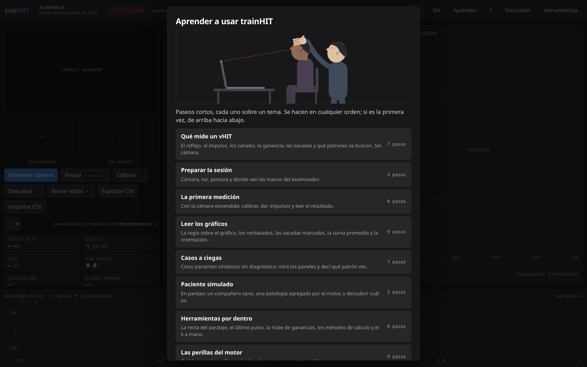

| Paseo | De qué trata | ¿Cámara? |
|---|---|---|
| **Qué mide un vHIT** | El reflejo, el impulso, los seis canales, la ganancia, las sacadas, los patrones que se buscan y los límites. | No |
| **Los canales verticales** | Los pares LARP y RALP: cómo se prueban, qué hace el ojo, por qué importan y por qué trainHIT todavía no los mide. | No |
| **Preparar la sesión** | Cámara, luz, postura y manos del examinador. | No |
| **La primera medición** | Calibrar, dar impulsos, leer paneles y lista, CSV. | Sí |
| **Leer los gráficos** | La regla, los rechazados, las sacadas, la asimetría, el promedio, suavizar, la orientación y la pausa. | No (usa ejemplos) |
| **Casos a ciegas** | Cinco pacientes sintéticos sin diagnóstico. | No |
| **Paciente simulado** | En parejas, una patología agregada por el motor. | Sí |
| **Herramientas por dentro** | La recta del paralaje, el último pulso, la nube, los métodos y el k a mano. | No (usa ejemplos) |
| **Las perillas del motor** | Cada perilla, probada con Recalcular. | No (usa ejemplos) |

Las tarjetas de lectura aparecen al centro con el fondo oscurecido:

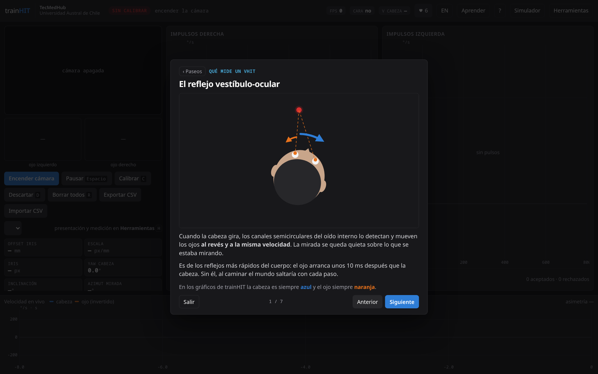

Las demás tarjetas iluminan la parte de la pantalla de la que hablan y dejan la
página usable, porque lo que se señala tiene que poder apretarse. Algunos pasos
esperan algo (la cara, una calibración, pulsos, un recálculo), pero la espera
nunca traba: el botón dice **Saltar** hasta que se cumple.

---

## 10. Casos a ciegas

Cinco pacientes sintéticos, cada uno con una letra y **sin decir qué tiene**.
Se cargan desde **Aprender › Casos a ciegas**. Hay que mirar los paneles y
elegir el patrón de una lista, que es la misma para todos los casos: si cada
caso trajera sus propias opciones, la lista delataría la respuesta.

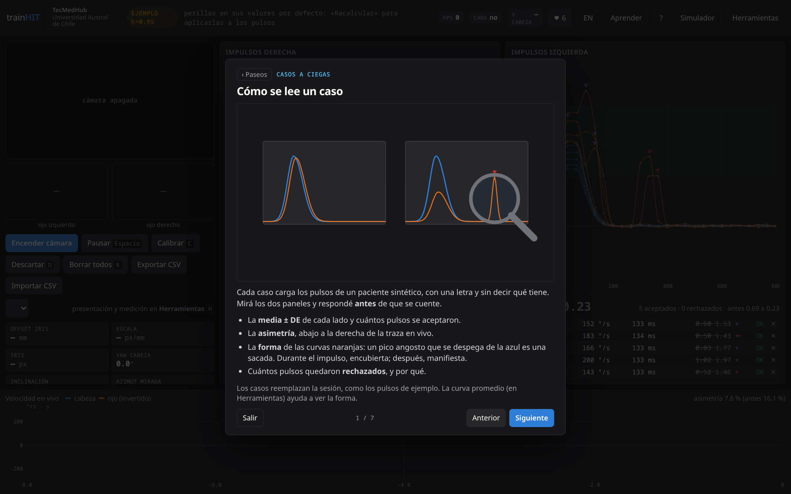

Qué mirar:

- la **media ± DE** de cada lado y cuántos pulsos se aceptaron;
- la **asimetría**;
- la **forma** de las curvas naranjas: un pico angosto que se despega de la
  azul es una sacada;
- cuántos pulsos quedaron **rechazados**, y por qué.

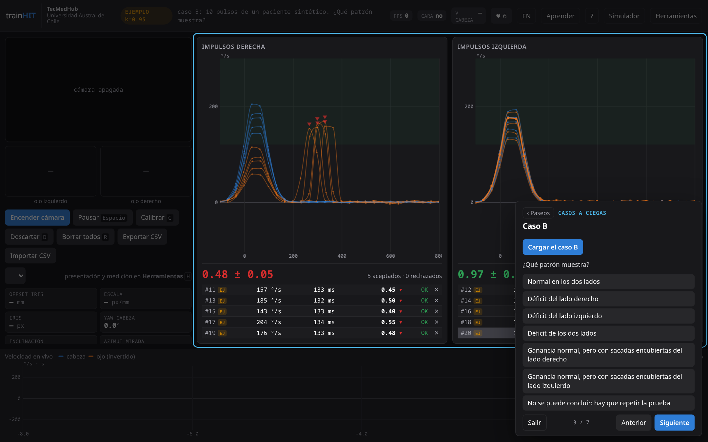

Si la respuesta es incorrecta, aparece una pista y se puede volver a intentar.
Si es correcta, aparece la explicación:

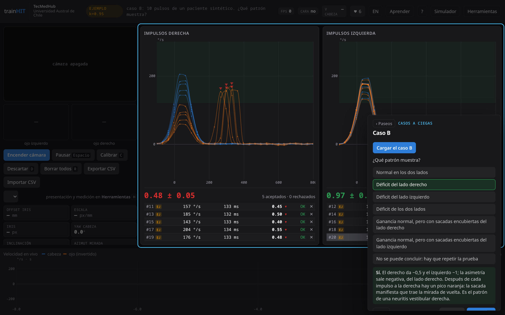

| Caso | Lo que enseña |
|---|---|
| A | La referencia: cómo se ve lo normal. |
| B | La neuritis de libro, y el signo de la asimetría. |
| C | Una asimetría de cero no es un resultado normal. |
| D | Una media normal (¡>1!) puede esconder un déficit con sacadas encubiertas: el falso negativo. |
| E | Sin pulsos aceptados suficientes no se concluye: se repite la prueba. |

---

## 11. Paciente simulado

El **Simulador** (en la barra, o `S`) pone una patología encima de pulsos
**reales**. Un compañero sano hace de paciente y el alumno le da impulsos de
verdad, con su técnica, sus rebotes y sus manos en la cara. El motor le agrega
el déficit: la mirada se arrastra con la cabeza en lo que el reflejo no
compensa, y unas sacadas la traen de vuelta. Se practica **examinar y leer a la
vez**.

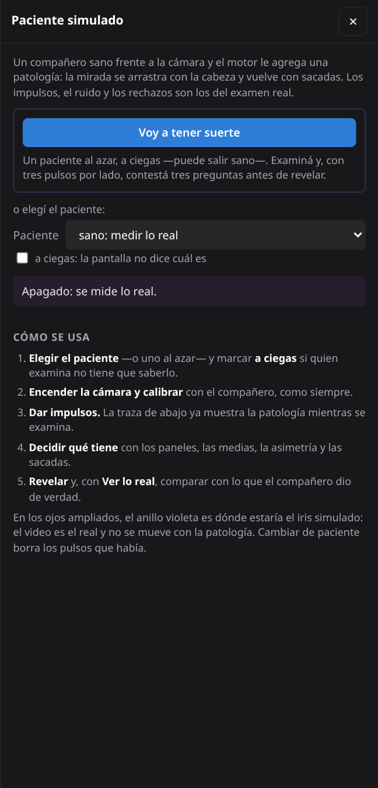

| Perfil | Qué agrega |
|---|---|
| Neuritis derecha / izquierda | Ganancia 0,35–0,55 de ese lado, con sacadas manifiestas. |
| Déficit compensado derecho / izquierdo | Ganancia 0,40–0,55 con sacadas encubiertas agrupadas: **se lee normal**. |
| Vestibulopatía bilateral | Los dos lados 0,30–0,50, con sacadas manifiestas. |
| Sin patología (control) | Nada: los pulsos salen marcados como simulados, pero son los reales. |

### Voy a tener suerte

Es la práctica completa en un clic.

**1.** Enciende la cámara y **calibra** con el compañero, como siempre.

**2.** Abre **Simulador** y presiona **Voy a tener suerte**. Se sortea un paciente
(el control sano incluido) y queda **a ciegas**.

**3.** El cajón **se cierra** para dejar los dos paneles a la vista. En la barra,
junto a **SIMULADO**, un contador lleva los pulsos aceptados de cada lado.
Un clic en el contador vuelve a abrir el cajón.

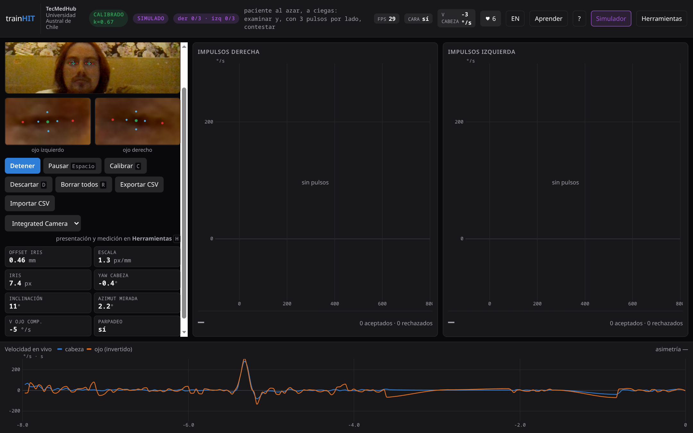


**4.** Da impulsos. La traza de abajo ya muestra la patología mientras se
examina. En los ojos ampliados, un **anillo violeta** marca dónde estaría el
iris simulado. El video es el real y no se mueve.


**5.** Con **tres pulsos aceptados por lado** el cajón se abre solo y se habilita
**Ya sé qué tiene**.

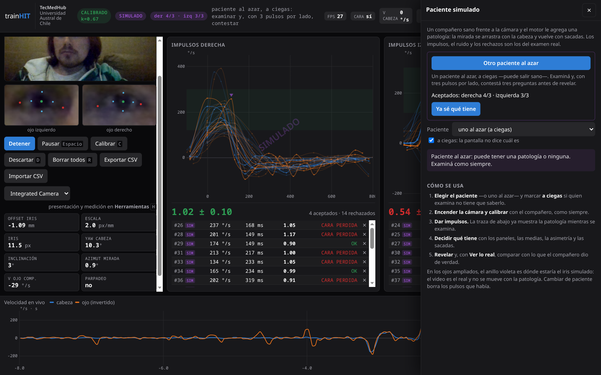

**6.** Aparecen tres preguntas en el orden del razonamiento clínico: qué lado está
afectado, qué sacadas aparecen y qué patrón muestra.

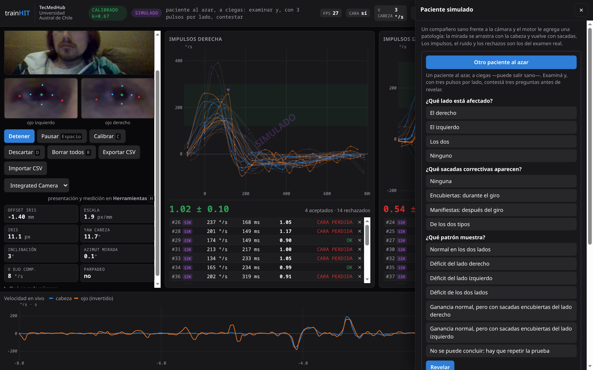

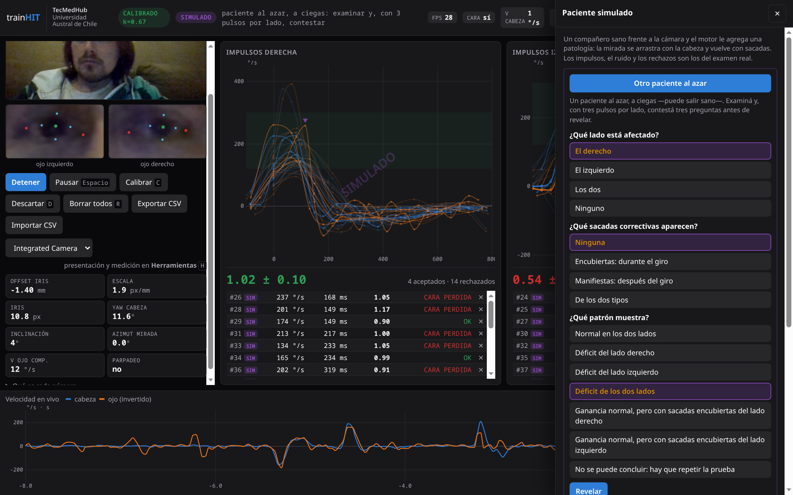

**7.** **Revelar** corrige cada pregunta: verde la respuesta correcta, rojo la
elegida si no lo era. También da la nota y dice cuál era el perfil.

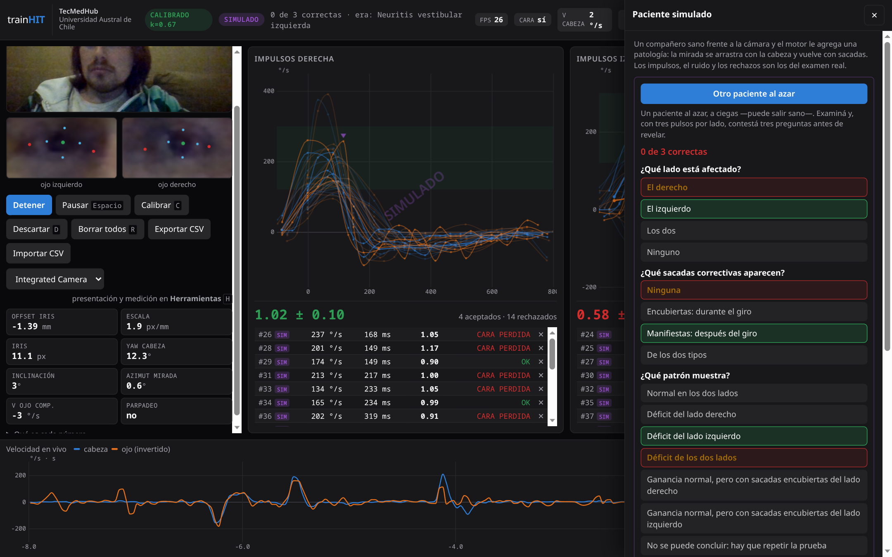

**8.** **Ver lo real** recalcula cada pulso sin la patología: lo que el compañero
dio de verdad, con lo simulado tachado al lado. Los gráficos pasan a decir
**SIN SIMULAR**.

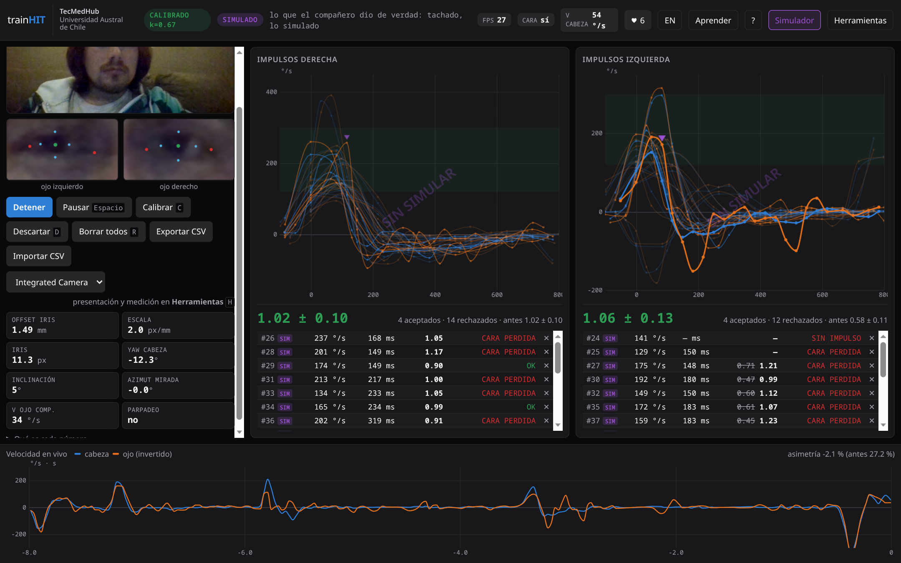

**Otro paciente al azar** empieza de nuevo.

### Elegir el paciente a mano

Fuera de la práctica, quien hace de docente puede elegir el perfil en
**Paciente** y marcar **a ciegas**. Así el selector se esconde y la pantalla no
dice cuál es. **Revelar** lo muestra al final.

### Lo simulado nunca pasa por real

- La barra dice **SIMULADO**.
- Cada pulso lleva la marca **sim**.
- Los gráficos llevan una marca de agua, así que una captura también la lleva.
- El CSV tiene la columna `simulado` (`oculto` mientras es a ciegas).
- **Cambiar de paciente borra los pulsos:** mezclar dos pacientes daría una
  media que no es de nadie.

### Sin cámara: el teléfono como cabeza

Con **Teléfono** (junto a **Encender cámara**) se practica sin webcam y sin
compañero. El teléfono hace de cabeza del paciente: su giroscopio da el giro, y
en el recuadro de la cámara aparece una **cara dibujada** que gira con él. El
ojo lo pone el modelo: sano, con la mirada quieta en el blanco, o con la
patología que se elija en el Simulador. Todo lo demás —la traza, los pulsos,
las ganancias, las perillas y **Voy a tener suerte**— funciona igual que con la
cámara.

**1.** En el PC, presiona **Teléfono** y después **Mostrar el QR**.

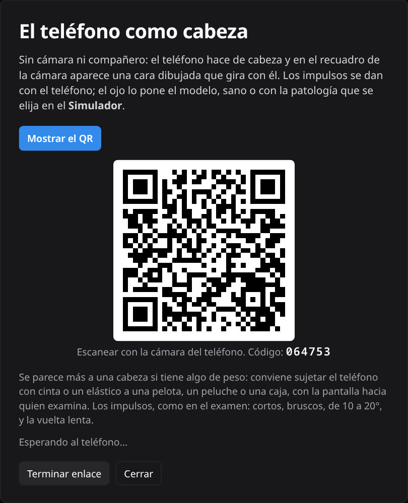

**2.** Escanea el QR con la cámara del teléfono y toca **Usar este teléfono
como cabeza**. La pantalla del teléfono es la cara del paciente y mira hacia
quien examina: girar el teléfono hacia la derecha de quien examina es girar la
cabeza a la izquierda del paciente.

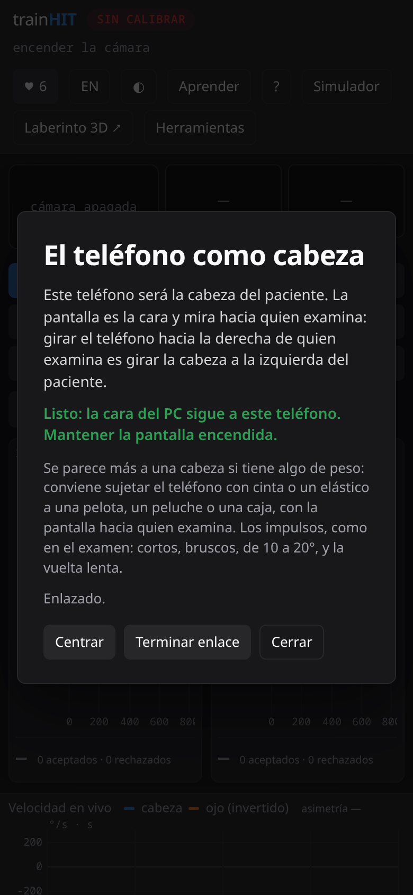

**3.** En el PC, la barra dice **TELÉFONO ENLAZADO** y la calibración,
**TELÉFONO k=0.95**: no hace falta calibrar, porque el paralaje de la cara
dibujada es conocido. **Centrar** toma la posición de ahora como frente.

**4.** Da impulsos con el teléfono como con una cabeza: cortos, bruscos, de 10
a 20°, y la vuelta lenta. Se siente más real si el teléfono va sujeto con cinta
o un elástico a algo con peso —una pelota, un peluche, una caja—, con la
pantalla hacia quien examina.

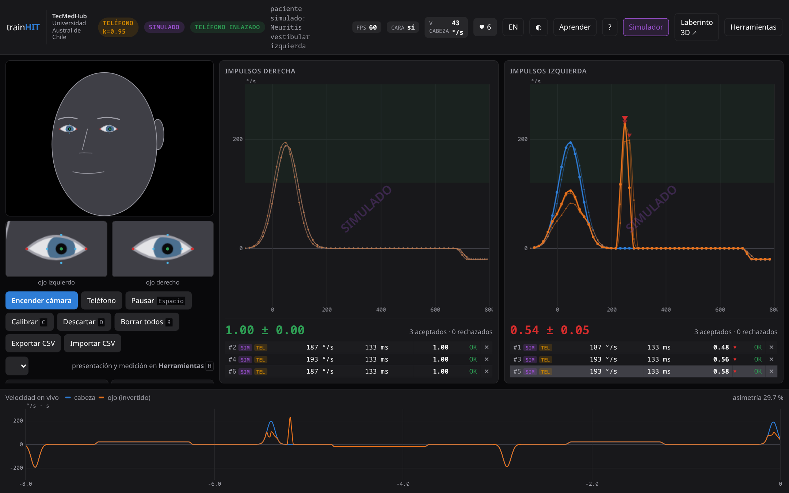

En la cara se ve lo mismo que en un examen: con el reflejo sano el iris se
queda mirando al frente mientras la cabeza gira; con déficit se va con la
cabeza, y una sacada lo trae de vuelta.

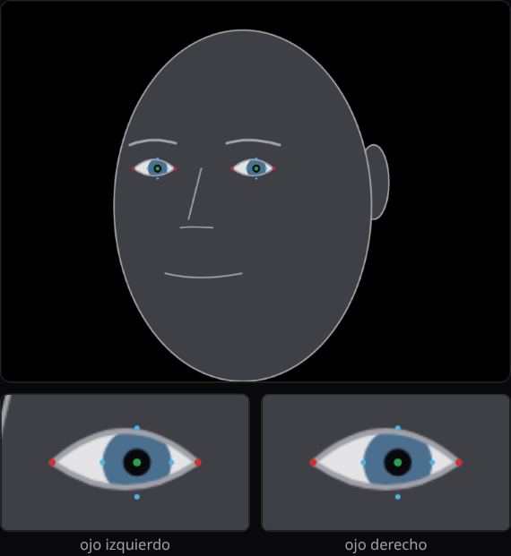

- Los pulsos del teléfono llevan la marca **tel** y se borran al encender la
  cámara: no se mezclan con pulsos medidos.
- El enlace pasa por el servidor de Labyrinthus 3D solo para presentarse; el
  giroscopio va directo al PC. Si la red no deja conectarlos directo, pasa por
  el servidor y la barra lo dice (**POR EL SERVIDOR**).
- El teléfono tiene que tener giroscopio y dar permiso para leer los sensores.

---

## 12. Guardar y compartir datos

### Exportar CSV

**Exportar CSV** baja un archivo con la sesión completa:

- un pulso por fila, con su ganancia y la configuración con que se calculó;
- una muestra por fila, para rehacer las cuentas en una planilla;
- los cuadros crudos.

El CSV queda siempre en español, porque es un formato de datos.

### Importar CSV

**Importar CSV** abre ese archivo en otro computador u otro día y **vuelve a
calcular cada pulso desde los datos crudos**. Sirve para repartir un caso
medido y que cada alumno lo mire con sus propias perillas. La sesión importada
reemplaza la actual, y la barra muestra que la calibración es la del archivo.

### El «me gusta»

El **♥** de la barra suma un voto a un contador público y anónimo. No viaja el
video, ni las mediciones, ni nada de la sesión. Hay un voto por navegador.

---

## 13. Idioma, tema, pantallas pequeñas y uso sin red

### Idioma

trainHIT está en **español e inglés**. Arranca en español si el navegador está
en español, en cualquier variante, y en inglés si está en cualquier otro idioma;
el navegador suele tomar el idioma del sistema operativo. Mandan antes el que
diga la dirección (`?lang=en`, útil para un enlace de curso) y el que se eligió
la vez anterior. El botón
**EN** / **ES** de la barra cambia el idioma en vivo, sin recargar y sin perder
la sesión.

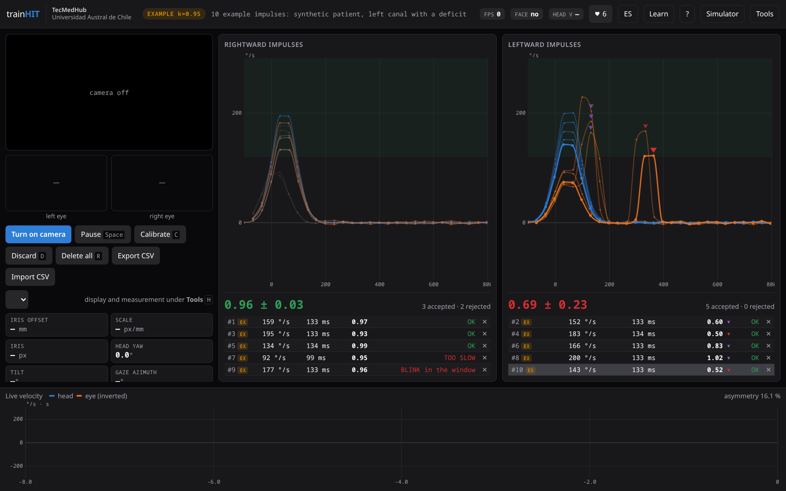

### Tema claro u oscuro

El botón del tema, en la barra junto al del idioma, da la vuelta entre tres
opciones:

| Botón | Tema |
|---|---|
| **◐** | **Automático:** el del sistema operativo. Si el sistema cambia solo —el modo noche que se enciende al atardecer—, la página cambia con él. Es el de fábrica. |
| **☀** | **Claro**, siempre: para proyectar en una sala con luz. |
| **☾** | **Oscuro**, siempre. |

El botón muestra el tema en que está, no el que sigue. La elección queda
guardada en el navegador. Los colores clínicos —la cabeza azul, el ojo naranja,
las sacadas— son los mismos en los dos temas, y el video y los ojos ampliados
siguen sobre fondo negro, porque son imagen.

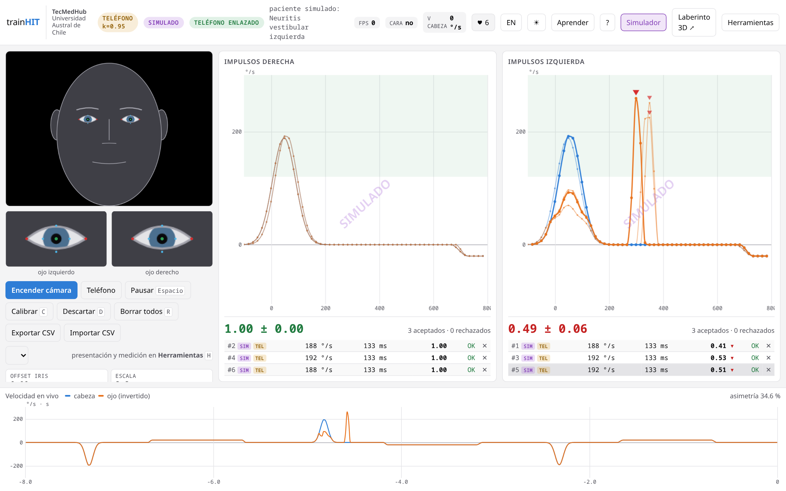

### Pantallas pequeñas

En un teléfono, la cámara pasa a un cuadro pequeño con los ojos al lado. Con el
teléfono de costado, la pantalla vuelve a dos columnas.

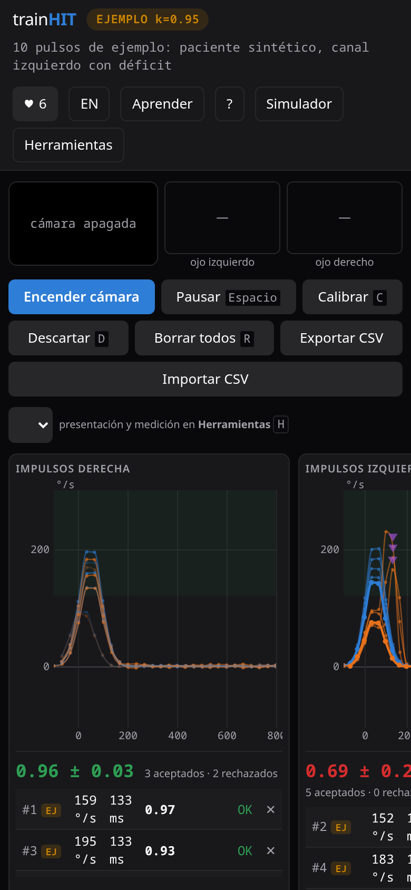

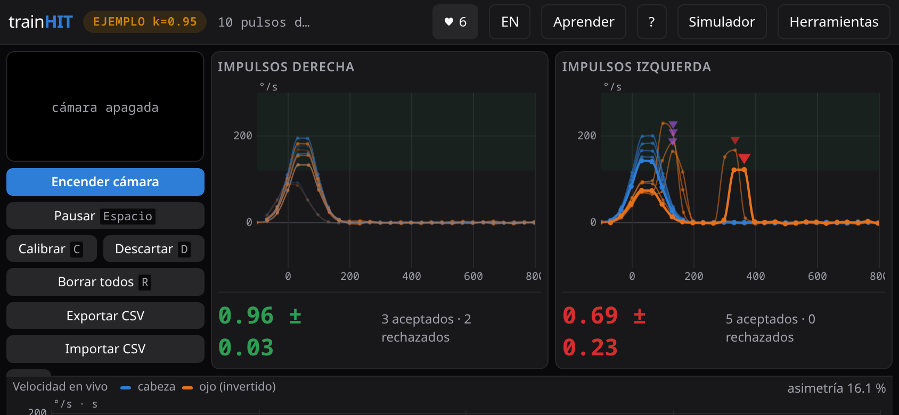

### Sin red

Después de la primera carga, la página y el modelo de seguimiento quedan
guardados en el navegador, y trainHIT abre y mide **sin conexión**. Está pensado
para el aula, donde el wifi falla.

---

## 14. Atajos de teclado

| Tecla | Qué hace |
|---|---|
| `C` | Calibrar el paralaje (10 s). |
| `Espacio` o `P` | Pausar y congelar la traza de abajo (la cámara sigue). |
| `D` | Descartar el último pulso. |
| `Z` | Devolver el último descartado. |
| `R` | Borrar todos los pulsos. |
| `H` | Abrir o cerrar Herramientas. |
| `S` | Abrir o cerrar el Simulador. |
| `T` | Abrir o cerrar «Aprender a usar». |

---

## 15. Problemas frecuentes

| Problema | Causa probable y solución |
|---|---|
| La cámara no enciende | El navegador no tiene permiso: hay que darlo en el candado de la barra de direcciones. Si se abrió `index.html` con doble clic, hace falta un servidor (ver la [sección 2](#2-antes-de-empezar)). |
| **CARA no** | Poca luz, luz de atrás o cara fuera del encuadre. Pon la luz de frente y centra la cara. |
| **FPS** muy bajo (menos de 20) | El equipo va justo. Cierra otras pestañas y programas que usen la cámara o la GPU. |
| La calibración sale rechazada | Girar más lento, sin soltar la mirada del punto rojo, y con un arco de ±20°. |
| Todos los pulsos *MUY LENTO* | Los impulsos tienen que ser más rápidos: un giro corto y seco. |
| Muchos *CARA PERDIDA* | Las manos tapan cejas o pómulos: toma la cabeza más arriba. |
| *IRIS MUY PEQUEÑO* | El paciente está lejos o la cámara tiene poca resolución. Acércalo. |
| Ganancias cerca de 1,9 | Falta calibrar (la barra dice **SIN CALIBRAR**), o quedó **k a mano** en 0. |
| Ganancias mayores que 1 | Una sacada encubierta dentro del impulso infla la ganancia (ver el caso D). También pasa con impulsos que hace el propio paciente. |
| El teléfono no se enlaza | Los dos aparatos necesitan internet para presentarse. Si la barra se queda en **ESPERANDO AL TELÉFONO…**, probar con los dos en la misma red wifi, o con el PC conectado al punto de acceso del teléfono. |
| La barra dice **PERILLAS CAMBIADAS** | Hay perillas fuera de su valor de fábrica. Herramientas › **Valores por defecto**. |

---

## 16. Para qué y para quién

Esta segunda parte junta **ideas para usar trainHIT en clases**. No es un
programa cerrado: son actividades, secuencias y pautas que cada docente puede
adaptar al curso, al tiempo disponible y a los equipos que tenga.

### Para quién

Estudiantes de carreras de la salud que ven el **sistema vestibular** y su
evaluación: fonoaudiología, tecnología médica, medicina, kinesiología y
enfermería. También sirve en talleres y visitas al laboratorio, para mostrar
cómo un número clínico sale de una imagen.

### Qué aporta frente a un equipo clínico

Un vHIT clínico entrega la ganancia y las sacadas, pero no muestra cómo se
calcularon. trainHIT sí lo muestra, y eso permite enseñar tres cosas que con un
equipo cerrado quedan como caja negra:

- **Cómo se mide:** del video al ángulo del ojo, de ahí a la velocidad y de
  ahí a la ganancia, con cada paso a la vista.
- **Por qué el número puede engañar:** el paralaje, las sacadas encubiertas,
  el método de cálculo y los criterios de aceptación cambian el resultado.
- **Cómo se examina:** la técnica del examinador decide si hay pulsos para
  leer, y eso se ve en los rechazos.

### Qué hace falta en la sala

- **Un computador con webcam por grupo** de 2 o 3 estudiantes. Sin cámara
  igual se pueden hacer los paseos, los casos a ciegas y las perillas.
- **Un proyector** para las demostraciones y la discusión.
- **Red solo la primera vez.** Conviene abrir la página en cada equipo antes
  de la clase: después funciona sin conexión.
- **Una silla sin ruedas** para el paciente, con espacio detrás para el
  examinador.

---

## 17. Resultados de aprendizaje

Al terminar las actividades, se espera que el estudiante pueda:

1. **Explicar** el reflejo vestíbulo-ocular y por qué el impulso cefálico
   pone a prueba un canal semicircular.
2. **Ejecutar** un impulso cefálico con técnica adecuada: amplitud, velocidad,
   imprevisibilidad y posición de las manos.
3. **Interpretar** los gráficos de un vHIT: ganancia por lado, asimetría,
   sacadas encubiertas y manifiestas, y pulsos rechazados.
4. **Reconocer** los patrones normal, déficit unilateral y déficit bilateral,
   y el déficit que queda oculto por sacadas encubiertas.
5. **Justificar** por qué una ganancia depende de la calibración, del método
   de cálculo y de los criterios de aceptación.
6. **Reconocer los límites** de una medición: cuándo no se puede concluir y
   por qué esta herramienta no sirve para diagnosticar.

---

## 18. Secuencias de clase sugeridas

### Sesión práctica de 90 minutos

Para un curso que ya vio la fisiología del VOR en teoría.

| Tiempo | Actividad | Con qué | Producto |
|---|---|---|---|
| 0–15 min | Encuadre: qué mide un vHIT y qué no | Paseo **Qué mide un vHIT**, proyectado | Preguntas abiertas del curso |
| 15–30 min | Preparar la sesión y calibrar | Paseos **Preparar la sesión** y **La primera medición** | Cada grupo con una calibración aceptada |
| 30–50 min | Casos a ciegas | Paseo **Casos a ciegas**, en grupos | Respuesta del grupo a cada caso |
| 50–80 min | Paciente simulado en parejas | **Simulador › Voy a tener suerte**, con rotación | Nota de la práctica y rúbrica de técnica |
| 80–90 min | Cierre | Discusión del caso D y de los límites | Una idea que cada uno se lleva |

### Sesión corta de 45 minutos, sin cámara

Sirve para una clase teórica con proyector, o cuando no hay webcams.

1. **10 min:** paseo **Qué mide un vHIT**.
2. **15 min:** **Casos a ciegas** A a E, votando a mano alzada antes de
   revelar cada uno.
3. **15 min:** el experimento del paralaje (actividad 19.2) y los tres métodos
   (actividad 19.6).
4. **5 min:** cierre con la pregunta "¿por qué el caso D se lee normal?".

Con un teléfono a mano, el paso 3 puede ser práctico: el teléfono como cabeza
(sección 11) con un perfil del Simulador, proyectado para todo el curso.

### Laboratorio en dos sesiones

- **Sesión 1, técnica.** Preparación, calibración y examen en parejas sin
  simulador. La meta es la **tasa de aceptados** (actividad 19.8).
- **Sesión 2, lectura.** Simulador a ciegas, perillas y trabajo con un CSV
  compartido (actividad 19.7). Se termina con un informe breve.

---

## 19. Actividades

Cada actividad dice qué se busca, cómo se hace y qué discutir al final.

### 19.1 Del gráfico al número

**Qué se busca:** que la ganancia deje de ser un número mágico.

1. Cargar los **pulsos de ejemplo** (Aprender › Leer los gráficos).
2. Con la **regla**, medir el área de cabeza y de ojo de un pulso del lado
   derecho, desde el inicio hasta el fin del impulso.
3. Dividir las áreas a mano y comparar con la ganancia de la lista.
4. Repetir midiendo solo la subida del impulso.

**Para discutir:** ¿por qué cambia la ganancia según el tramo? ¿Qué tramo usa
el motor, y por qué ese?

### 19.2 El experimento del paralaje

**Qué se busca:** entender para qué se calibra.

1. Con los pulsos de ejemplo, abrir **Herramientas › Calibración del
   paralaje**.
2. Poner **k a mano en 0**, marcar **usar este k** y apretar **Recalcular**.
3. Anotar la ganancia del lado sano (~1,9) y volver al k calibrado.

**Para discutir:** ningún reflejo tiene ganancia 1,9. ¿De dónde sale ese
número? ¿Qué pasaría en la clínica con un equipo mal calibrado?

### 19.3 Casos a ciegas en grupos

**Qué se busca:** leer un vHIT completo, no solo un número.

1. Cada grupo carga los casos A a E y decide el patrón **antes** de responder
   en la página.
2. El docente pide la respuesta de cada grupo y recién ahí se revela.
3. Se discuten los casos donde hubo desacuerdo.

**Para discutir:** en el caso C, ¿por qué una asimetría de cero no es normal?
En el caso D, ¿qué habría que mirar para no quedarse con la media?

### 19.4 Paciente simulado con rotación

**Qué se busca:** examinar y leer a la vez, con una patología desconocida.

Grupos de tres, con tres roles que rotan en cada ronda:

- **Paciente:** un compañero sano frente a la cámara.
- **Examinador:** da los impulsos y responde las preguntas.
- **Observador:** llena la rúbrica de técnica (sección 20).

Cada ronda es un **Voy a tener suerte**: examinar hasta tener 3 pulsos
aceptados por lado, contestar, **Revelar** y mirar **Ver lo real**.

**Para discutir:** ¿los pulsos rechazados del examinador fueron por técnica o
por el paciente? ¿Qué cambió entre la primera ronda y la última?

### 19.5 Una perilla por grupo

**Qué se busca:** entender los criterios detrás de un resultado.

1. Cada grupo recibe una perilla: ventana del derivador, umbrales, pico
   mínimo, parpadeo o iris mínimo.
2. Con los pulsos de ejemplo, cambian solo esa perilla, apretan
   **Recalcular** y anotan qué cambió: ganancias, aceptados y rechazados.
3. Cada grupo presenta su hallazgo en 2 minutos.

**Para discutir:** bajar el pico mínimo deja entrar el pulso lento, y subir el
umbral de parpadeo acepta mediciones con el ojo cerrado. ¿Qué criterio
aflojarían en la clínica, y cuál nunca?

### 19.6 Tres métodos, un pulso

**Qué se busca:** que una ganancia no se compare sin su método.

1. Con el caso D cargado, abrir **Herramientas › Ganancia vs pico**.
2. Comparar en la tabla las medias y la asimetría de cada método.
3. Mirar la fila **hasta la sacada ≈** del lado izquierdo.

**Para discutir:** ¿cuál de los métodos "tiene razón"? ¿Por qué en el caso D la
de área da ~1 y la que corta en la sacada da ~0,5?

### 19.7 Un caso para todos

**Qué se busca:** que todo el curso analice la misma medición, cada uno con
sus propios criterios.

1. El docente mide a un voluntario (o arma un caso con el simulador) y guarda
   la sesión con **Exportar CSV**.
2. Reparte el archivo por el aula virtual.
3. Cada estudiante lo abre con **Importar CSV**, lo analiza y escribe un
   informe breve: ganancia por lado, asimetría, sacadas, pulsos rechazados y
   una conclusión, o "no concluyente" si corresponde.

El CSV también se puede abrir en una planilla para rehacer las cuentas.

### 19.8 La tasa de aceptados

**Qué se busca:** mejorar la técnica con una medida objetiva.

Cada examinador da 10 impulsos y cuenta cuántos salieron **aceptados** y los
motivos de los rechazados (*MUY LENTO*, *MUY RÁPIDO*, *CARA PERDIDA*,
*PARPADEO*). Se repite después de corregir la técnica y se compara.

**Para discutir:** ¿qué motivo de rechazo fue el más común en el curso, y qué
lo corrige?

### 19.9 Lo que esto no es

**Qué se busca:** pensamiento crítico sobre la tecnología clínica.

En grupos, con el paseo **Qué mide un vHIT › Lo que esto no es** y la sección
**Herramientas › Cómo se mide**, preparar una lista de las diferencias entre
trainHIT y un vHIT clínico: cuadros por segundo, desacadización, distancia al
blanco (Judge et al., 2018; Castro et al., 2018), canales verticales y
validación.

**Para discutir:** ¿qué haría falta para que una herramienta así se pudiera
usar con pacientes? ¿Por qué tiene un tope de 60 cuadros por segundo puesto a
propósito?

---

## 20. Evaluación

### Evaluación formativa, dentro de la misma página

- **Casos a ciegas:** cada respuesta da una pista si es incorrecta y una
  explicación si es correcta. Sirve para autoevaluarse.
- **Voy a tener suerte:** al revelar, la página da la nota ("2 de 3
  correctas"). Una captura de pantalla sirve de evidencia.

### Cuestionario en Moodle

**Herramientas › Para docentes › Preguntas para Moodle (GIFT)** baja un archivo
listo para importar en el **banco de preguntas** del curso (Banco de
preguntas › Importar › formato GIFT). Trae:

- una pregunta por cada caso a ciegas, con los números del caso;
- preguntas de conceptos: paralaje, sacadas, falso negativo, canales,
  asimetría, calibración y rechazos;
- una numérica de ganancia, un verdadero/falso y un emparejamiento de métodos.

Con ese banco se arma un cuestionario de entrada (antes del práctico) y uno de
salida (después) para comparar.

### Rúbrica de técnica del examinador

La llena el observador de la actividad 19.4, o el docente.

| Criterio | Logrado | En desarrollo | No logrado |
|---|---|---|---|
| **Preparación** | Cámara a la altura de los ojos, luz de frente, inclinación ~30° | Falta un elemento | Varios elementos mal |
| **Calibración** | Aceptada al primer intento | Aceptada al segundo o tercer intento | No logra calibrar |
| **Manos** | Por arriba de la cabeza, cara despejada | Alguna vez tapa la cara | Pierde la cara seguido (*CARA PERDIDA*) |
| **Amplitud y velocidad** | Giros cortos y rápidos, pico entre 150 y 300 °/s | Algunos *MUY LENTO* o *MUY RÁPIDO* | La mayoría rechazados |
| **Imprevisibilidad** | Alterna los lados sin patrón | Patrón a veces predecible | Siempre alterna igual |
| **Retorno** | Vuelve lento al centro y espera | Vuelve rápido a veces | Retorno brusco, impulsos encadenados |
| **Tasa de aceptados** | 8 o más de 10 | 5 a 7 de 10 | Menos de 5 de 10 |

### Pauta para el informe breve (actividad 19.7)

| Elemento | Qué se espera |
|---|---|
| Datos de la medición | Pulsos aceptados y rechazados por lado, y motivos |
| Resultados | Ganancia media ± DE por lado, con el método, y asimetría |
| Sacadas | Tipo (encubiertas o manifiestas) y lado |
| Interpretación | Patrón que muestra, justificado con los gráficos |
| Límites | Qué no se puede concluir con esta medición y por qué |

---

## 21. Errores frecuentes y preguntas para discutir

### Errores frecuentes de los estudiantes

| Error | Cómo abordarlo |
|---|---|
| Leer solo la asimetría | Caso C: los dos lados bajos dan asimetría cero. |
| Quedarse con la media sin mirar las curvas | Caso D: la sacada encubierta infla la ganancia. Seleccionar un pulso y mirarlo. |
| Confundir el lado con el de la pantalla | Derecha e izquierda son las del paciente: un impulso a su derecha cae en el panel derecho. |
| Creer que ganancia mayor que 1 es "mejor" | Mostrar el caso D y los pulsos sin calibrar: más de 1 suele ser un artefacto. |
| Olvidar calibrar | La barra dice **SIN CALIBRAR** y los pulsos salen **s/c**. Repetir el experimento del paralaje (19.2). |
| Impulsos grandes y lentos | Mirar el pico de la lista y los rechazos *MUY LENTO*; practicar giros cortos. |
| Interpretar con dos o tres pulsos | Caso E: sin pulsos aceptados suficientes no se concluye. |
| Tomar el resultado como diagnóstico | Volver a la sección "Lo que no es" y a la actividad 19.9. |

### Preguntas para abrir la discusión

- ¿Por qué el impulso tiene que ser impredecible?
- Si el reflejo es perfecto, ¿qué se ve en el gráfico? ¿Y si no hay reflejo?
- ¿Qué información da una sacada que no da la ganancia?
- ¿Por qué un vHIT normal en un vértigo agudo puede ser una señal de alarma?
- ¿Qué pesa más en el resultado: el paciente, el examinador o el equipo?
- ¿Qué cambiaría si la cámara diera 250 cuadros por segundo en vez de 30?

---

## 22. Cuidados en el aula

> **El cuello del compañero es real.** Antes de dar impulsos, preguntar si
> tiene alguna lesión, dolor o cirugía cervical, o vértigo en ese momento: en
> ese caso no hace de paciente. Los impulsos son **pequeños (10–20°)**, nunca
> hasta el tope del giro, y se detienen si el paciente siente molestia.

- **Es para aprender, no para diagnosticar.** Si un estudiante ve algo que le
  preocupa en su propia medición, lo más probable es la técnica, la luz o los
  30 fps. Igual, cualquier síntoma real se consulta con un profesional, no con
  esta página.
- **El video no sale del computador.** trainHIT procesa todo en el navegador y
  no guarda ni envía imágenes.
- **Los CSV no llevan nombres**, pero son mediciones de una persona. Al
  compartirlos en el aula virtual conviene no identificar al voluntario.
- **Probar antes de la clase.** Conviene abrir la página, encender la cámara y
  calibrar en cada equipo: así el modelo queda guardado y los problemas de
  permisos o de luz aparecen antes, no durante la clase.

---

## 23. Glosario

| Término | Significado |
|---|---|
| **VOR** | Reflejo vestíbulo-ocular: mueve los ojos al revés que la cabeza y a la misma velocidad, para que la mirada quede quieta. |
| **Impulso cefálico** | Un giro de cabeza pequeño, rápido e impredecible, dado por el examinador (Halmagyi & Curthoys, 1988). |
| **Ganancia** | Cuánto giró el ojo por cada grado que giró la cabeza. 1 es compensación perfecta. |
| **Sacada correctiva** | El salto rápido con que el ojo vuelve al blanco cuando el reflejo no alcanzó. |
| **Encubierta / manifiesta** | La sacada que ocurre durante el giro / después del giro. |
| **Desacadizar** | Sacar las sacadas de la señal antes de calcular la ganancia. trainHIT no lo hace. |
| **Paralaje (k)** | El corrimiento del iris en la imagen al girar la cabeza, aunque el ojo no se mueva. La calibración lo mide. |
| **Asimetría** | (derecha − izquierda) / (derecha + izquierda), en %. |
| **Ventana del impulso** | El tramo entre el inicio y el fin del impulso, sobre el que se calcula la ganancia. |
| **RALP / LARP** | Los pares de canales verticales. trainHIT no los mide. |


*trainHIT es software libre (Apache-2.0), desarrollado en el Laboratorio
TecMedHub de la Universidad Austral de Chile, Sede Puerto Montt. El código y
cada decisión del cálculo están explicados en el repositorio.*

---

## 24. Referencias

Las fuentes de los números y de las decisiones de trainHIT. En el texto se
citan por autor y año; cada una lleva una línea sobre para qué se usa aquí.

### El impulso cefálico y el vHIT

<div class="referencias" markdown="1">

- Halmagyi GM, Curthoys IS. A clinical sign of canal paresis. *Arch Neurol.*
  1988;45(7):737-9. doi:[10.1001/archneur.1988.00520310043015](https://doi.org/10.1001/archneur.1988.00520310043015)
  — El impulso cefálico como signo clínico: la prueba que trainHIT enseña.
- Weber KP, Aw ST, Todd MJ, McGarvie LA, Curthoys IS, Halmagyi GM. Head impulse
  test in unilateral vestibular loss: vestibulo-ocular reflex and catch-up
  saccades. *Neurology.* 2008;70(6):454-63. doi:[10.1212/01.wnl.0000299117.48935.2e](https://doi.org/10.1212/01.wnl.0000299117.48935.2e)
  — Las sacadas correctivas encubiertas y manifiestas.
- MacDougall HG, Weber KP, McGarvie LA, Halmagyi GM, Curthoys IS. The video
  head impulse test: diagnostic accuracy in peripheral vestibulopathy.
  *Neurology.* 2009;73(14):1134-41. doi:[10.1212/WNL.0b013e3181bacf85](https://doi.org/10.1212/WNL.0b013e3181bacf85)
  — El vHIT contra la bobina escleral. De aquí sale el corte de 0,80, medido
  con ganancia de área desacadizada, a ~250 Hz y con el blanco a ~1 m.
- Halmagyi GM, Chen L, MacDougall HG, Weber KP, McGarvie LA, Curthoys IS. The
  video head impulse test. *Front Neurol.* 2017;8:258. doi:[10.3389/fneur.2017.00258](https://doi.org/10.3389/fneur.2017.00258)
  — Revisión del método: técnica, ganancia y sacadas.

</div>

### Cámara remota y lo que hace variar la ganancia

<div class="referencias" markdown="1">

- Wiener-Vacher SR, Wiener SI. Video head impulse tests with a remote camera
  system: normative values of semicircular canal vestibulo-ocular reflex gain
  in infants and children. *Front Neurol.* 2017;8:434. doi:[10.3389/fneur.2017.00434](https://doi.org/10.3389/fneur.2017.00434)
  — Normativos con cámara remota a 100 fps y blanco a 1–1,3 m: el precedente
  del enfoque sin gafas.
- Judge PD, Rodriguez AI, Barin K, Janky KL. Impact of target distance, target
  size, and visual acuity on the video head impulse test. *Otolaryngol Head
  Neck Surg.* 2018;159(4):739-42. doi:[10.1177/0194599818779908](https://doi.org/10.1177/0194599818779908)
  — La distancia y el tamaño del blanco cambian la ganancia medida.
- Castro P, Sena Esteves S, Lerchundi F, Buckwell D, Gresty MA, Bronstein AM,
  et al. Viewing target distance influences the vestibulo-ocular reflex gain
  when assessed using the video head impulse test. *Audiol Neurootol.*
  2018;23(5):285-9. doi:[10.1159/000493845](https://doi.org/10.1159/000493845)
  — La distancia del blanco y la ganancia del VOR.
- Money-Nolan LE, Flagge AG. Factors affecting variability in vestibulo-ocular
  reflex gain in the video head impulse test in individuals without
  vestibulopathy: a systematic review of literature. *Front Neurol.*
  2023;14:1125951. doi:[10.3389/fneur.2023.1125951](https://doi.org/10.3389/fneur.2023.1125951)
  — La ganancia normal no es un número fijo: hacen falta normativos por equipo
  y protocolo.

</div>

### Cómo se calcula la ganancia

<div class="referencias" markdown="1">

- Zamaro E, Saber Tehrani AS, Kattah JC, Eibenberger K, Guede CI, Armando L,
  et al. VOR gain calculation methods in video head impulse recordings.
  *J Vestib Res.* 2020;30(4):225-34. doi:[10.3233/VES-200708](https://doi.org/10.3233/VES-200708)
  — Los métodos de cálculo de la ganancia no son intercambiables.
- Jacobsen CL, Abrahamsen ER, Skals RK, Hougaard DD. Is regression gain or
  instantaneous gain the most reliable and reproducible gain value when
  performing video head impulse testing of the lateral semicircular canals?
  *J Vestib Res.* 2021;31(3):151-62. doi:[10.3233/VES-180669](https://doi.org/10.3233/VES-180669)
  — Ganancia por regresión contra ganancia instantánea: cuál es más
  reproducible.
- Du Y, Ren L, Liu X, Guo W, Wu Z, Yang S. The characteristics of vHIT gain
  and PR score in peripheral vestibular disorders. *Acta Otolaryngol.*
  2021;141(1):43-9. doi:[10.1080/00016489.2020.1812715](https://doi.org/10.1080/00016489.2020.1812715)
  — La ganancia y la dispersión de las sacadas (PR score) en trastornos
  vestibulares periféricos.

</div>

### El motor de medición

<div class="referencias" markdown="1">

- Kartynnik Y, Ablavatski A, Grishchenko I, Grundmann M. Real-time facial
  surface geometry from monocular video on mobile GPUs. arXiv:[1907.06724](https://arxiv.org/abs/1907.06724);
  2019. — La malla facial de MediaPipe, de la que salen el giro de la cabeza y
  los puntos de los ojos.
- Ablavatski A, Vakunov A, Grishchenko I, Raveendran K, Zhdanovich M.
  Real-time pupil tracking from monocular video for digital puppetry.
  arXiv:[2006.11341](https://arxiv.org/abs/2006.11341); 2020. — El seguimiento
  del iris de MediaPipe.
- Rüfer F, Schröder A, Erb C. White-to-white corneal diameter: normal values in
  healthy humans obtained with the Orbscan II topography system. *Cornea.*
  2005;24(3):259-61. doi:[10.1097/01.ico.0000148312.01805.53](https://doi.org/10.1097/01.ico.0000148312.01805.53)
  — El diámetro horizontal de la córnea, 11,71 ± 0,42 mm en adultos sanos: por
  qué el iris sirve de regla.
- Savitzky A, Golay MJE. Smoothing and differentiation of data by simplified
  least squares procedures. *Anal Chem.* 1964;36(8):1627-39. doi:[10.1021/ac60214a047](https://doi.org/10.1021/ac60214a047)
  — La derivada por ajuste polinómico local del derivador.

</div>

### Software

- **trainHIT**, código abierto (Apache-2.0): <https://github.com/Debaq/trainhit>
- **MediaPipe** (Google, Apache-2.0), el modelo de seguimiento de la cara:
  <https://github.com/google-ai-edge/mediapipe>
- **Labyrinthus 3D**, del mismo laboratorio, de donde viene el enlace con el
  teléfono: <https://github.com/Debaq/labyrinthus3d>

### Cómo citar trainHIT

> Baier-Quezada N, Uribe-Hernández V, López-Moncada F. trainHIT: vHIT
> didáctico en el navegador [software]. Versión 2026-09-27.77. Puerto Montt:
> Laboratorio TecMedHub, Universidad Austral de Chile; 2026. Disponible en:
> https://github.com/Debaq/trainhit
