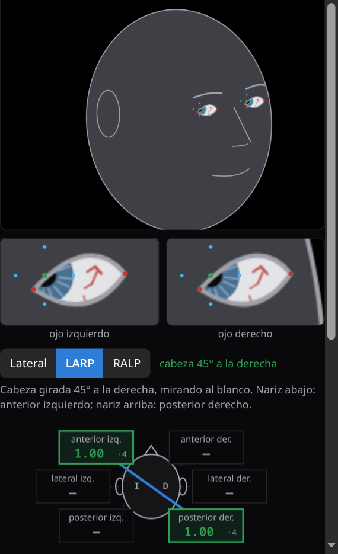
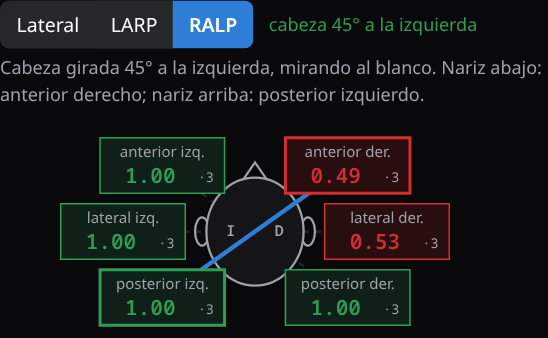

# El teléfono en la cabeza

**Guía rápida de trainHIT para examinar los seis canales con un teléfono**

Con el teléfono sujeto a la cabeza de un compañero, los impulsos son de
verdad: el peso de la cabeza, el cuello que frena y las manos que se resbalan.
trainHIT lee el giro con el giroscopio del teléfono, dibuja la cara en el PC y
pone el ojo con su modelo, sano o con la patología del **Simulador**. Así se
practican también los **canales verticales**, que la webcam no puede medir.

> **Es entrenamiento, no un examen.** La cara y el ojo son simulados: lo que se
> mide es la técnica de quien examina. No se usa con pacientes. Impulsos
> pequeños (10 a 20°), y nunca en alguien con dolor o una lesión de cuello.

## 1. Dónde va el teléfono

**En la frente, apaisado, con la pantalla hacia adelante** y la espalda del
teléfono apoyada en la piel, sobre las cejas. Así la app entiende sola hacia
dónde mira la nariz.

Lo que importa:

- **Que no baile.** Si el teléfono se mueve sobre la piel, suma giros que la
  cabeza no dio y el pulso sale con rebote o fuera del plano. Un trozo de
  antideslizante de cocina (la malla de goma) entre la frente y el teléfono
  ayuda mucho.
- **Que no tape los ojos** ni las cejas: por encima de ellas.
- **Firme pero sin apretar.** Un teléfono pesa unos 200 g: con una cinta bien
  puesta alcanza.
- **La pantalla encendida.** trainHIT pide que no se apague mientras dura el
  enlace; conviene tener la batería cargada.

## 2. Ideas caseras para sujetarlo

| Con qué | Cómo | Ojo con |
|---|---|---|
| **Cinta elástica ancha** (de deporte o de pelo, 4 a 6 cm) | El teléfono entre la cinta y la frente; si es larga, una segunda vuelta por encima. | Las cintas angostas lo dejan girar: mejor anchas. |
| **Arnés de linterna frontal** | Se saca la linterna y el soporte abraza el teléfono. La tira de arriba no deja que baje. | Es la opción más firme. |
| **Elástico de costura** (60 cm × 3 cm, cosido en anillo) | Se ajusta al contorno de la cabeza; se puede coser un bolsillo de tela para el teléfono. | Barato y lavable: sirve para un curso entero. |
| **Gorra ajustada + dos elásticos** | El teléfono sobre el frente de la gorra, con dos elásticos (de billetes o de pelo) alrededor. | La gorra floja se corre: apretarla atrás. |
| **Casco de bicicleta + velcro o cinta adhesiva** | El teléfono pegado al frente del casco, bien ajustado con la correa. | La cinta, sobre la funda y no sobre el teléfono. |
| **Venda elástica** (de botiquín) | Dos o tres vueltas alrededor de la cabeza sobre el teléfono. | Sin apretar: la cabeza no es un tobillo. |

**La prueba antes de empezar:** con la cabeza quieta, empuja el teléfono con
un dedo hacia los lados. Si se mueve sobre la piel, ajusta o cambia de
sujeción.

## 3. Enlazar y centrar

1. En el PC, presiona **Teléfono** y **Mostrar el QR**.
2. Escanea el QR con el teléfono y toca **Usar este teléfono como cabeza**
   *antes* de sujetarlo: el permiso de los sensores pide un toque.
3. Sujeta el teléfono en la frente.
4. Con la cabeza derecha mirando el blanco (la cámara del PC o un punto en la
   pared), presiona **Centrar** en el PC. Esa es la posición «de frente».

## 4. Examinar cada plano

Con el teléfono enlazado aparece en el PC el selector **Lateral · LARP ·
RALP**. Debajo dice cómo se pone la cabeza, y al lado, cuánto está girada
ahora: en **verde** cuando está donde el plano pide.

| Plano | Cabeza | Impulso | Canal |
|---|---|---|---|
| **Lateral** | de frente, un poco inclinada hacia abajo | de costado, a la derecha / a la izquierda | lateral derecho / izquierdo |
| **LARP** | girada 45° a la **derecha**, los ojos en el blanco | nariz abajo | anterior izquierdo |
| | | nariz arriba | posterior derecho |
| **RALP** | girada 45° a la **izquierda**, los ojos en el blanco | nariz abajo | anterior derecho |
| | | nariz arriba | posterior izquierdo |

En los verticales el impulso es un **cabeceo** —la nariz baja o sube— con la
cabeza ya girada 45°. Como siempre: corto, brusco, de 10 a 20°, y la vuelta
lenta. Las manos van arriba de la cabeza y bajo el mentón, lejos del teléfono.

Si el impulso se aparta más de 30° del plano —por ejemplo, un cabeceo con la
cabeza de frente en LARP— el pulso sale rechazado: **FUERA DEL PLANO**.

Debajo de la guía, el **resumen de los seis canales** junta todo: la cabeza
desde arriba con la ganancia media de cada canal, en verde o en rojo según el
corte de su plano. Un clic en un canal lleva a su plano.

## 5. Qué mirar en la cara

El iris tiene fibras y una cripta oscura, y la esclera tiene vasos: con
ellos se ve si el ojo **rueda** (torsión). Con la cabeza a 45° y la mirada en
el plano del canal, el ojo que compensa se mueve casi solo hacia arriba o
abajo. Con la cabeza de frente, el mismo giro sería mitad torsión: por eso se
gira la cabeza.

Con un perfil del **Simulador** puesto, el canal afectado muestra la ganancia
baja y las sacadas. La neuritis vestibular común toca el lateral y el anterior
de un oído y deja el posterior sano; la **inferior** toca solo el posterior, y
los laterales se ven normales. **Voy a tener suerte** sortea un paciente y pide
los seis canales antes de contestar.

## Si algo no anda

| Se ve | Qué hacer |
|---|---|
| Nariz abajo cae en el panel de «nariz arriba» | La pantalla mira hacia la piel: dar vuelta el teléfono y **Centrar**. |
| La cara dibujada se ladea cuando la cabeza cabecea | El teléfono está en un costado de la cabeza: pasarlo a la frente y **Centrar**. |
| Muchos **REBOTE** o **FUERA DEL PLANO** | El teléfono baila: ajustar la sujeción o agregar antideslizante. |
| La guía nunca se pone verde | **Centrar** con la cabeza mirando el blanco, y recién después girarla 45°. |
| El PC dice **RECONECTANDO** | El teléfono se durmió o perdió el wifi: se reconecta solo al despertarlo. |

trainHIT · TecMedHub · Universidad Austral de Chile, Sede Puerto Montt · Autores: Nicolás&nbsp;Baier-Quezada, Vanessa&nbsp;Uribe-Hernández, Fernanda&nbsp;López-Moncada, Benjamín&nbsp;Catipillan-Ulloa

